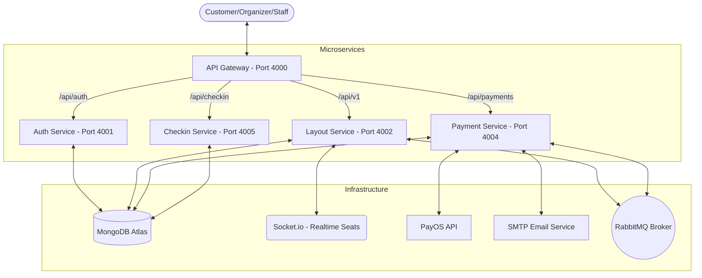
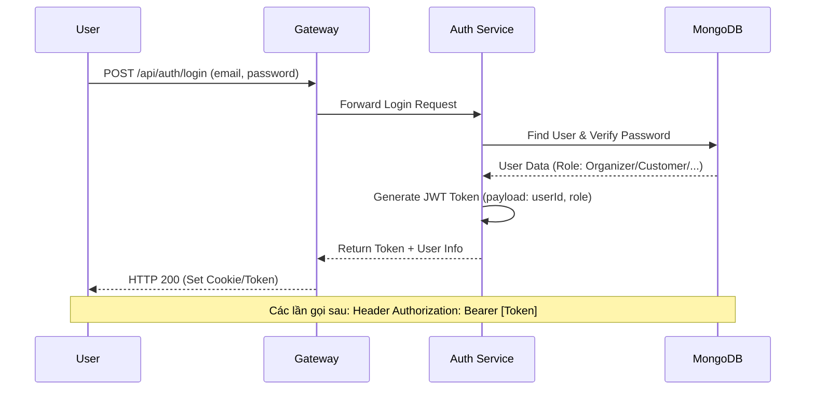
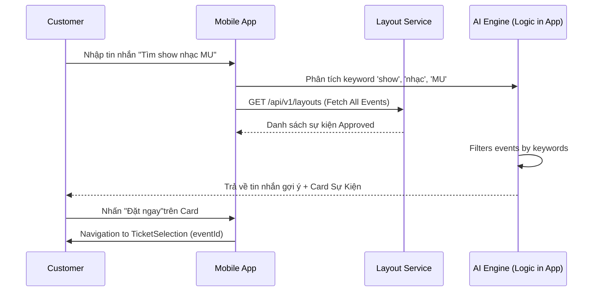
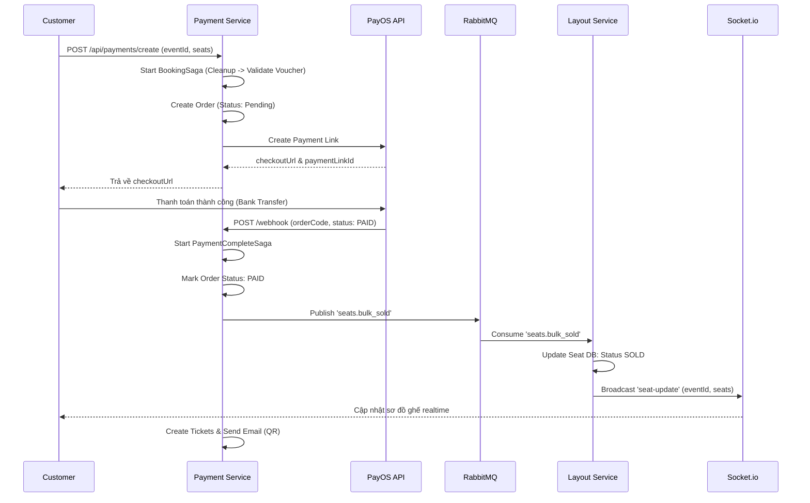
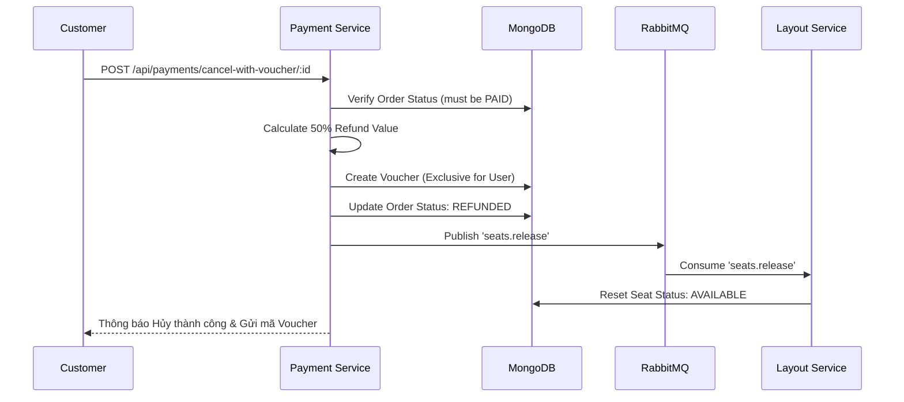
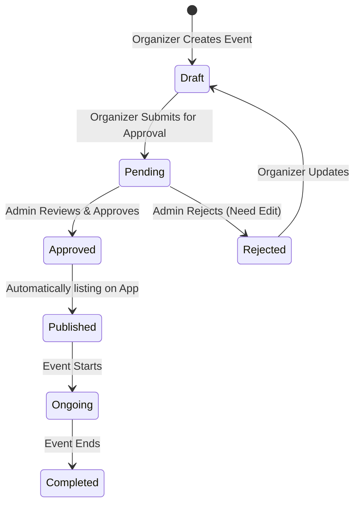
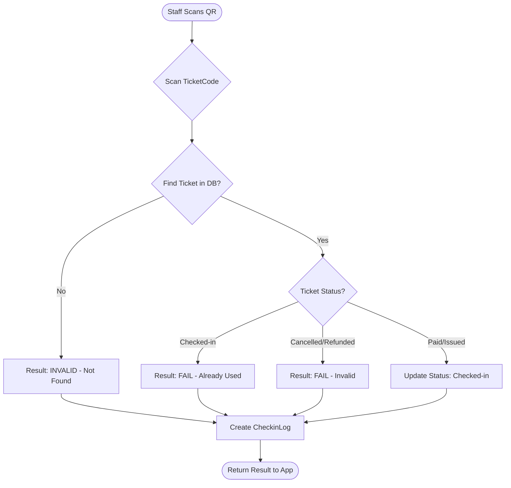
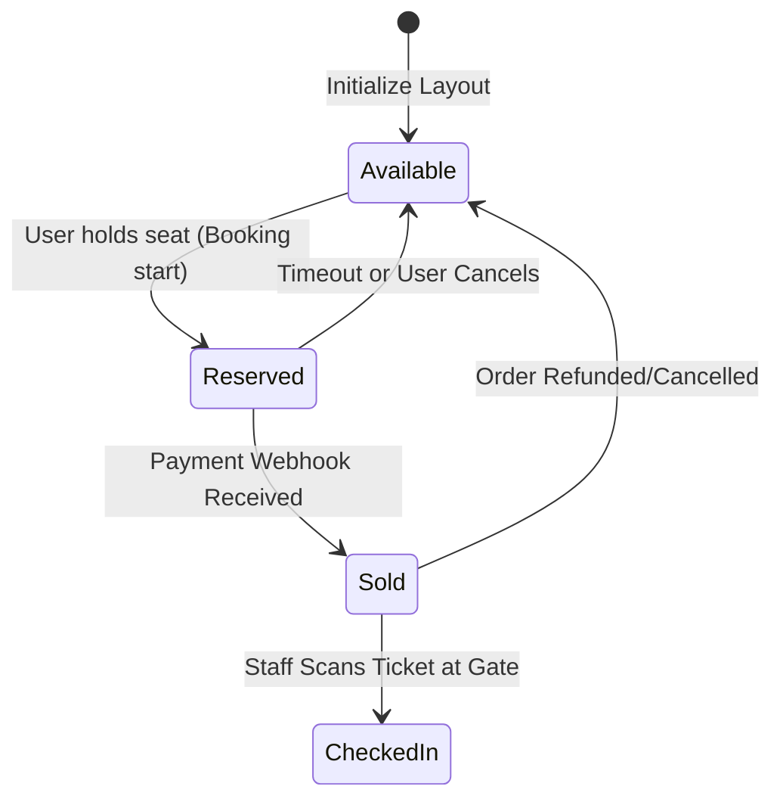

# System Architecture & Workflows - Event Ticketing Platform

Tài liệu này tổng hợp các biểu đồ (Diagrams) mô tả kiến trúc và luồng hoạt động của hệ thống dưới dạng **Mermaid**. Bạn có thể copy code này vào [Mermaid Live Editor](https://mermaid.live/) để xem hoặc render trực tiếp nếu tool hỗ trợ.

---

## 1. Kiến Trúc Tổng Quan (System Architecture)
Mô tả cách các Microservices tương tác với nhau thông qua API Gateway và Shared Database/Broker.

---

## 2. Luồng Đăng Nhập & Phân Quyền (Auth & RBAC)
Quy trình xác thực người dùng và cấp quyền dựa trên Role.

---

## 3. Luồng AI Assistant & Tìm kiếm (Discovery)
Mô tả cách AI Assistant hỗ trợ tìm kiếm và gợi ý đặt vé.

---

## 4. Luồng Đặt Vé & Thanh Toán (Booking Saga)
Mô tả quy trình phức tạp nhất: Giữ ghế -> Thanh toán -> Webhook.

---

## 5. Luồng Hủy Vé & Cấp Voucher (Refund Policy)
Quy trình hoàn tiền 50% bằng Voucher.

---

## 6. Luồng Kiểm Duyệt & Vận Hành (Admin & Organizer)
Tương tác giữa Organizer tạo sự kiện và Admin phê duyệt.

---

## 7. Luồng Check-in Tại Cổng (Checkin Workflow)
Xử lý quét mã QR bởi Staff.

---

## 8. Sơ Đồ Trạng Thái Ghế (Seat State Machine)
Mô tả vòng đời của một vị trí ghế ngồi.

---
**Tài liệu này được trích xuất từ cấu trúc thư mục `backend/services/` và mã nguồn các Saga Orchestrator.**
