# Full UML System Design - Event Ticketing Platform

Tài liệu này cung cấp 20 biểu đồ thiết kế (5 biểu đồ cho mỗi thành viên) theo đúng bảng phân vai Use Case, bao gồm: **Activity Diagram, Sequence Diagram, State Diagram, Integrated Communication Diagram, và Detail Design.**

---

## 1. Nhóm của Đạt: Customer Flow & Discovery
**Phạm vi:** UC-01, 02, 03, 04, 05, 06, 07, 08, 12, 19.

### 1.1. Activity Diagram: Luồng Khám phá & Tìm kiếm (UC-06, 07, 12)
```mermaid
activityDiagram
    start
    :Truy cập Trang chủ/Explore;
    if (Nhập từ khóa hoặc chọn Category?) then (Có)
        :Gọi LayoutAPI.listLayouts(query);
        :Lọc danh sách sự kiện dựa trên Search/Category;
    else (Không)
        :Hiển thị sự kiện Trending/Gần đây;
    endif
    :Người dùng chọn 1 sự kiện;
    :Hiển thị Chi tiết sự kiện (UC-07);
    fork
        :Xem sơ đồ ghế;
    split
        :Nhấn "Yêu thích" (UC-12);
        :Lưu vào Wishlist DB;
    end fork
    stop
```

### 1.2. Sequence Diagram: Luồng Đăng ký & Xác thực (UC-01)
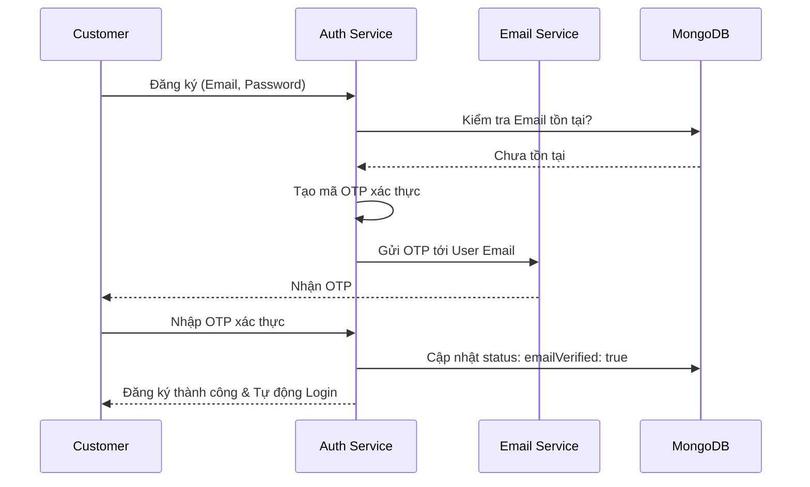

### 1.3. State Diagram: Trạng thái Tài khoản (UC-02, 38)
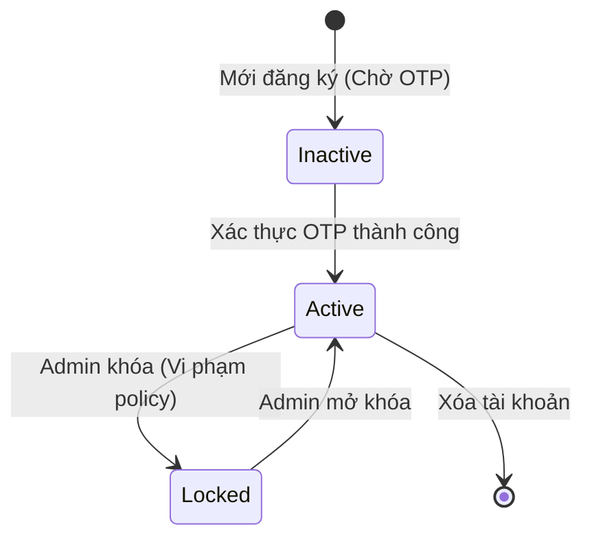

### 1.4. Communication Diagram: Tìm kiếm & Gợi ý (UC-06, 08)
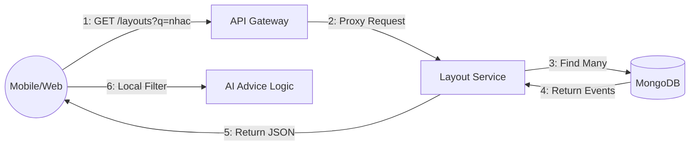

### 1.5. Detail Design: Logic Gợi ý cá nhân hóa (UC-08)
- **Input:** `preferredDestinations`, `preferredHotelTypes` (categories), `totalSpent`.
- **Logic:** 
  - Ưu tiên các sự kiện cùng thể loại khách hàng hay xem.
  - Ưu tiên sự kiện gần vị trí địa lý của khách hàng.
  - Sắp xếp theo mức giá phù hợp với `totalSpent` trung bình.

---

## 2. Nhóm của Nam: Core Booking & Org Setup
**Phạm vi:** UC-09, 16, 21, 22, 24, 25, 26, 18, 42, 43.

### 2.1. Activity Diagram: Luồng Tạo Sự kiện (UC-22, 23)
```mermaid
activityDiagram
    start
    :Organizer đăng nhập;
    :Nhập thông tin sự kiện (Tên, Banner, Policy);
    :Thiết lập sơ đồ chỗ ngồi (Canvas);
    :Lưu bản nháp (Draft);
    :Gửi phê duyệt (Submit);
    :Admin duyệt sự kiện;
    if (Được duyệt?) then (Yes)
        :Công khai sự kiện;
    else (No)
        :Nhận phản hồi & Chỉnh sửa;
    endif
    stop
```

### 2.2. Sequence Diagram: Luồng Giữ ghế (UC-09)
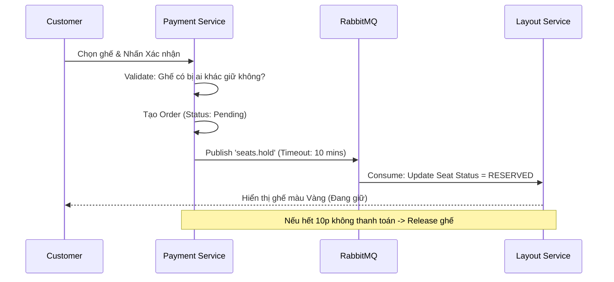

### 2.3. State Diagram: Trạng thái Sự kiện (UC-22, 37)
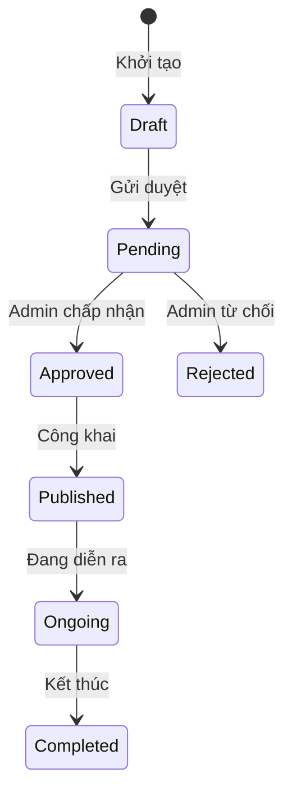

### 2.4. Communication Diagram: Thông báo tự động (UC-42)
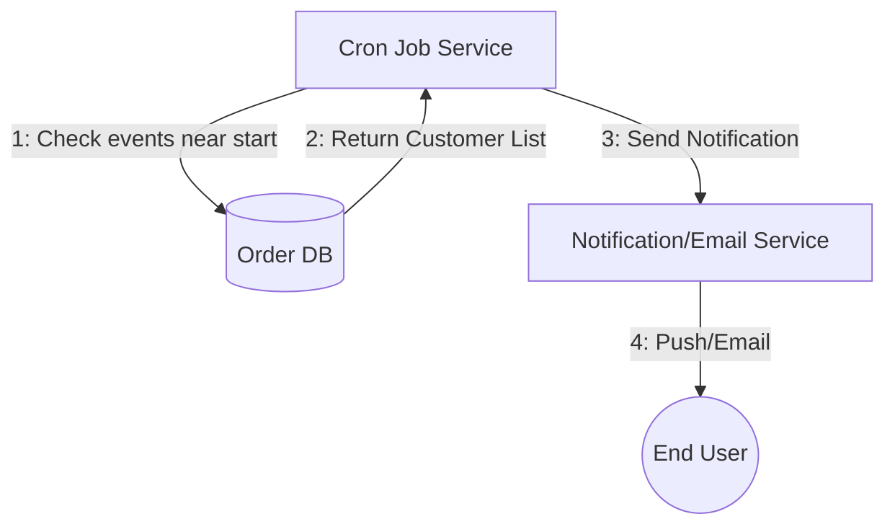

### 2.5. Detail Design: Logic Xác thực Voucher (UC-24)
- **Quy tắc:**
  - `maxUses`: Tổng số lần mã được dùng.
  - `minimumPrice`: Giá trị đơn tối thiểu để áp dụng.
  - `eventId`: Mã này chỉ dùng cho sự kiện cụ thể hay toàn sàn.
  - `userId`: Mã độc quyền (Dành cho khách hàng bị hủy vé cũ).

---

## 3. Nhóm của Phước: Payment & Check-in
**Phạm vi:** UC-11, 15, 17, 44, 39, 31, 32, 33, 34, 35.

### 3.1. Activity Diagram: Luồng Thanh toán PayOS (UC-17)
```mermaid
activityDiagram
    start
    :User chọn Thanh toán;
    :Hệ thống tạo Link PayOS;
    :User chuyển hướng sang PayOS;
    :Quét mã QR Ngân hàng;
    :Giao dịch thành công;
    :PayOS gửi Webhook về Payment Service;
    :Cập nhật Đơn hàng = PAID;
    :Sinh Vé QR & Gửi Email;
    stop
```

### 3.2. Sequence Diagram: Luồng Check-in QR (UC-32, 33)
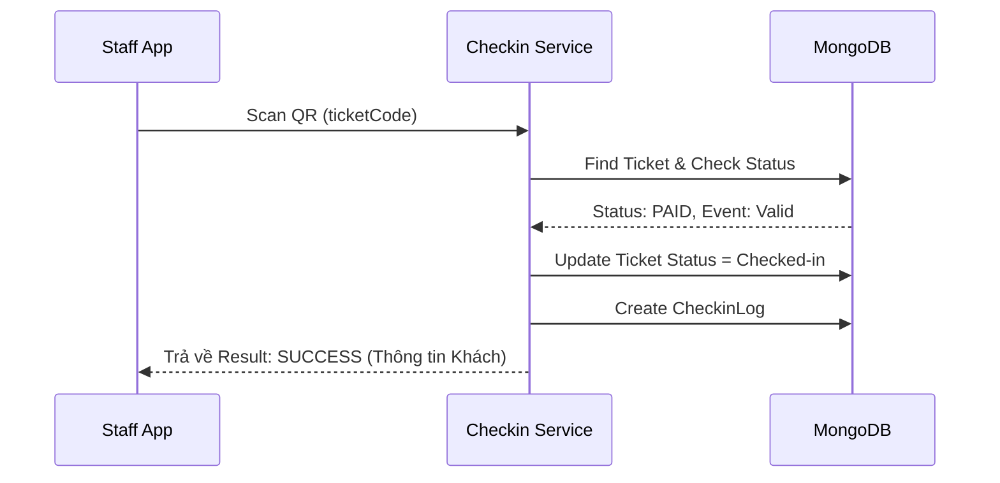

### 3.3. State Diagram: Trạng thái Vé (UC-18, 33, 15)
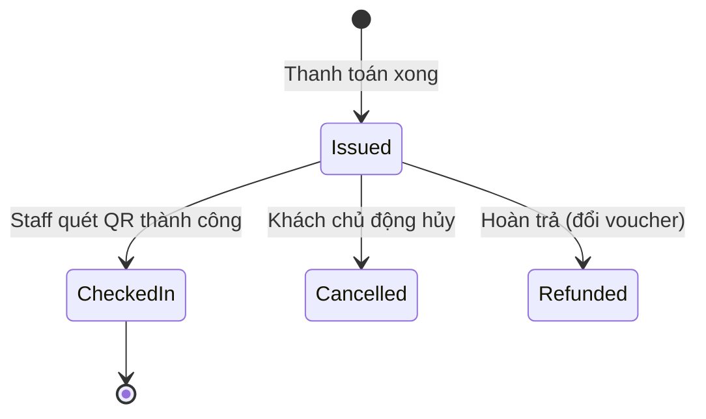

### 3.4. Communication Diagram: Luồng Tài chính (UC-39, 44)
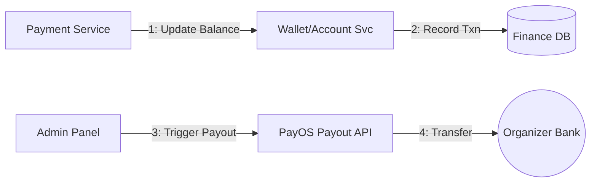

### 3.5. Detail Design: Đăng ký & Check-in Khuôn mặt (UC-34, 35)
- **Enrollment:** User chụp ảnh -> Hệ thống gửi tới AI (Face-api.js/AWS Rekognition) -> Lưu `Face Embedding` (mảng vector).
- **Check-in:** Staff chụp ảnh tại cổng -> So sánh Vector hiện tại với `Embedding` trong DB -> Tỷ lệ khớp > 90% thì xác nhận.

---

## 4. Nhóm của Phúc: Graphics, Admin & Analytics
**Phạm vi:** UC-23, 36, 27, 28, 29, 30, 37, 38, 40, 41.

### 4.1. Activity Diagram: Xử lý Khiếu nại (UC-40)
```mermaid
activityDiagram
    start
    :Customer gửi khiếu nại;
    :Hệ thống thông báo cho Admin;
    :Admin xem chi tiết giao dịch & lý do;
    if (Hợp lệ?) then (Có)
        :Thực hiện Hoàn tiền/Voucher;
        :Đóng khiếu nại;
    else (Không)
        :Từ chối & Gửi phản hồi;
    endif
    stop
```

### 4.2. Sequence Diagram: Gợi ý Giá vé AI (UC-30)
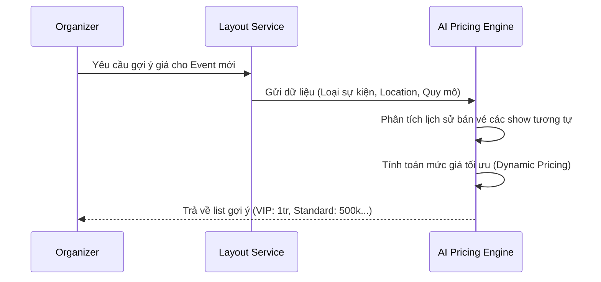

### 4.3. State Diagram: Trạng thái Ghế (Seat State)
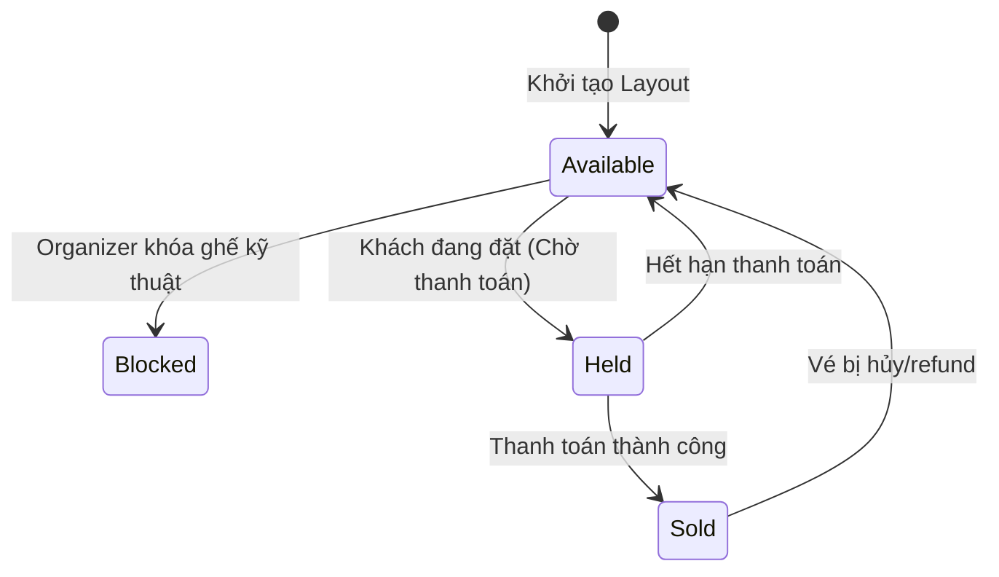

### 4.4. Communication Diagram: Tổng hợp Báo cáo (UC-29)
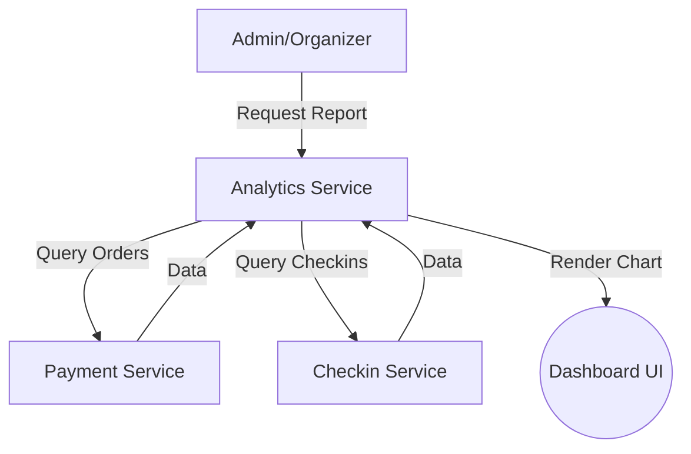

### 4.5. Detail Design: Chức năng Xem Chỗ ngồi 360 độ (UC-36)
- **Cấu hình:** Organizer upload ảnh Panorama 360 độ cho từng Zone.
- **Hiển thị:** Dùng thư viện `Three.js` hoặc `Pannellum`. Khi User click vào Zone trên sơ đồ 2D -> Mở Popup 360 độ hiển thị góc nhìn thực tế từ vị trí đó tới sân khấu.

---
**Gợi ý cho Dashboard Báo cáo (UC-29):**
- Biểu đồ đường: Doanh thu theo ngày.
- Biểu đồ tròn: Tỷ trọng loại vé (VIP vs Normal).
- Biểu đồ cột: Hiệu quả sử dụng Voucher.
