# UML Designs - Nhóm của Đạt (Customer Flow & Discovery)

Tài liệu này chứa bộ 5 diagram (Activity, Sequence, State, Communication, Detail Design) cho mỗi Use Case trong nhóm 10 Use Case của Đạt.

---

## UC-01: Đăng ký tài khoản (Register)

### 1. Activity Diagram
```mermaid
activityDiagram
    start
    :User nhập Email & Password;
    :Hệ thống kiểm tra định dạng;
    if (Đúng định dạng?) then (Yes)
        :Mã hóa Password;
        :Lưu User trạng thái "Inactive";
        :Gửi OTP qua Email;
        :User nhập OTP;
        if (OTP khớp?) then (Yes)
            :Cập nhật trạng thái "Active";
            stop
        else (No)
            :Báo lỗi OTP;
            stop
        endif
    else (No)
        :Báo lỗi định dạng;
        stop
    endif
```

### 2. Sequence Diagram
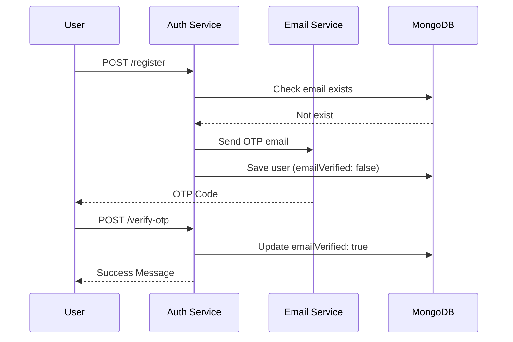

### 3. State Diagram
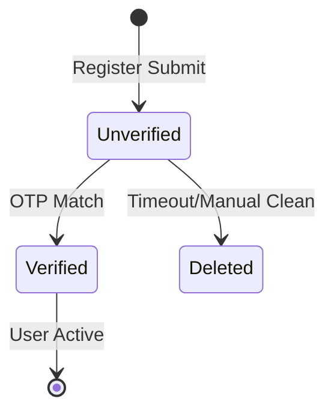

### 4. Communication Diagram
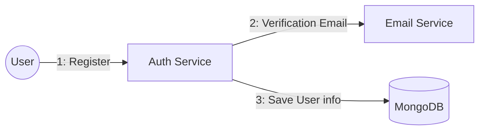

### 5. Detail Design
- **Logic:** Sử dụng `bcrypt` mã hóa mật khẩu 10 salt rounds. Lưu `emailVerificationCode` trong Schema User kèm `emailVerificationExpires` (10 phút).

---

## UC-02: Đăng nhập / Logout

### 1. Activity Diagram
```mermaid
activityDiagram
    start
    :User nhập Email/Pass;
    :Auth Service kiểm tra Credentials;
    if (Hợp lệ?) then (Yes)
        :Tạo JWT Token (Access & Refresh);
        :Lưu Token vào Cookie/LocalStorage;
        :Chuyển hướng vào Home;
    else (No)
        :Báo lỗi thông tin;
    endif
    stop
```

### 2. Sequence Diagram
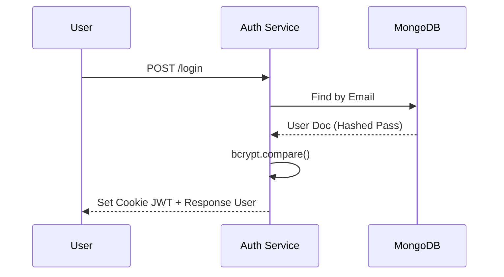

### 3. State Diagram
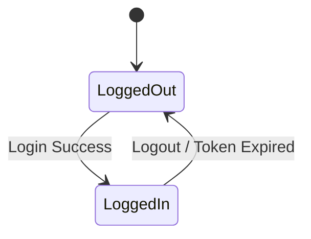

### 4. Communication Diagram
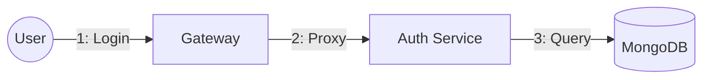

### 5. Detail Design
- **JWT:** Header `RS256`, Payload chứa `userId`, `role`. Cookie `httpOnly`, `secure: true`.

---

## UC-03: Quên mật khẩu

### 1. Activity Diagram
```mermaid
activityDiagram
    start
    :User yêu cầu Reset;
    :Nhập Email;
    if (Email tồn tại?) then (Yes)
        :Gửi mã Reset qua Email;
        :User nhập mã & Pass mới;
        :Cập nhật Pass;
    else (No)
        :Báo lỗi Email;
    endif
    stop
```

### 2. Sequence Diagram
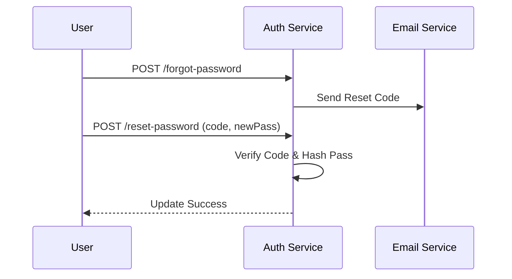

### 3. State Diagram
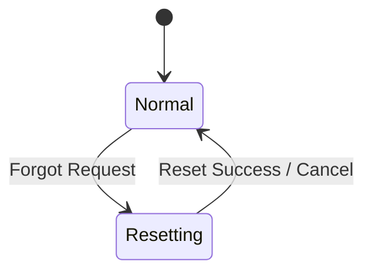

### 4. Communication Diagram
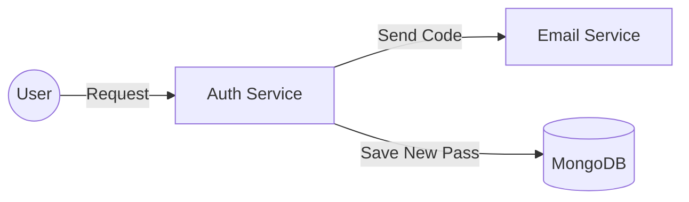

### 5. Detail Design
- **Code:** Sử dụng chuỗi số ngẫu nhiên 6 chữ số. Hết hạn sau 5 phút.

---

## UC-06: Tìm kiếm & Lọc

### 1. Activity Diagram
```mermaid
activityDiagram
    start
    :User nhập Keywords/Category;
    :Hệ thống truy vấn DB;
    :Lọc theo giá/ngày/vị trí;
    :Hiển thị kết quả;
    stop
```

### 2. Sequence Diagram
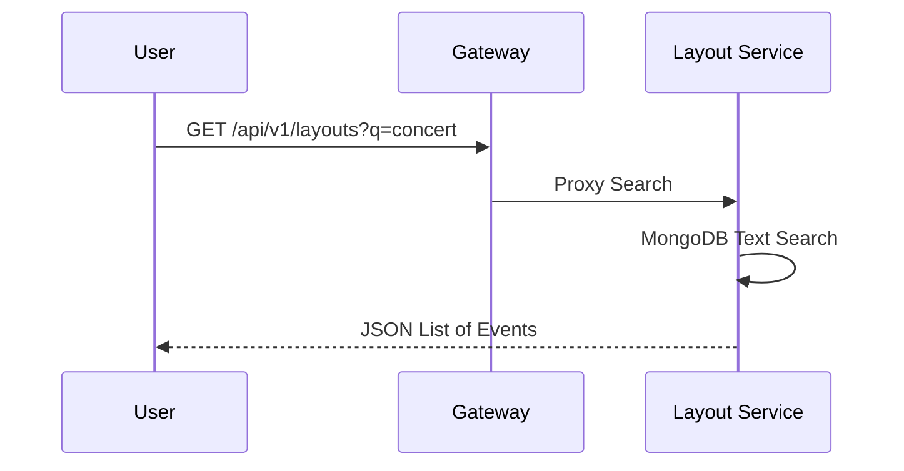

### 3. State Diagram
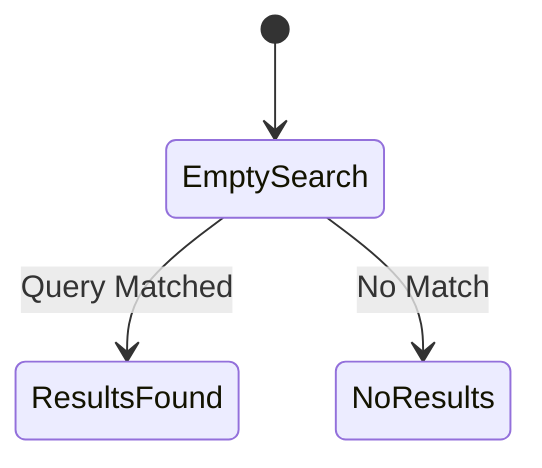

### 4. Communication Diagram
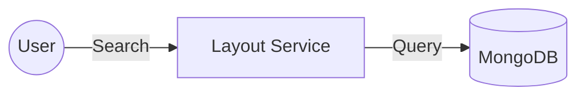

### 5. Detail Design
- **Index:** Tạo `text index` trên trường `eventName` và `eventDescription` trong MongoDB để tìm kiếm nhanh.

---

---

## UC-04: Cập nhật hồ sơ

### 1. Activity Diagram
```mermaid
activityDiagram
    start
    :User nhập thông tin mới (Name, Avatar, Phone);
    :Hệ thống xác thực JWT;
    :Cập nhật vào Database;
    :Trả về thông báo thành công;
    stop
```

### 2. Sequence Diagram
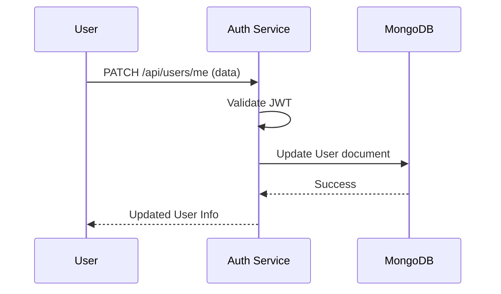

### 3. State Diagram
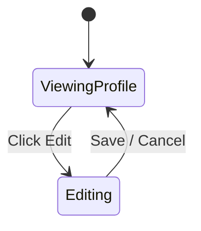

### 4. Communication Diagram
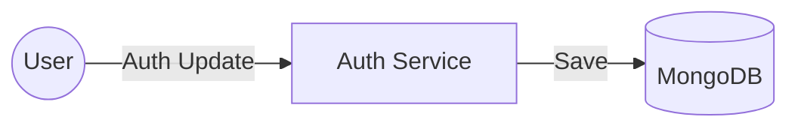

### 5. Detail Design
- **Field:** `firstName`, `lastName`, `phone`, `avatar` (url từ Cloudinary).

---

## UC-05: Đổi mật khẩu

### 1. Activity Diagram
```mermaid
activityDiagram
    start
    :User nhập Pass cũ & Pass mới;
    :Kiểm tra Pass cũ khớp DB?;
    if (Khớp?) then (Yes)
        :Hash Pass mới;
        :Cập nhật DB;
    else (No)
        :Báo lỗi Pass cũ;
    endif
    stop
```

### 2. Sequence Diagram
```mermaid
sequenceDiagram
    participant U as User
    participant A as Auth Service
    participant DB as MongoDB
    U->>A: POST /change-password
    A->>DB: Get current Hashed Pass
    A->>A: Compare input with Hashed
    A->>DB: Update NEW Hashed Pass
    A-->>U: Password Changed
```

### 3. State Diagram
```mermaid
stateDiagram-v2
    [*] --> Secure
    Secure --> ChangingPass: Request
    ChangingPass --> Secure: Success
```

### 4. Communication Diagram
```mermaid
graph LR
    U((User)) -- New Pass --> A[Auth Service]
    A -- Update --> DB[(MongoDB)]
```

### 5. Detail Design
- **Validation:** Pass mới không được trùng Pass cũ. Độ dài tối thiểu 6 ký tự.

---

## UC-07: Xem chi tiết sự kiện

### 1. Activity Diagram
```mermaid
activityDiagram
    start
    :User click vào Event Card;
    :Hệ thống lấy thông tin chi tiết;
    :Lấy sơ đồ chỗ ngồi;
    :Hiển thị chi tiết (Mô tả, Nghệ sĩ, Thời gian);
    stop
```

### 2. Sequence Diagram
```mermaid
sequenceDiagram
    participant U as User
    participant L as Layout Service
    participant DB as MongoDB
    U->>L: GET /api/v1/layouts/:eventId
    L->>DB: Find Layout & Event details
    DB-->>L: Layout Data
    L-->>U: Render Details Page
```

### 3. State Diagram
```mermaid
stateDiagram-v2
    [*] --> Browsing
    Browsing --> DetailView: Select Event
    DetailView --> Browsing: Back
```

### 4. Communication Diagram
```mermaid
graph LR
    U((User)) -- View ID --> L[Layout Service]
    L -- Fetch --> DB[(MongoDB)]
```

### 5. Detail Design
- **Data:** Bao gồm `zones` (List of Seat Zones), `minPrice`, `maxPrice`.

---

## UC-08: Gợi ý cá nhân hóa

### 1. Activity Diagram
```mermaid
activityDiagram
    start
    :User vào Home;
    :Hệ thống lấy sở thích (Preferences) của User;
    :Lọc sự kiện theo Preferences;
    :Hiển thị Section "Recommended for you";
    stop
```

### 2. Sequence Diagram
```mermaid
sequenceDiagram
    participant U as User
    participant A as Auth Service
    participant L as Layout Service
    U->>A: Get My Profile (including preferences)
    A-->>U: Preferences Data
    U->>L: GET /layouts (Filter by Categories)
    L-->>U: Suggested Events
```

### 3. State Diagram
```mermaid
stateDiagram-v2
    [*] --> DefaultFeed
    DefaultFeed --> PersonalizedFeed: User Preferences Loaded
```

### 4. Communication Diagram
```mermaid
graph LR
    Inter((Interface)) -- Get Prefs --> Auth[Auth Service]
    Inter -- Filter Events --> Layout[Layout Service]
```

### 5. Detail Design
- **Logic:** Map `user.preferences.preferredDestinations` với `event.category`.

---

## UC-12: Thêm vào yêu thích

### 1. Activity Diagram
```mermaid
activityDiagram
    start
    :User nhấn biểu tượng Tim;
    :Auth Service lưu eventId vào wishlist;
    :Cập nhật UI (Tim đỏ);
    stop
```

### 2. Sequence Diagram
```mermaid
sequenceDiagram
    participant U as User
    participant A as Auth Service
    U->>A: POST /wishlist/add (eventId)
    A->>A: Check JWT
    A->>A: Save to user.wishlist
    A-->>U: Wishlist Updated
```

### 3. State Diagram
```mermaid
stateDiagram-v2
    [*] --> Unselected
    Unselected --> Selected: Click Like
    Selected --> Unselected: Click Unlike
```

### 4. Communication Diagram
```mermaid
graph LR
    U((User)) -- Like --> A[Auth Service]
```

### 5. Detail Design
- **Schema:** Thêm `wishlist: [String]` (array of IDs) vào User Schema.

---

## UC-19: Lịch sử mua vé

### 1. Activity Diagram
```mermaid
activityDiagram
    start
    :User vào mục My Tickets;
    :Payment Service lấy list Orders của User;
    :Hiển thị các đơn PAID & REFUNDED;
    stop
```

### 2. Sequence Diagram
```mermaid
sequenceDiagram
    participant U as User
    participant P as Payment Service
    participant DB as MongoDB
    U->>P: GET /api/payments/user/:userId
    P->>DB: Query Orders (Paid/Refunded)
    DB-->>P: Order List
    P-->>U: Render Ticket History
```

### 3. State Diagram
```mermaid
stateDiagram-v2
    [*] --> EmptyHistory
    EmptyHistory --> HasHistory: Purchase Made
```

### 4. Communication Diagram
```mermaid
graph LR
    U((User)) -- Get Orders --> P[Payment Service]
    P -- Fetch --> DB[(MongoDB)]
```

### 5. Detail Design
- **Query:** `db.orders.find({ userId: ctx.userId }).sort({ createdAt: -1 })`.

