# UML Designs - Nhóm của Nam (Core Booking & Org Setup)

Tài liệu này chứa bộ 5 diagram (Activity, Sequence, State, Communication, Detail Design) cho mỗi Use Case trong nhóm 10 Use Case của Nam.

---

## UC-09: Chọn & Giữ ghế

### 1. Activity Diagram
```mermaid
activityDiagram
    start
    :User chọn ghế trên SeatMap;
    :Gửi yêu cầu giữ ghế lên Server;
    if (Ghế còn trống?) then (Yes)
        :Đánh dấu ghế "Reserved";
        :Bắt đầu đếm ngược 10 phút;
        :Trả về kết quả thành công;
    else (No)
        :Báo lỗi ghế đã bị đặt;
    endif
    stop
```

### 2. Sequence Diagram
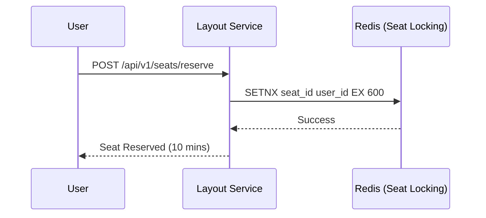

### 3. State Diagram
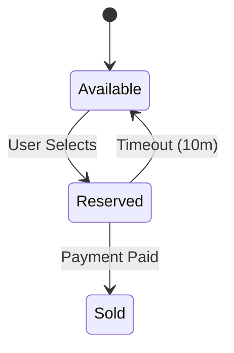

### 4. Communication Diagram
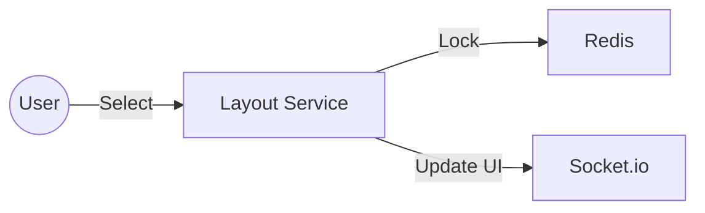

### 5. Detail Design
- **Redis Key:** `seat_lock:{eventId}:{seatId}`. Value là `userId`. TTL: 600s.

---

## UC-22: Tạo mới sự kiện

### 1. Activity Diagram
```mermaid
activityDiagram
    start
    :Org nhập thông tin sự kiện;
    :Upload Banner lên Cloudinary;
    :Lưu trạng thái "Pending Approval";
    :Thông báo cho Admin;
    stop
```

### 2. Sequence Diagram
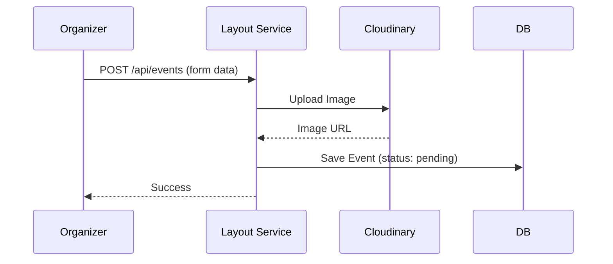

### 3. State Diagram
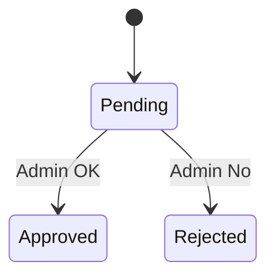

### 4. Communication Diagram
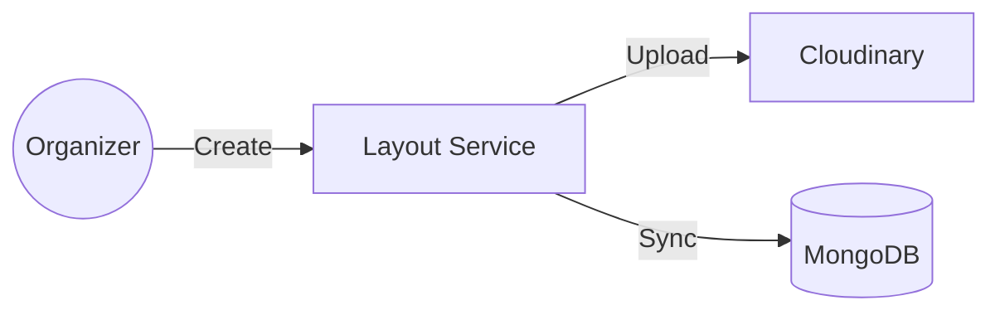

### 5. Detail Design
- **Cloudinary Folder:** `/events/banners/`.

---

## UC-16: Đăng ký danh sách chờ (Waitlist)

### 1. Activity Diagram
```mermaid
activityDiagram
    start
    :User vào trang sự kiện đã hết vé;
    :Nhấn "Đăng ký danh sách chờ";
    :Hệ thống kiểm tra user đã trong list chưa;
    if (Chưa có?) then (Yes)
        :Lưu thông tin {userId, eventId} vào Waitlist DB;
        :Thông báo đăng ký thành công;
    else (No)
        :Báo lỗi đã đăng ký rồi;
    endif
    stop
```

### 2. Sequence Diagram
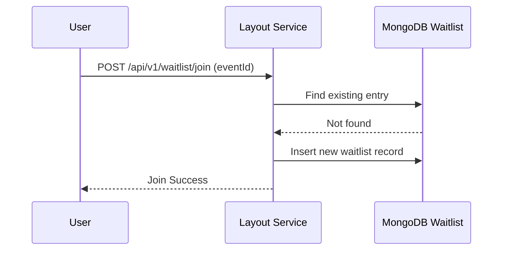

### 3. State Diagram
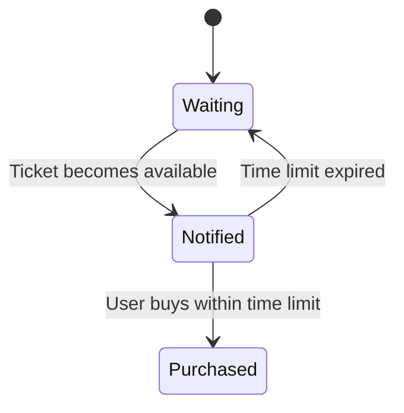

### 4. Communication Diagram
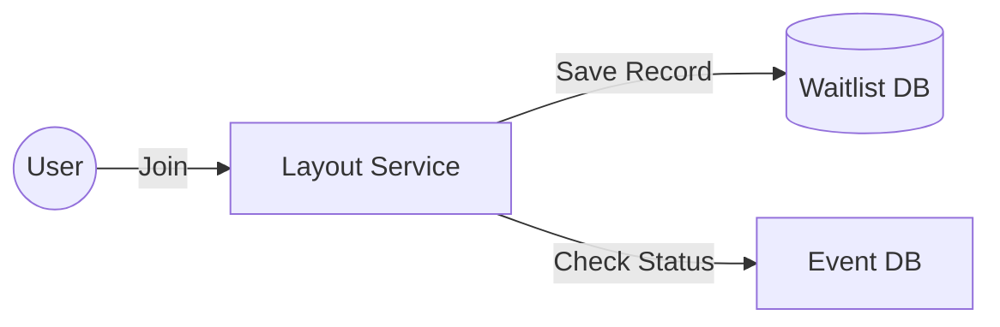

### 5. Detail Design
- **Schema:** `Waitlist: { userId, eventId, joinedAt, notifiedAt, status: ['waiting', 'notified', 'expired'] }`.

---

## UC-21: Đăng ký/Đăng nhập Organizer

### 1. Activity Diagram
```mermaid
activityDiagram
    start
    :User chọn "Be an Organizer";
    :Nhập thông tin công ty/cá nhân;
    :Hệ thống xác thực tư cách;
    :Tạo tài khoản với role "organizer";
    :Đăng nhập bằng Portal riêng;
    stop
```

### 2. Sequence Diagram
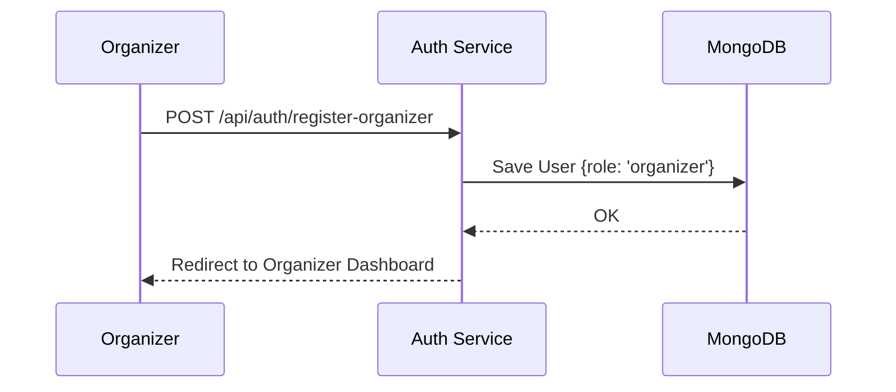

### 3. State Diagram
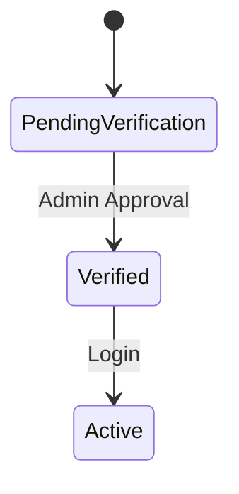

### 4. Communication Diagram
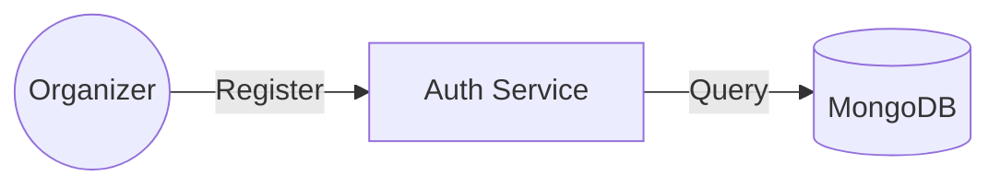

### 5. Detail Design
- **Logic:** Tách biệt database field `role: 'organizer'`. Organizer Dashboard sử dụng layout riêng trên Frontend.

---

## UC-24: Quản lý Voucher

### 1. Activity Diagram
```mermaid
activityDiagram
    start
    :Organizer vào mục Vouchers;
    :Nhấn "Tạo mới";
    :Thiết lập điều kiện (Phần trăm/Cố định, Hạn dùng);
    :Lưu vào hệ thống;
    :Theo dõi số lượt đã sử dụng;
    stop
```

### 2. Sequence Diagram
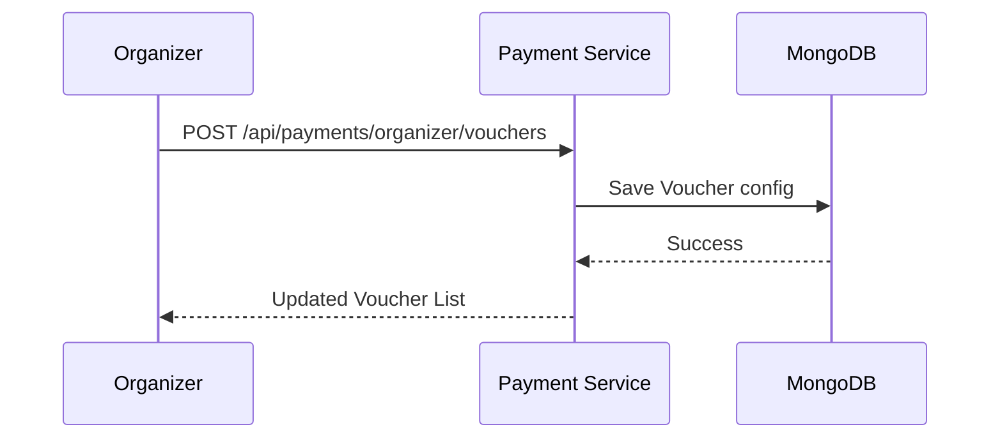

### 3. State Diagram
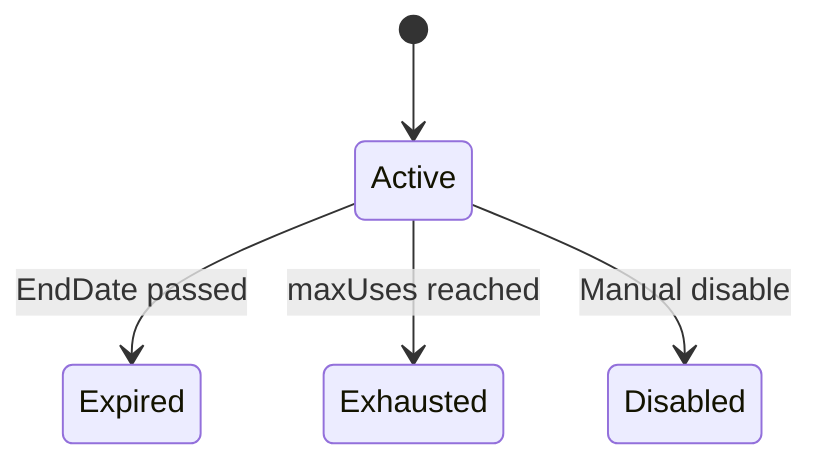

### 4. Communication Diagram
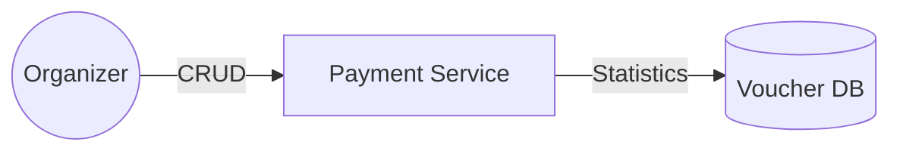

### 5. Detail Design
- **Key Fields:** `minimumPrice` (áp dụng cho đơn từ bao nhiêu), `usedCount` (increment khi thanh toán thành công).

---

## UC-25: CRUD nhân viên (Staff Management)

### 1. Activity Diagram
```mermaid
activityDiagram
    start
    :Organizer vào Team Management;
    :Thêm Email nhân viên mới;
    :Gán quyền Check-in;
    :Nhân viên nhận Email kích hoạt;
    stop
```

### 2. Sequence Diagram
```mermaid
sequenceDiagram
    participant O as Organizer
    participant A as Auth Service
    participant E as Email Service
    O->>A: POST /api/users/staff (email, accessLevel)
    A->>A: Create Staff Account (Temporary Pass)
    A->>E: Send invitation & Credentials
    E-->>O: Success
```

### 3. State Diagram
```mermaid
stateDiagram-v2
    [*] --> Invited
    Invited --> Active: First Login / Change Pass
    Active --> Deactivated: Removed by Org
```

### 4. Communication Diagram
```mermaid
graph LR
    O((Organizer)) -- Manage --> A[Auth Service]
    A -- Data --> DB[(User DB)]
```

### 5. Detail Design
- **RBAC:** Staff có `role: 'staff'` và trường `managedBy: organizerId`.

---

## UC-26: Gửi thông báo (Global)

### 1. Activity Diagram
```mermaid
activityDiagram
    start
    :Admin/Organizer soạn tin nhắn;
    :Chọn đối tượng (Tất cả/Theo Event);
    :Hệ thống lọc danh sách User;
    :Gửi hàng loạt (RabbitMQ);
    stop
```

### 2. Sequence Diagram
```mermaid
sequenceDiagram
    participant A as Admin/Org
    participant NS as Notification Service
    participant R as RabbitMQ
    participant DB as User DB
    A->>NS: POST /broadcast (msg, filter)
    NS->>DB: Get Target Users
    DB-->>NS: User List
    NS->>R: Loop Publish 'push.notify'
    R-->>A: Broadcast Started
```

### 3. State Diagram
```mermaid
stateDiagram-v2
    [*] --> Queued
    Queued --> Sending
    Sending --> Sent
    Sending --> Failed
```

### 4. Communication Diagram
```mermaid
graph TD
    A[Admin] -- Request --> NS[Notification Svc]
    NS -- Task --> R[RabbitMQ]
    R -- Process --> Workers[Email/Push Workers]
```

### 5. Detail Design
- **Worker:** Dùng RabbitMQ để tránh treo server khi gửi hàng chục ngàn notifications cùng lúc.

---

## UC-18: Xuất vé & Gửi QR (Ticket Issuance)

### 1. Activity Diagram
```mermaid
activityDiagram
    start
    :Payment Service nhận tín hiệu PAID;
    :Tạo Ticket Record;
    :Mã hóa Order ID thành QR;
    :Upload ảnh QR (nếu cần/hoặc sinh trực tiếp);
    :Gửi Email đính kèm QR;
    stop
```

### 2. Sequence Diagram
```mermaid
sequenceDiagram
    participant P as Payment Service
    participant E as Email Service
    P->>P: generateQRCode(orderId)
    P->>DB: Create Ticket {status: 'issued'}
    P->>E: POST /send-ticket (qrImage, userEmail)
    E-->>P: Sent
```

### 3. State Diagram
```mermaid
stateDiagram-v2
    [*] --> Issued
    Issued --> Consumed: Scanned at gate
    Issued --> Invalidated: Refunded
```

### 4. Communication Diagram
```mermaid
graph LR
    P[Payment Service] -- Data --> DB[(Ticket DB)]
    P -- Send --> E[Email Service]
```

### 5. Detail Design
- **Security:** QR chứa Token được ký (digitally signed) để chống sửa đổi nội dung.

---

## UC-42: Gửi thông báo tự động (Auto Reminders)

### 1. Activity Diagram
```mermaid
activityDiagram
    start
    :Sự kiện sắp diễn ra (VD: 2h trước);
    :Cron Job quét Orders;
    :Lọc khách hàng chưa check-in;
    :Tự động đẩy Notification: "Sắp tới giờ rồi!";
    stop
```

### 2. Sequence Diagram
```mermaid
sequenceDiagram
    participant C as Cron Job
    participant DB as MongoDB
    participant NS as Notification Service
    C->>DB: Find tickets (eventTime - 2h)
    DB-->>C: Ticket/User List
    C->>NS: Trigger Push (userIds)
    NS-->>C: Notified
```

### 3. State Diagram
```mermaid
stateDiagram-v2
    [*] --> Checking
    Checking --> Sending: Found Users
    Sending --> [*]
```

### 4. Communication Diagram
```mermaid
graph TD
    Cron -- Periodic --> PaymentSvc
    PaymentSvc -- Query --> DB
    PaymentSvc -- Call --> NotifySvc
```

### 5. Detail Design
- **Logic:** Sử dụng `node-cron` hoặc `Agenda` để chạy tác vụ ngầm định kỳ.

---

## UC-43: Thanh toán ký quỹ (Deposit)

### 1. Activity Diagram
```mermaid
activityDiagram
    start
    :Organizer đăng ký sự kiện tốn phí;
    :Chọn phương thức Ký quỹ;
    :Thanh toán tiền cọc cổng sàn;
    :Hệ thống xác nhận tiền đã nộp;
    :Mở khóa tính năng bán vé;
    stop
```

### 2. Sequence Diagram
```mermaid
sequenceDiagram
    participant O as Organizer
    participant P as Payment Service
    participant OS as PayOS
    O->>P: POST /api/organizer/deposit
    P->>OS: Create Deposit Link
    OS-->>O: Payment UI
    OS->>P: Webhook (Deposit Paid)
    P->>DB: Update Org Status: DEPOSITED
```

### 3. State Diagram
```mermaid
stateDiagram-v2
    [*] --> Unpaid
    Unpaid --> Paid: Deposit Success
    Paid --> [*]: Published
```

### 4. Communication Diagram
```mermaid
graph LR
    O((Org)) -- Deposit --> P[Payment Service]
    P -- Verify --> OS[PayOS]
```

### 5. Detail Design
- **Field:** `isDepositPaid` trong Schema Event. Chỉ khi `true` mới được duyệt `Approved`.
