# UML Designs - Nam's Group (Core Booking & Org Setup)

> **Trạng thái triển khai (dựa trên code backend thực tế):**
> - ✅ UC-09, UC-21, UC-22, UC-24, UC-25, UC-18, UC-42 (Job), UC-43 — **Đã có code**
> - ⚠️ UC-16 (Waitlist) — **Thiết kế, chưa có code**
> - ⚠️ UC-26 (Global Notification Broadcast) — **Chỉ có RabbitMQ config, chưa có broadcast endpoint**

---

## UC-09: Select & Hold Seat ✅

### 1. Activity Diagram
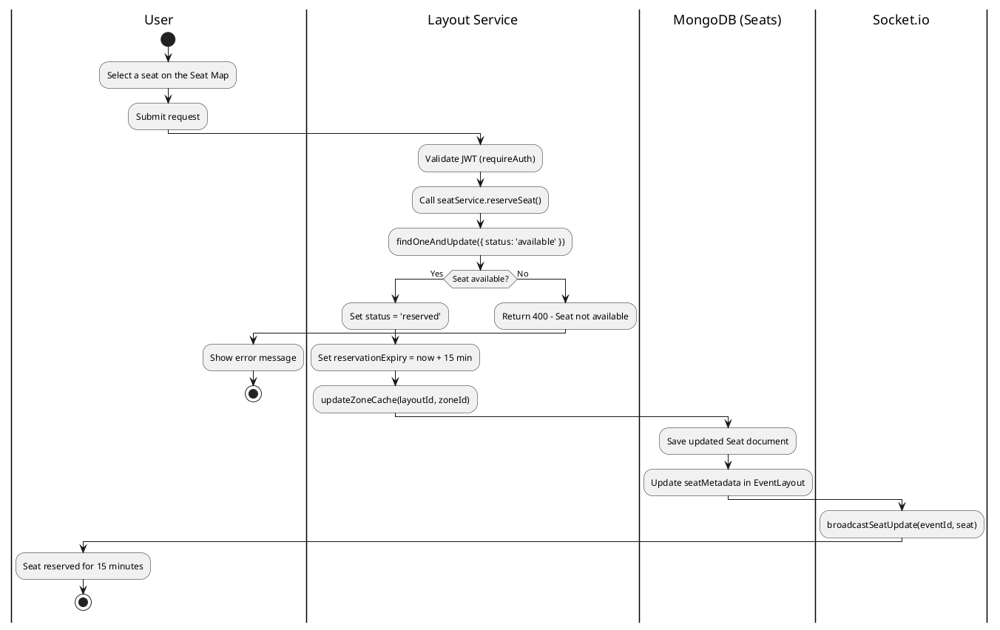

### 2. Sequence Diagram
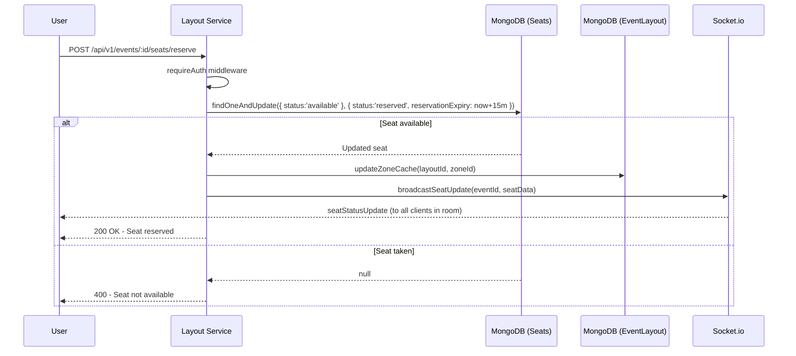

### 3. State Diagram
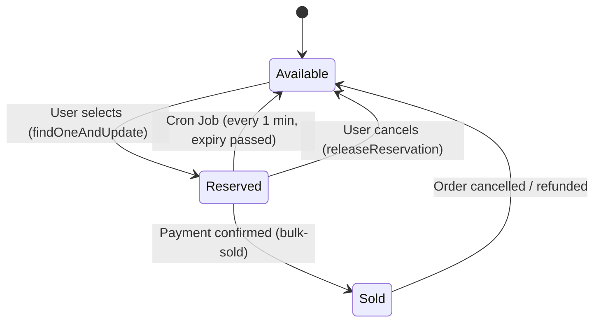

### 4. Communication Diagram
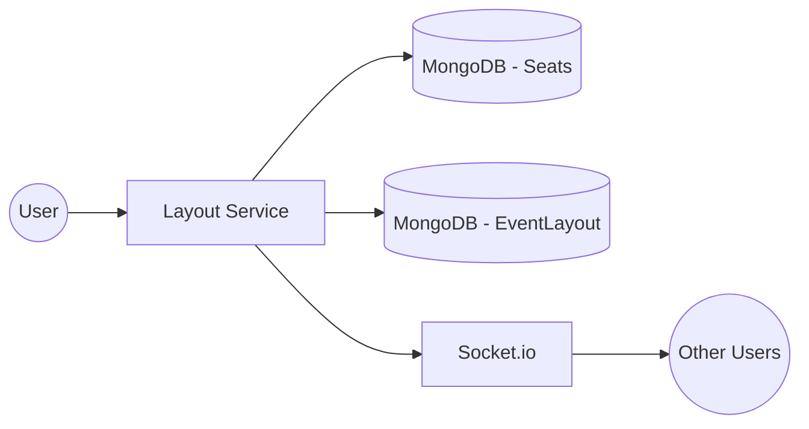

### 5. Class Diagram
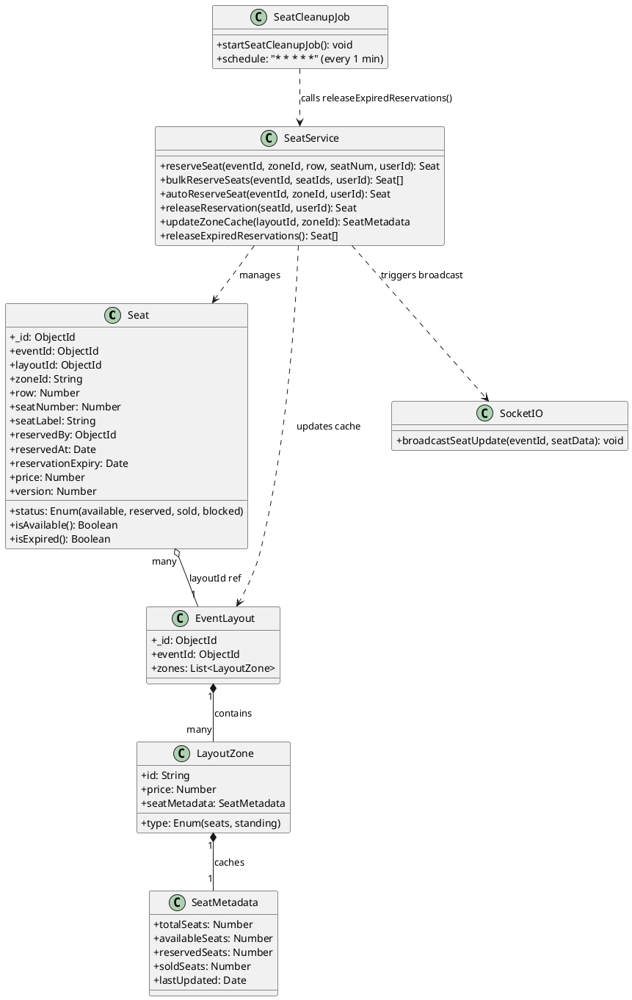

---

## UC-16: Waitlist Registration ⚠️ (Design Only — Not Yet Implemented)

> **Lưu ý:** Chức năng này chưa có code trong backend. Đây là thiết kế dự kiến.

### 1. Sequence Diagram (Design)
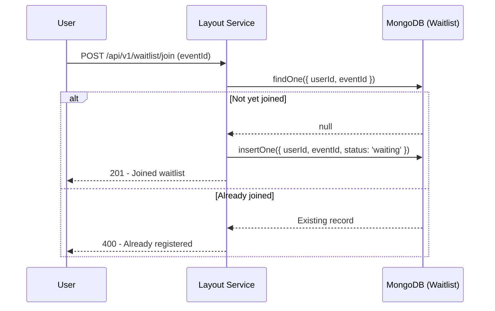

### 2. State Diagram
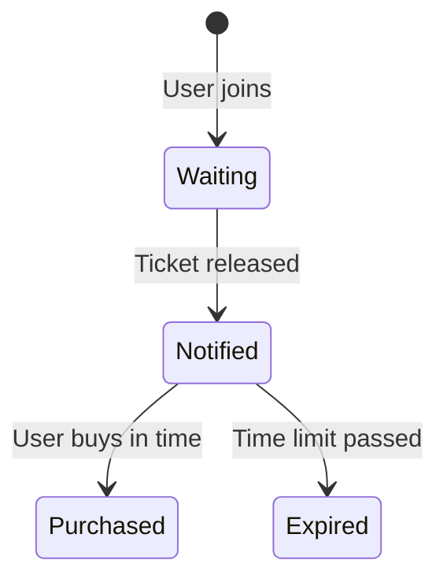

### 3. Class Diagram (Planned Design)
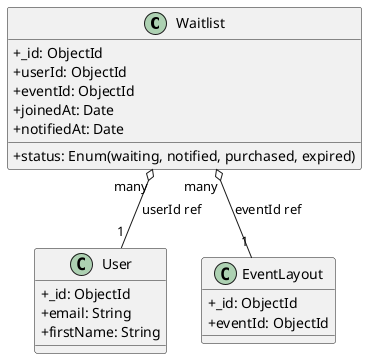
> **Note:** This collection does not yet exist in the backend codebase.

---

## UC-21: Organizer Register / Login ✅

### 1. Activity Diagram
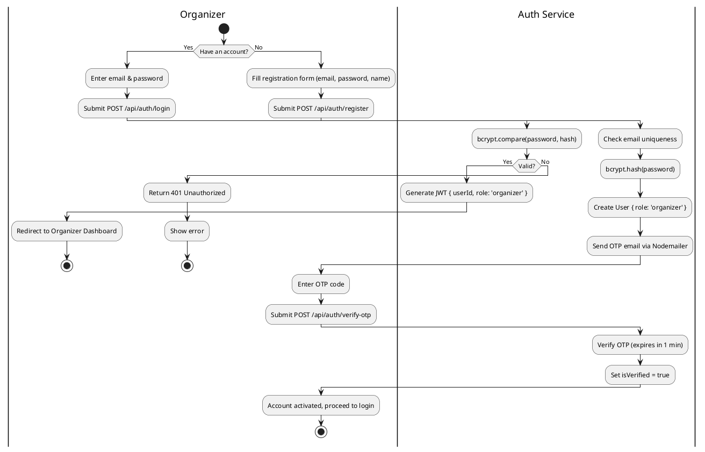

### 2. Sequence Diagram
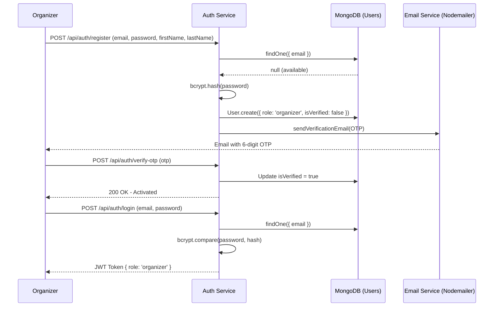

### 3. State Diagram
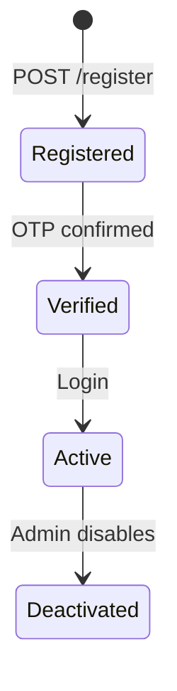

### 4. Communication Diagram
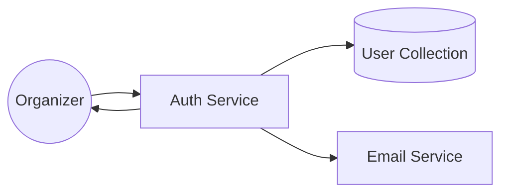

### 5. Class Diagram
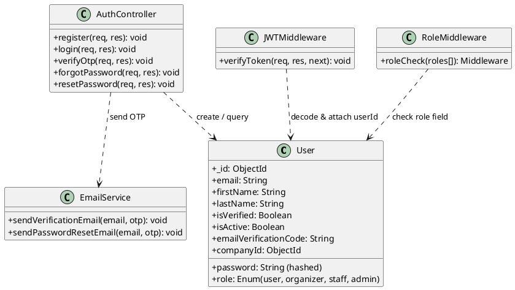

---

## UC-22: Create New Event ✅

### 1. Activity Diagram
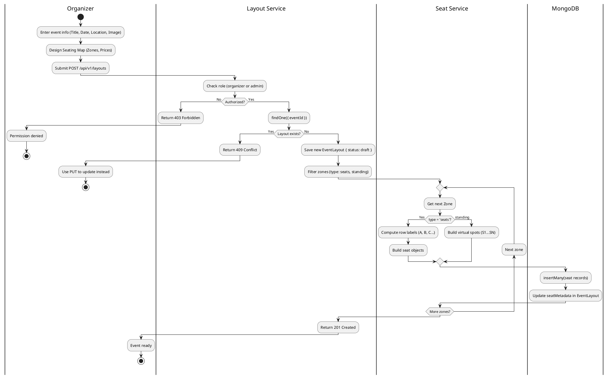

### 2. Sequence Diagram
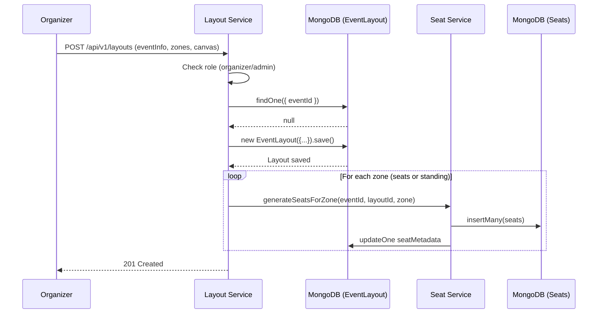

### 3. State Diagram
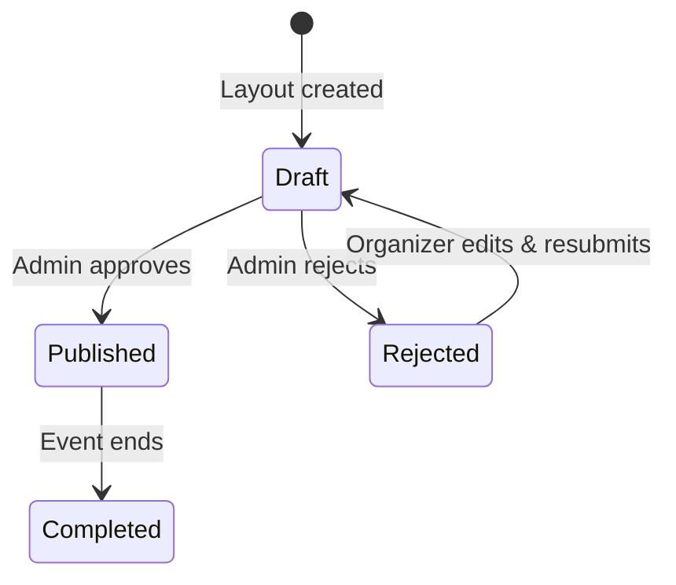

### 4. Communication Diagram
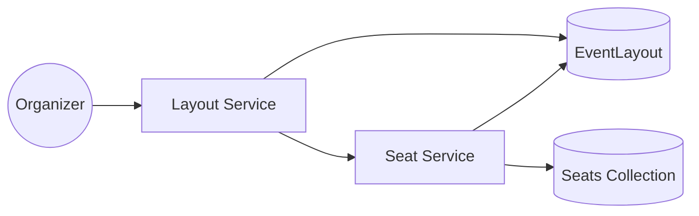

### 5. Class Diagram
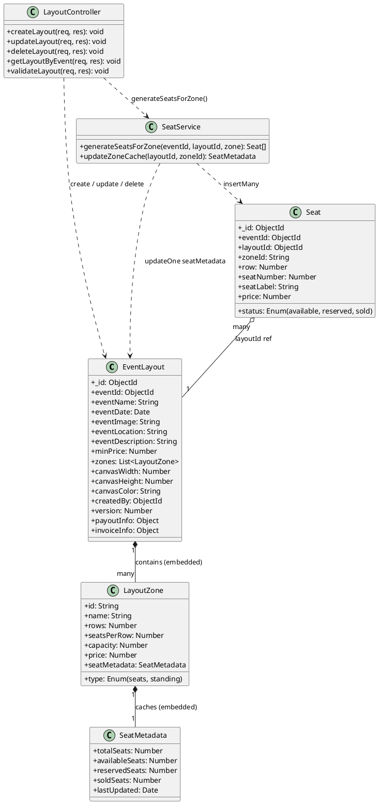

---

## UC-24: Voucher Management ✅

### 1. Activity Diagram
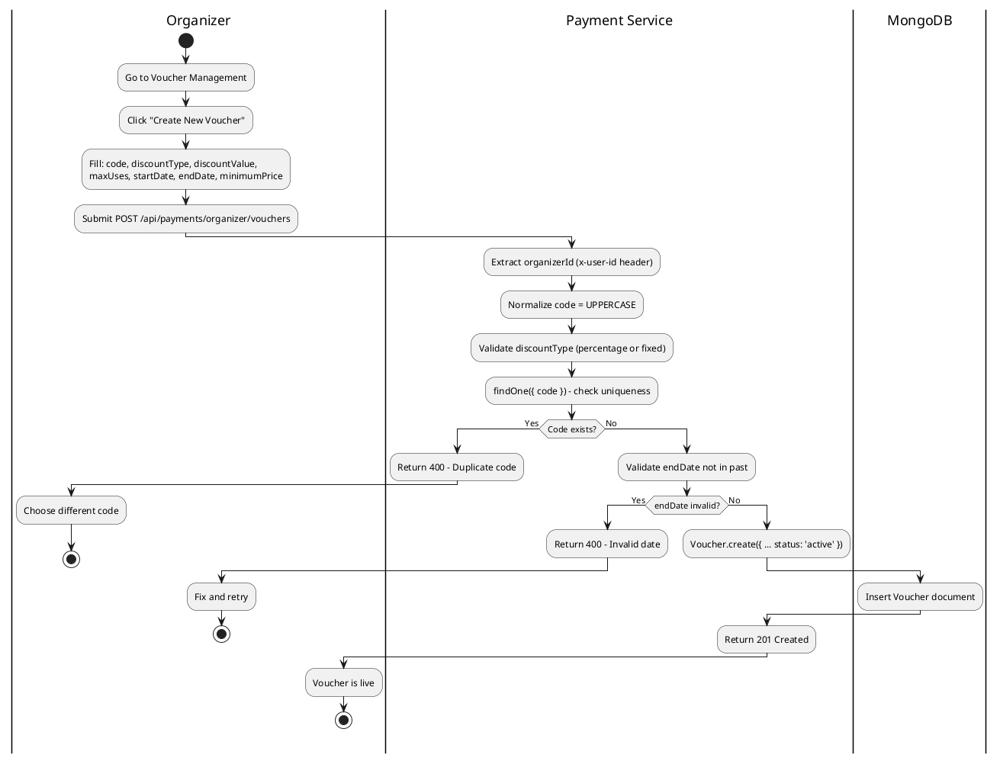

### 2. Sequence Diagram
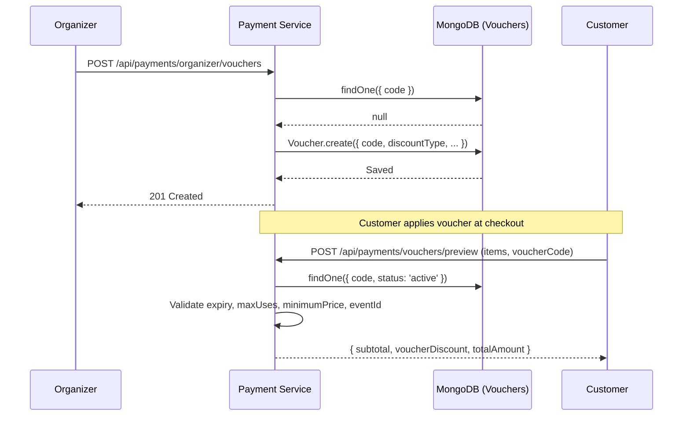

### 3. State Diagram
```mermaid
stateDiagram-v2
    [*] --> Active: Created
    Active --> Expired: endDate < now
    Active --> Exhausted: usedCount >= maxUses
    Active --> Inactive: Organizer disables (PUT)
    Expired --> [*]
    Exhausted --> [*]
```

### 4. Communication Diagram
```mermaid
graph LR
    O((Organizer)) -- CRUD --> PS[Payment Service]
    PS -- findOne/create/update/delete --> DB[(Voucher Collection)]
    C((Customer)) -- preview --> PS
    PS -- validate --> BS[BookingSaga on checkout]
```

### 5. Class Diagram
```plantuml
@startuml UC24-Class
skinparam classAttributeIconSize 0

class Voucher {
  + _id: ObjectId
  + code: String (UPPERCASE, unique)
  + discountType: Enum(percentage, fixed)
  + discountValue: Number
  + maxUses: Number
  + usedCount: Number
  + minimumPrice: Number
  + startDate: Date
  + endDate: Date
  + status: Enum(active, inactive)
  + organizerId: ObjectId
  + eventId: ObjectId
  + userId: ObjectId
}

class VoucherController {
  + createVoucher(req, res): void
  + getVouchers(req, res): void
  + updateVoucher(req, res): void
  + deleteVoucher(req, res): void
  + previewVoucher(req, res): void
}

class BookingSaga {
  + validateVoucherStep: SagaStep
  + execute(ctx): void
}

class Order {
  + _id: ObjectId
  + voucherCode: String
  + voucherId: ObjectId
  + voucherDiscount: Number
  + subtotal: Number
  + totalAmount: Number
}

VoucherController ..> Voucher : CRUD
BookingSaga ..> Voucher : findOne & increment usedCount
Order "many" o-- "0..1" Voucher : voucherId ref
@enduml
```

---

## UC-25: Staff CRUD ✅

### 1. Activity Diagram
```plantuml
@startuml UC25-Activity
|Organizer|
start
:Go to Team Management;
:Click "Add Staff";
:Enter email, firstName, lastName, password;
:Submit POST /api/users/staff;

|Auth Service|
:verifyToken + roleCheck('organizer');
if (Authorized?) then (No)
  :Return 403 Forbidden;
  |Organizer|
  stop
else (Yes)
  |Auth Service|
  :findOne({ email }) - check duplicate;
  if (Email exists?) then (Yes)
    :Return 400 - Email taken;
    |Organizer|
    :Use different email;
    stop
  else (No)
    |Auth Service|
    :User.create({ role:'staff', companyId: organizerId });
    |MongoDB|
    :Insert User document;
    |Auth Service|
    :Return 201 - Staff account created;
    |Organizer|
    :Share credentials with staff member;
    stop
  endif
endif
@enduml
```

### 2. Sequence Diagram
```mermaid
sequenceDiagram
    participant O as Organizer
    participant AS as Auth Service
    participant DB as MongoDB (Users)

    O->>AS: POST /api/users/staff (email, firstName, lastName, password)
    AS->>AS: verifyToken + roleCheck(['organizer'])
    AS->>DB: findOne({ email })
    DB-->>AS: null
    AS->>DB: User.create({ role:'staff', companyId: organizerId })
    DB-->>AS: Staff created
    AS-->>O: 201 - Staff data (no password)

    O->>AS: GET /api/users/staff
    AS->>DB: find({ companyId: organizerId, role: 'staff' })
    DB-->>AS: Staff list (paginated)
    AS-->>O: 200 - Staff list

    O->>AS: PATCH /api/users/staff/:staffId (firstName, isActive...)
    AS->>DB: User.findById(staffId), check companyId
    AS->>DB: staff.save()
    AS-->>O: 200 - Updated

    O->>AS: DELETE /api/users/staff/:staffId
    AS->>DB: findByIdAndDelete(staffId)
    AS-->>O: 200 - Deleted
```

### 3. State Diagram
```mermaid
stateDiagram-v2
    [*] --> Active: Created by Organizer
    Active --> Inactive: isActive = false (PATCH)
    Inactive --> Active: isActive = true (PATCH)
    Active --> Deleted: DELETE /staff/:id
    Inactive --> Deleted: DELETE /staff/:id
    Deleted --> [*]
```

### 4. Communication Diagram
```mermaid
graph LR
    O((Organizer)) --> AS[Auth Service]
    AS --> MW[verifyToken + roleCheck]
    AS --> DB[(User Collection)]
```

### 5. Class Diagram
```plantuml
@startuml UC25-Class
skinparam classAttributeIconSize 0

class User {
  + _id: ObjectId
  + email: String
  + password: String
  + firstName: String
  + lastName: String
  + phone: String
  + role: Enum(user, organizer, staff, admin)
  + companyId: ObjectId
  + isActive: Boolean
}

class UserController {
  + createStaff(req, res): void
  + getStaffList(req, res): void
  + getStaffById(req, res): void
  + updateStaff(req, res): void
  + deleteStaff(req, res): void
}

class JWTMiddleware {
  + verifyToken(req, res, next): void
}

class RoleMiddleware {
  + roleCheck(roles[]): Middleware
}

User "many" o-- "1" User : companyId (Organizer)
UserController ..> User : CRUD (filter by companyId)
UserController ..> JWTMiddleware : protected by
UserController ..> RoleMiddleware : roleCheck(['organizer'])
@enduml
```

---

## UC-18: Ticket Issuance & QR Delivery ✅

### 1. Activity Diagram
```plantuml
@startuml UC18-Activity
|PayOS Gateway|
start
:Send Webhook (Status: PAID);

|Payment Service|
:verifyPaymentWebhookData(signature);
:Find Order by orderCode;
:Run PaymentCompleteSaga;

|PaymentCompleteSaga|
:Step 1 - Mark Order status = 'paid';
:Step 2 - Publish seats.bulk_sold (RabbitMQ);
:Step 3 - Auto-payout to Organizer bank;
:Step 4 - sendPaymentConfirmationEmail;

|Ticket Service|
:createTicketsForOrder(orderId, items);
:Generate QR code per ticket;
:Save Ticket documents { status: 'issued' };

|MongoDB|
:insertMany(Ticket records);

|Email Service|
:sendTicketQREmail(userEmail, tickets);

|Customer|
:Receive email with QR ticket(s);
stop
@enduml
```

### 2. Sequence Diagram
```mermaid
sequenceDiagram
    participant PY as PayOS
    participant PS as Payment Service
    participant PCS as PaymentCompleteSaga
    participant TS as Ticket Service
    participant DB as MongoDB (Tickets)
    participant ES as Email Service
    participant C as Customer

    PY->>PS: POST /webhook { orderCode, status: PAID }
    PS->>PS: verifyPaymentWebhookData(signature)
    PS->>PCS: execute({ order })
    PCS->>PCS: mark-order-paid
    PCS->>PCS: publish seats.bulk_sold (RabbitMQ)
    PCS->>PCS: auto-payout to organizer bank
    PCS->>ES: sendPaymentConfirmationEmail
    PCS->>TS: createTicketsForOrder(orderId, items)
    TS->>TS: Generate QR per ticket
    TS->>DB: insertMany(Ticket records)
    DB-->>TS: Saved
    PCS->>ES: sendTicketQREmail(email, tickets)
    ES-->>C: Email with QR attachments
    PCS-->>PS: Saga done
    PS-->>PY: 200 OK
```

### 3. State Diagram
```mermaid
stateDiagram-v2
    [*] --> Issued: createTicketsForOrder()
    Issued --> Consumed: QR scanned at gate (checkin-service)
    Issued --> Invalidated: Order refunded
    Consumed --> [*]
    Invalidated --> [*]
```

### 4. Communication Diagram
```mermaid
graph LR
    PY[PayOS] --> PS[Payment Service]
    PS --> PCS[PaymentCompleteSaga]
    PCS --> TS[Ticket Service]
    TS --> DB[(Tickets Collection)]
    PCS --> ES[Email Service]
    ES --> C((Customer))
```

### 5. Class Diagram
```plantuml
@startuml UC18-Class
skinparam classAttributeIconSize 0

class Order {
  + _id: ObjectId
  + orderCode: Number
  + userId: ObjectId
  + eventId: ObjectId
  + eventName: String
  + items: List<OrderItem>
  + status: Enum(pending, processing, paid, cancelled)
  + totalAmount: Number
}

class Ticket {
  + _id: ObjectId
  + orderId: ObjectId
  + orderCode: Number
  + userId: ObjectId
  + eventId: ObjectId
  + eventName: String
  + seatId: ObjectId
  + status: Enum(issued, consumed, invalidated)
  + qrCode: String
}

class PaymentCompleteSaga {
  + markPaidStep: SagaStep
  + markSeatsSoldStep: SagaStep
  + autoPayoutStep: SagaStep
  + sendEmailStep: SagaStep
  + createTicketsStep: SagaStep
  + sendTicketQRStep: SagaStep
  + execute(ctx): SagaResult
}

class TicketService {
  + createTicketsForOrder(orderId, orderCode, userId, eventId, items): Ticket[]
}

class EmailService {
  + sendPaymentConfirmationEmail(data): Boolean
  + sendTicketQREmail(data): Boolean
}

PaymentCompleteSaga ..> Order : mark status = paid
PaymentCompleteSaga ..> TicketService : createTicketsForOrder()
PaymentCompleteSaga ..> EmailService : sendTicketQREmail()
TicketService ..> Ticket : insertMany
Ticket "many" o-- "1" Order : orderId ref
@enduml
```

---

## UC-42: Automatic Order Cleanup (Auto Job) ✅

> **Thực tế trong code:** UC-42 trong code là **tự động dọn dẹp đơn hàng hết hạn** (`orderCleanup.ts`) và **tự động giải phóng ghế hết hạn** (`seatCleanup.js`), không phải gửi reminder email.

### 1. Activity Diagram
```plantuml
@startuml UC42-Activity
|System - Order Cleanup (every 20s)|
start
:Find Orders: status IN (pending, processing)\nAND createdAt < now - 5 minutes;

|MongoDB|
:Return expired order list;

|System - Order Cleanup|
if (Expired orders found?) then (Yes)
  repeat
    :Run CancelSaga for each order;
    :Cancel PayOS payment link;
    :Release reserved seats;
    :Delete Order document;
  backward:Next order;
  repeat while (More orders?)
  :Log cleanup complete;
  stop
else (No)
  :No action needed;
  stop
endif

|System - Seat Cleanup (every 1 min)|
start
:Find Seats: status='reserved'\nAND reservationExpiry < now;

|MongoDB|
:Return expired seats;

|System - Seat Cleanup|
if (Expired seats?) then (Yes)
  :updateMany(status = 'available');
  :updateZoneCache for affected zones;
  :broadcastSeatUpdate via Socket.io;
  stop
else (No)
  stop
endif
@enduml
```

### 2. Sequence Diagram
```mermaid
sequenceDiagram
    participant OJ as Order Cleanup Job (20s interval)
    participant SJ as Seat Cleanup Job (node-cron, 1 min)
    participant DB as MongoDB
    participant CS as CancelSaga
    participant PY as PayOS
    participant SK as Socket.io

    loop Every 20 seconds
        OJ->>DB: find({ status: pending/processing, createdAt < now-5min })
        DB-->>OJ: Expired orders
        loop For each expired order
            OJ->>CS: execute({ order, payosClient })
            CS->>PY: cancelPaymentLink(paymentLinkId)
            CS->>DB: Release seats (bulk-release)
            CS->>DB: Delete order
        end
    end

    loop Every 1 minute (node-cron)
        SJ->>DB: find({ status:'reserved', expiry < now })
        DB-->>SJ: Expired seats
        SJ->>DB: updateMany(status = 'available')
        SJ->>DB: updateZoneCache()
        SJ->>SK: broadcastSeatUpdate()
    end
```

### 3. State Diagram
```mermaid
stateDiagram-v2
    state "Order Cleanup" as OC {
        [*] --> Scanning: Every 20 seconds
        Scanning --> Cancelling: Found stale orders
        Cancelling --> Done: All cancelled
        Scanning --> Idle: Nothing to do
    }
    state "Seat Cleanup" as SC {
        [*] --> Scanning2: Every 1 minute (cron)
        Scanning2 --> Releasing: Found expired reservations
        Releasing --> Broadcasting: Socket.io update
        Scanning2 --> Idle2: Nothing to do
    }
```

### 4. Class Diagram
```plantuml
@startuml UC42-Class
skinparam classAttributeIconSize 0

class OrderCleanupJob {
  + startOrderCleanupJob(): void
  + processExpiredOrders(): void
  + interval: 20 seconds (setInterval)
}

class SeatCleanupJob {
  + startSeatCleanupJob(): void
  + schedule: "* * * * *" (node-cron, every 1 min)
}

class CancelSaga {
  + execute(ctx): SagaResult
  + cancelPayOSLink: SagaStep
  + releaseSeatsStep: SagaStep
  + deleteOrderStep: SagaStep
}

class SeatService {
  + releaseExpiredReservations(): Seat[]
}

class Order {
  + _id: ObjectId
  + status: Enum(pending, processing, paid, cancelled)
  + createdAt: Date
}

class Seat {
  + _id: ObjectId
  + status: Enum(available, reserved, sold)
  + reservationExpiry: Date
}

OrderCleanupJob ..> Order : find expired orders
OrderCleanupJob ..> CancelSaga : execute per order
CancelSaga ..> Order : delete
SeatCleanupJob ..> SeatService : releaseExpiredReservations()
SeatService ..> Seat : updateMany status=available
@enduml
```

---

## UC-43: Escrow Payment & Platform Commission ✅

### 1. Activity Diagram
```plantuml
@startuml UC43-Activity
|Customer|
start
:Select seats and proceed to checkout;
:Submit POST /api/payments/create;

|Payment Service (BookingSaga)|
:Validate & apply voucher (if any);
:subtotal = sum(items);
:commissionAmount = totalAmount * 5%;
:organizerAmount = totalAmount - commissionAmount;
:Create Order { status: 'pending' };
:createPaymentLink(PayOS);

|PayOS|
:Generate QR code + checkoutUrl;
:Return payment link;

|Payment Service|
:Order status = 'processing';
:Return checkoutUrl to Customer;

|Customer|
:Complete bank transfer via QR;

|PayOS|
:Send Webhook (PAID);

|Payment Service (PaymentCompleteSaga)|
:Verify webhook signature;
:Mark Order status = 'paid';
:Publish seats.bulk_sold;
if (organizerBank configured?) then (Yes)
  :transferToOrganizerBank(organizerAmount);
  |Bank API|
  :Execute bank transfer;
  |Payment Service|
  :payoutStatus = 'success', payoutTxnId saved;
else (No / Not configured)
  :payoutStatus = 'skipped';
endif
:Create Tickets + Send QR Email;

|Customer|
:Receive confirmation + QR ticket;
stop
@enduml
```

### 2. Sequence Diagram
```mermaid
sequenceDiagram
    participant C as Customer
    participant PS as Payment Service
    participant BS as BookingSaga
    participant PY as PayOS
    participant PCS as PaymentCompleteSaga
    participant BT as BankTransfer Service
    participant B as Bank API

    C->>PS: POST /api/payments/create (items, voucherCode)
    PS->>BS: execute(ctx)
    BS->>BS: commissionAmount = totalAmount * 5%
    BS->>BS: organizerAmount = totalAmount - commission
    BS->>PY: createPaymentLink({ orderCode, amount })
    PY-->>BS: { checkoutUrl, qrCode, paymentLinkId }
    BS->>BS: Save Order { status: 'processing' }
    BS-->>PS: order + paymentLink
    PS-->>C: 201 { checkoutUrl, qrCode }

    C->>PY: Pay via banking app

    PY->>PS: POST /webhook { PAID }
    PS->>PCS: execute({ order })
    PCS->>PCS: mark-order-paid
    PCS->>BT: transferToOrganizerBank(organizerAmount, bankInfo)
    BT->>B: POST /transfers
    B-->>BT: { transactionId }
    BT-->>PCS: success
    PCS->>PCS: Update payoutStatus = 'success'
    PCS->>PCS: Create tickets + Send QR email
    PCS-->>PS: Saga complete
    PS-->>PY: 200 OK
```

### 3. State Diagram
```mermaid
stateDiagram-v2
    [*] --> Pending: Order created (BookingSaga)
    Pending --> Processing: PayOS link created
    Processing --> Paid: Webhook PAID
    Processing --> Cancelled: Expired (5min cleanup job)
    Paid --> Refunded: cancelPaidOrderWithVoucher

    state Paid {
        [*] --> PayoutPending
        PayoutPending --> PayoutSuccess: bank transfer OK
        PayoutPending --> PayoutFailed: bank transfer error
        PayoutPending --> PayoutSkipped: no bank configured
    }
```

### 4. Communication Diagram
```mermaid
graph LR
    C((Customer)) --> PS[Payment Service]
    PS --> BS[BookingSaga]
    BS --> PY[PayOS API]
    PY --> PS
    PS --> PCS[PaymentCompleteSaga]
    PCS --> BT[BankTransfer Service]
    BT --> B[Bank API]
    PCS --> TS[Ticket Service]
    PCS --> ES[Email Service]
```

### 5. Class Diagram
```plantuml
@startuml UC43-Class
skinparam classAttributeIconSize 0

class Order {
  + _id: ObjectId
  + orderCode: Number
  + userId: ObjectId
  + organizerId: ObjectId
  + subtotal: Number
  + commissionRate: Number
  + commissionAmount: Number
  + organizerAmount: Number
  + totalAmount: Number
  + voucherDiscount: Number
  + status: Enum(pending, processing, paid, cancelled)
  + payosPaymentLinkId: String
  + payosCheckoutUrl: String
  + qrCode: String
  + payoutStatus: Enum(pending, success, failed, skipped)
  + payoutTxnId: String
  + organizerBank: BankInfo
}

class BankInfo {
  + bankAccountNumber: String
  + bankAccountName: String
  + bankCode: String
  + bankName: String
}

class BookingSaga {
  + cleanupStep: SagaStep
  + validateVoucherStep: SagaStep
  + createOrderStep: SagaStep
  + createPayOSLinkStep: SagaStep
  + execute(ctx): SagaResult
}

class PaymentCompleteSaga {
  + markPaidStep: SagaStep
  + markSeatsSoldStep: SagaStep
  + autoPayoutStep: SagaStep
  + sendEmailStep: SagaStep
  + createTicketsStep: SagaStep
  + sendTicketQRStep: SagaStep
  + execute(ctx): SagaResult
}

class BankTransferService {
  + transferToOrganizerBank(payload): BankTransferResult
}

class PayOSClient {
  + createPaymentLink(data): PaymentLink
  + cancelPaymentLink(linkId): void
}

Order "1" *-- "1" BankInfo : organizerBank (embedded)
BookingSaga ..> Order : create
BookingSaga ..> PayOSClient : createPaymentLink()
PaymentCompleteSaga ..> Order : mark paid, update payout
PaymentCompleteSaga ..> BankTransferService : transferToOrganizerBank()
BankTransferService ..> PayOSClient : external bank API call
@enduml
```
