# UML Designs - Nhóm của Phúc (Graphics, Admin & Analytics)

---

## UC-23: Thiết lập sơ đồ ghế (Seat Layout Setup)

### 1. Activity Diagram
```mermaid
activityDiagram
    start
    :Organizer mở Layout Editor;
    :Vẽ Canvas (Width, Height, Color);
    :Kéo thả các Zone (Seats/Standing);
    :Thiết lập hàng (Rows) và số ghế mỗi hàng;
    :Gán giá vé cho từng Zone;
    :Lưu Layout vào Layout Service;
    stop
```

### 2. Sequence Diagram
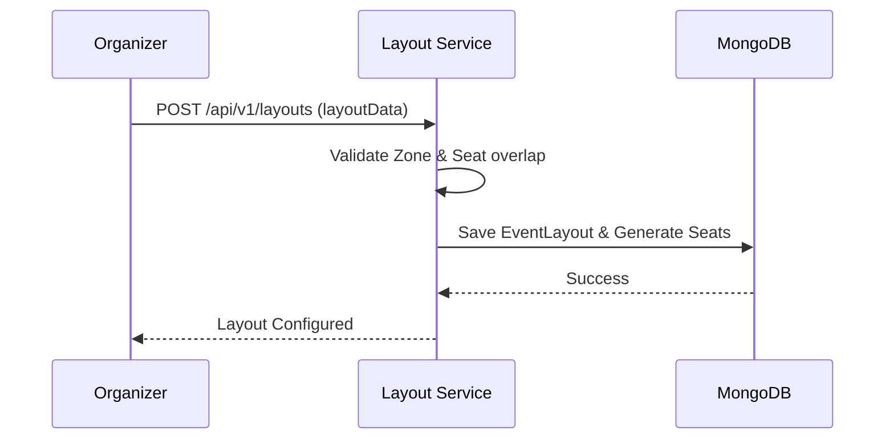

### 3. State Diagram
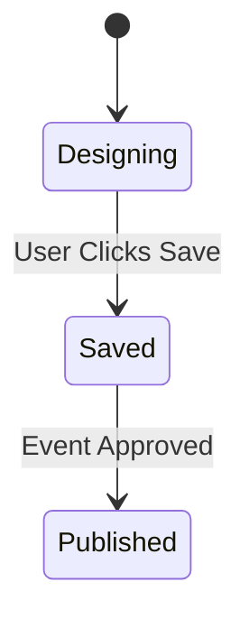

### 4. Communication Diagram
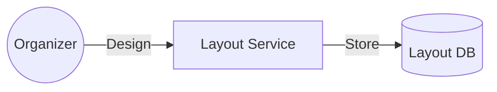

### 5. Detail Design
- **Architecture:** Lưu tọa độ (x, y) của từng Zone và Map các hàng thành mảng đối tượng Seat trong DB.

---

## UC-36: Xem chỗ ngồi 360 độ (360 Degree View)

### 1. Activity Diagram
```mermaid
activityDiagram
    start
    :User chọn một Zone trên sơ đồ;
    :Nhấn biểu tượng "360 View";
    :Hệ thống tải ảnh Panorama của Zone đó;
    :Sử dụng WebGL/Three.js để render;
    :User xoay camera xem góc nhìn;
    stop
```

### 2. Sequence Diagram
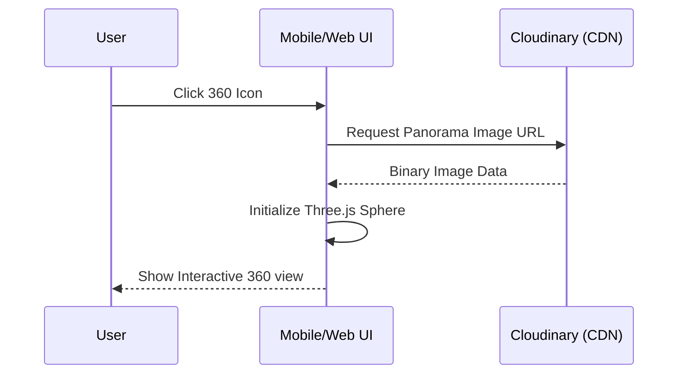

### 3. State Diagram
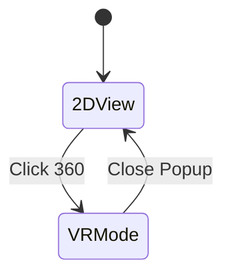

### 4. Communication Diagram
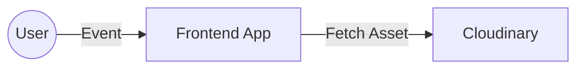

### 5. Detail Design
- **Tooling:** Dùng `Pannellum` hoặc `react-360-view`. Ảnh panorama cần có tỉ lệ 2:1.

---

## UC-27: Quản lý đơn hàng (Order Management)

### 1. Activity Diagram
```mermaid
activityDiagram
    start
    :Admin/Org vào mục Order Management;
    :Lọc đơn hàng theo Trạng thái/Ngày;
    :Xem chi tiết một đơn hàng cụ thể;
    :Thực hiện hành động (Hủy đơn/Gửi lại vé);
    stop
```

### 2. Sequence Diagram
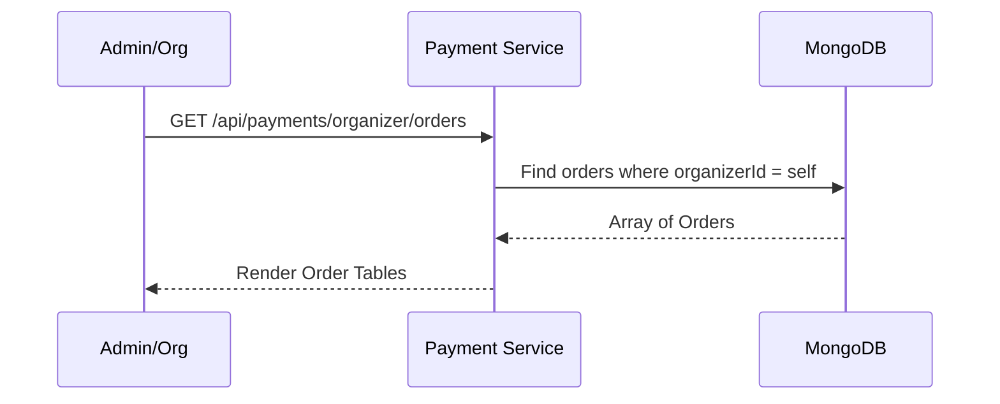

### 3. State Diagram
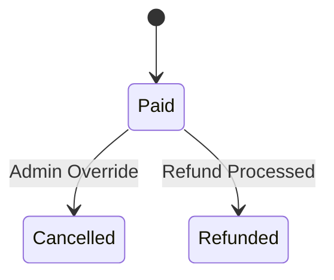

### 4. Communication Diagram
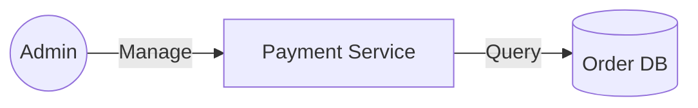

### 5. Detail Design
- **Filter:** Hỗ trợ tìm kiếm theo `orderCode` (PayOS) và `customerEmail`.

---

## UC-28: Xuất danh sách khách (Export Guest List)

### 1. Activity Diagram
```mermaid
activityDiagram
    start
    :Organizer chọn sự kiện;
    :Nhấn "Export Guest List";
    :Hệ thống lấy toàn bộ Paid Tickets;
    :Chuyển đổi dữ liệu sang CSV/Excel (json2csv);
    :Gửi file tải về cho trình duyệt;
    stop
```

### 2. Sequence Diagram
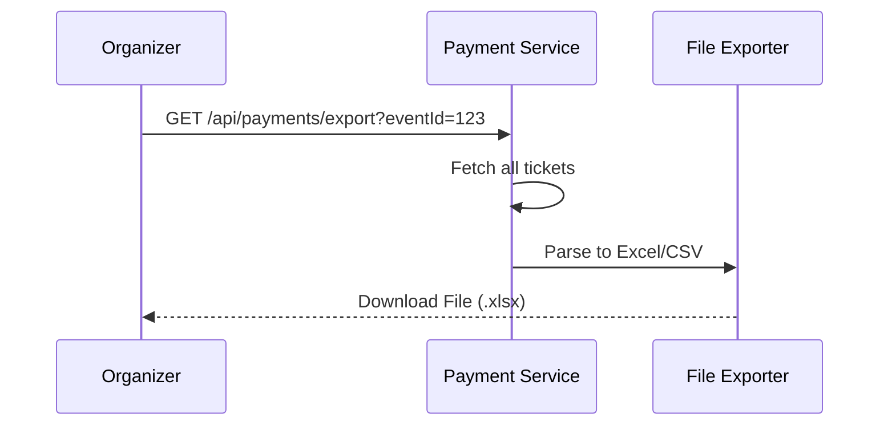

### 3. State Diagram
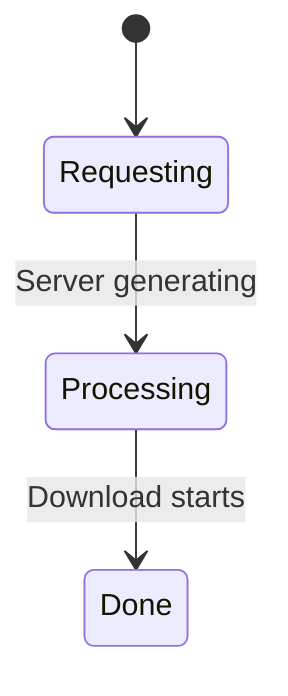

### 4. Communication Diagram
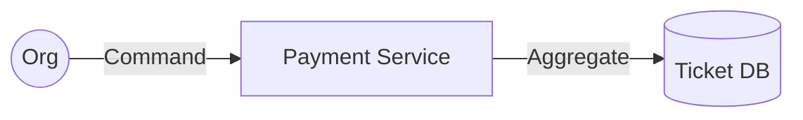

### 5. Detail Design
- **Library:** Dùng `exceljs` trong Node.js để tạo file ngay tại memory và stream về client.

---

## UC-29: Báo cáo & Analytics (Reporting)

### 1. Activity Diagram
```mermaid
activityDiagram
    start
    :Admin chọn Dashboard;
    :Hệ thống tổng hợp Doanh thu & Lượt bán;
    :Tính toán tỷ lệ lấp đầy (Occupancy Rate);
    :Vẽ biểu đồ hình cột & đường;
    stop
```

### 2. Sequence Diagram
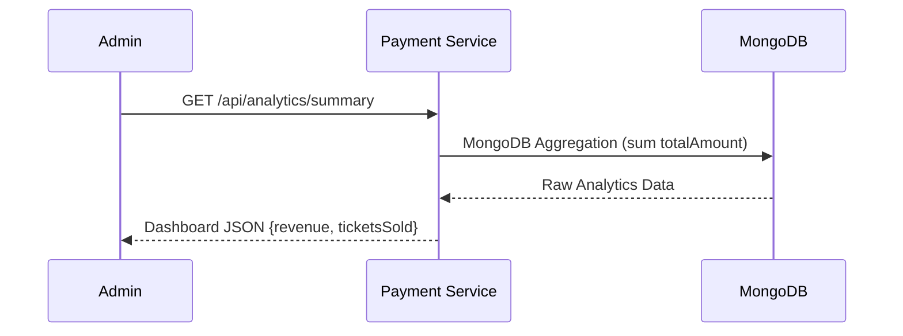

### 3. State Diagram
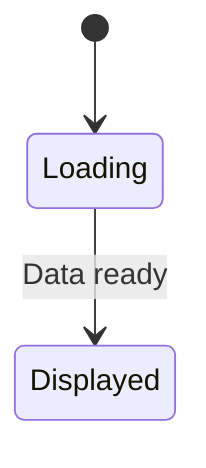

### 4. Communication Diagram
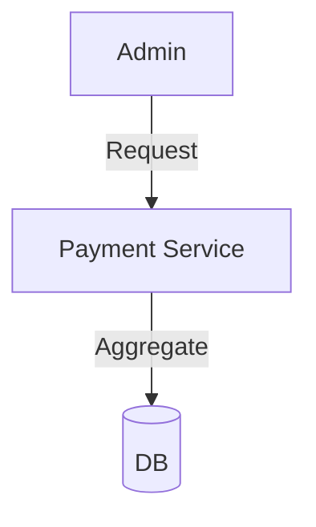

### 5. Detail Design
- **Aggregation:** `$group` theo `day` hoặc `month`. `$sum` trường `organizerAmount`.

---

## UC-30: Gợi ý giá vé (AI Pricing Suggestion)

### 1. Activity Diagram
```mermaid
activityDiagram
    start
    :Organizer yêu cầu định giá;
    :Hệ thống lấy dữ liệu sự kiện tương tự;
    :Phân tích nhu cầu thị trường & quy mô;
    :AI trả về 3 options (Giá thấp, Trung bình, Cao);
    :Organizer chọn và áp dụng;
    stop
```

### 2. Sequence Diagram
```mermaid
sequenceDiagram
    participant O as Organizer
    participant L as Layout Service
    participant AI as AI Pricing Engine
    O->>L: Request Pricing Recommendation
    L->>AI: Send {category, capacity, location}
    AI->>AI: Compare with historical data
    AI-->>L: Price Suggestions
    L-->>O: UI Comparison Card
```

### 3. State Diagram
```mermaid
stateDiagram-v2
    [*] --> Calculating
    Calculating --> ResultFound: AI Finished
```

### 4. Communication Diagram
```mermaid
graph LR
    L[Layout Service] -- Data --> AI[AI Analysis Engine]
```

### 5. Detail Design
- **Logic:** Dùng Linear Regression hoặc phân tích dữ liệu cũ để tìm `price point` có tỷ lệ bán vé (Sell-through rate) cao nhất.

---

## UC-37: Phê duyệt sự kiện (Approval)

### 1. Activity Diagram
```mermaid
activityDiagram
    start
    :Admin nhận thông báo Event mới;
    :Xem nội dung chi tiết & layout;
    if (Đạt chuẩn?) then (Có)
        :Bấm Approve;
        :Thông báo cho Organizer;
    else (Không)
        :Bấm Reject;
        :Ghi chú lý do;
    endif
    stop
```

### 2. Sequence Diagram
```mermaid
sequenceDiagram
    participant A as Admin
    participant L as Layout Service
    participant DB as MongoDB
    A->>L: PUT /api/events/:id/status (status: 'approved')
    L->>DB: Update Event Doc
    DB-->>L: Success
    L-->>A: Approved Successfully
```

### 3. State Diagram
```mermaid
stateDiagram-v2
    [*] --> Pending
    Pending --> Approved: Admin Accept
    Pending --> Rejected: Admin Deny
```

### 4. Communication Diagram
```mermaid
graph LR
    A((Admin)) -- Decision --> L[Layout Service]
```

### 5. Detail Design
- **Action:** Khi chuyển sang `approved`, Layout Service sẽ kích hoạt `broadcast` tới RabbitMQ để cập nhật dữ liệu Mobile.

---

## UC-38: Quản lý người dùng (User Management)

### 1. Activity Diagram
```mermaid
activityDiagram
    start
    :Admin truy cập User List;
    :Tìm kiếm User theo Email/ID;
    :Xem lịch sử hoạt động;
    :Thực hiện Khóa/Mở khóa tài khoản (Lock/Unlock);
    stop
```

### 2. Sequence Diagram
```mermaid
sequenceDiagram
    participant A as Admin
    participant AS as Auth Service
    participant DB as MongoDB
    A->>AS: PUT /api/users/:id/toggle-access
    AS->>DB: Update isActive: !isActive
    DB-->>AS: OK
    AS-->>A: User Updated
```

### 3. State Diagram
```mermaid
stateDiagram-v2
    [*] --> Active
    Active --> Banned: Lock Action
    Banned --> Active: Unlock Action
```

### 4. Communication Diagram
```mermaid
graph LR
    A((Admin)) -- Toggle --> AS[Auth Service]
```

### 5. Detail Design
- **Log:** Mỗi khi khóa user, lưu lý do và ID của Admin thực hiện vào `UserLogs`.

---

## UC-40: Quản lý khiếu nại (Complaints)

### 1. Activity Diagram
```mermaid
activityDiagram
    start
    :User gửi Ticket hỗ trợ;
    :Admin tiếp nhận yêu cầu;
    :Tra soát thông tin thanh toán/vé;
    :Phản hồi hoặc Hoàn tiền;
    :Đóng khiếu nại;
    stop
```

### 2. Sequence Diagram
```mermaid
sequenceDiagram
    participant U as User
    participant A as Admin
    participant S as Support Service
    U->>S: POST /api/complaints
    S->>A: Notification in Admin Panel
    A->>S: POST /complaints/:id/resolve (msg)
    S-->>U: Resolution Email
```

### 3. State Diagram
```mermaid
stateDiagram-v2
    [*] --> Open
    Open --> InProgress: Admin reading
    InProgress --> Resolved: Fixed
    InProgress --> Declined: Rejected complaint
```

### 4. Communication Diagram
```mermaid
graph LR
    U((User)) -- Submit --> S[Support Svc]
    S -- Notify --> A[Admin]
```

### 5. Detail Design
- **Field:** `severity` (Thấp/Trung bình/Cao), `attachment` (Ảnh chụp màn hình lỗi).

---

## UC-41: Quản lý Banner

### 1. Activity Diagram
```mermaid
activityDiagram
    start
    :Admin vào Banner Management;
    :Upload ảnh mới (Cloudinary);
    :Gán Link sự kiện hoặc Link ngoài;
    :Cập nhật thứ tự hiển thị;
    :Public lên trang chủ App;
    stop
```

### 2. Sequence Diagram
```mermaid
sequenceDiagram
    participant A as Admin
    participant L as Layout Service
    participant C as Cloudinary
    A->>L: POST /api/banners (image, link)
    L->>C: Upload
    C-->>L: Secure URL
    L->>DB: Save Banner Data
    L-->>A: Banner Live
```

### 3. State Diagram
```mermaid
stateDiagram-v2
    [*] --> Hidden
    Hidden --> Visible: Set Published
    Visible --> Hidden: Set Archived
```

### 4. Communication Diagram
```mermaid
graph LR
    A((Admin)) -- New Banner --> L[Layout Service]
    L -- Host --> C[Cloudinary]
```

### 5. Detail Design
- **API:** GET `/api/v1/banners` trả về list đã active sắp xếp theo `orderId`.
