# UML Designs - Phuc's Team (Graphics, Admin & Analytics)

---

## UC-23: Seat Layout Setup

### 1. Activity Diagram
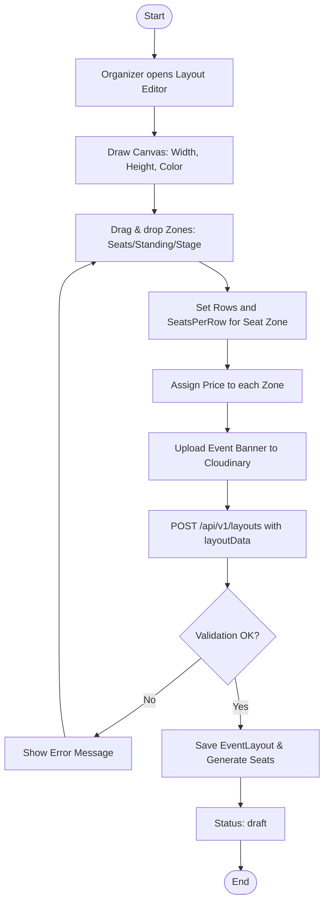
```mermaid
flowchart TD
    Start([Start]) --> A[Organizer opens Layout Editor]
    A --> B[Draw Canvas: Width, Height, Color]
    B --> C[Drag & drop Zones: Seats/Standing/Stage]
    C --> D[Set Rows and SeatsPerRow for Seat Zone]
    D --> E[Assign Price to each Zone]
    E --> F[Upload Event Banner to Cloudinary]
    F --> G[POST /api/v1/layouts with layoutData]
    G --> H{Validation OK?}
    H -->|No| I[Show Error Message]
    I --> C
    H -->|Yes| J[Save EventLayout & Generate Seats]
    J --> K[Status: draft]
    K --> End([End])
```

### 2. Sequence Diagram
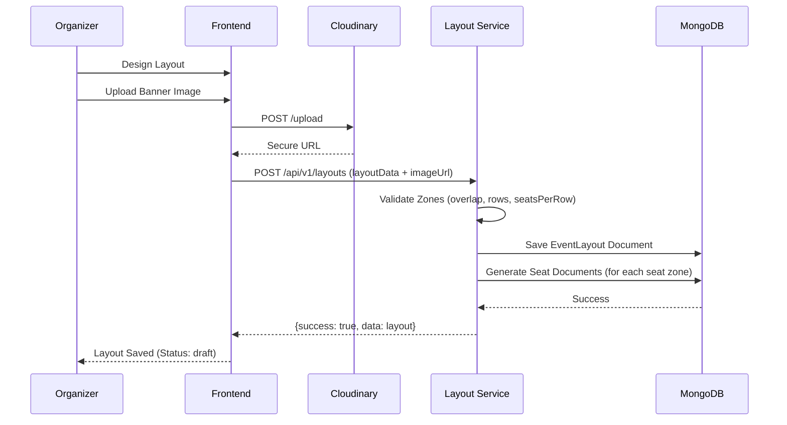
```mermaid
sequenceDiagram
    participant O as Organizer
    participant FE as Frontend
    participant Cloud as Cloudinary
    participant LS as Layout Service
    participant DB as MongoDB
    
    O->>FE: Design Layout
    O->>FE: Upload Banner Image
    FE->>Cloud: POST /upload
    Cloud-->>FE: Secure URL
    FE->>LS: POST /api/v1/layouts (layoutData + imageUrl)
    LS->>LS: Validate Zones (overlap, rows, seatsPerRow)
    LS->>DB: Save EventLayout Document
    LS->>DB: Generate Seat Documents (for each seat zone)
    DB-->>LS: Success
    LS-->>FE: {success: true, data: layout}
    FE-->>O: Layout Saved (Status: draft)
```

### 3. State Diagram
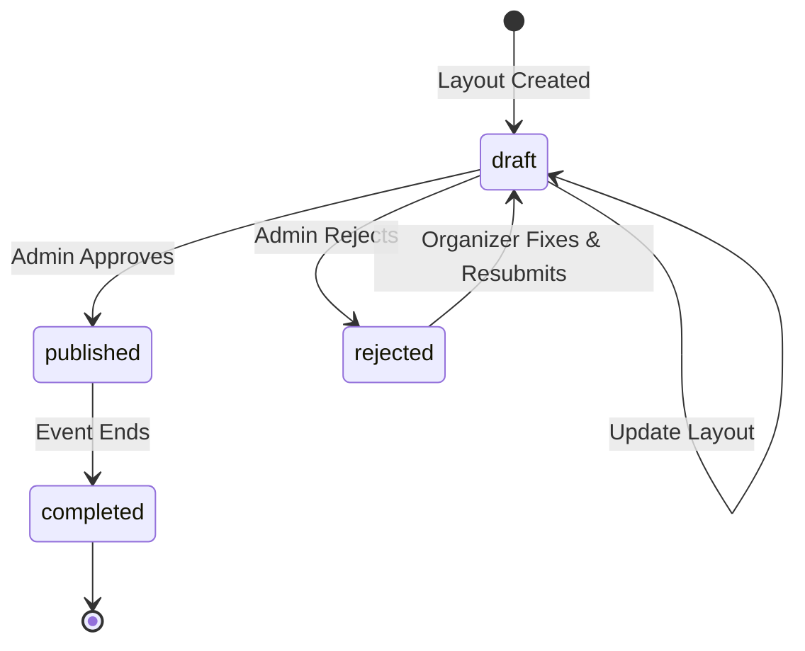
```mermaid
stateDiagram-v2
    [*] --> draft: Layout Created
    draft --> draft: Update Layout
    draft --> published: Admin Approves
    draft --> rejected: Admin Rejects
    rejected --> draft: Organizer Fixes & Resubmits
    published --> completed: Event Ends
    completed --> [*]
```

### 4. Communication Diagram
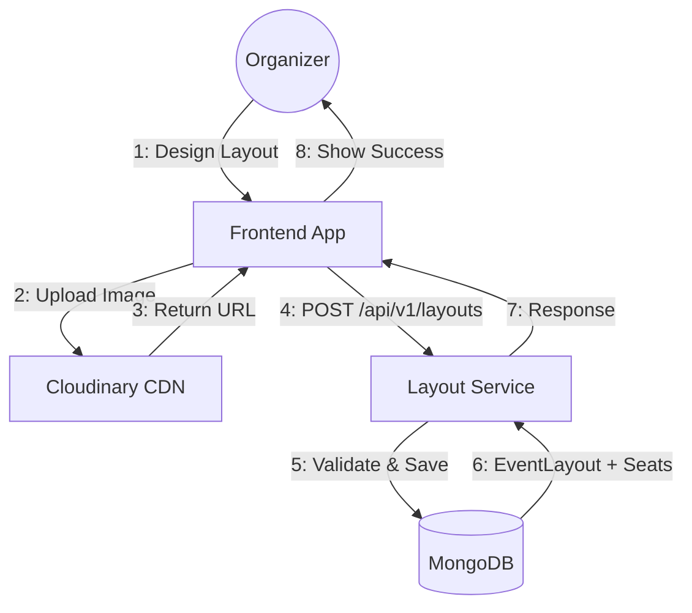
```mermaid
graph TB
    O((Organizer)) -->|1: Design Layout| FE[Frontend App]
    FE -->|2: Upload Image| Cloud[Cloudinary CDN]
    Cloud -->|3: Return URL| FE
    FE -->|4: POST /api/v1/layouts| LS[Layout Service]
    LS -->|5: Validate & Save| DB[(MongoDB)]
    DB -->|6: EventLayout + Seats| LS
    LS -->|7: Response| FE
    FE -->|8: Show Success| O
```

### 5. Class Diagram
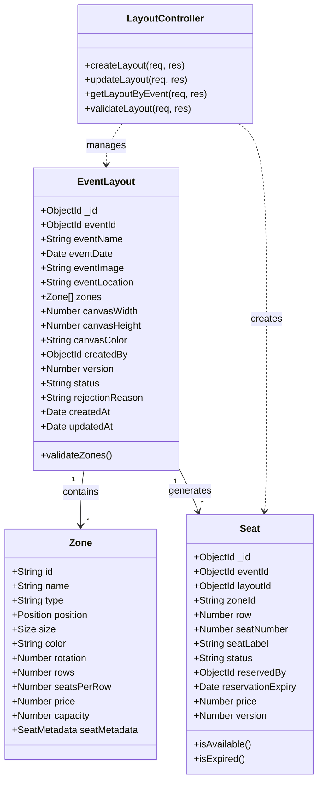
```mermaid
classDiagram
    class EventLayout {
        +ObjectId _id
        +ObjectId eventId
        +String eventName
        +Date eventDate
        +String eventImage
        +String eventLocation
        +Zone[] zones
        +Number canvasWidth
        +Number canvasHeight
        +String canvasColor
        +ObjectId createdBy
        +Number version
        +String status
        +String rejectionReason
        +Date createdAt
        +Date updatedAt
        +validateZones()
    }
    
    class Zone {
        +String id
        +String name
        +String type
        +Position position
        +Size size
        +String color
        +Number rotation
        +Number rows
        +Number seatsPerRow
        +Number price
        +Number capacity
        +SeatMetadata seatMetadata
    }
    
    class Seat {
        +ObjectId _id
        +ObjectId eventId
        +ObjectId layoutId
        +String zoneId
        +Number row
        +Number seatNumber
        +String seatLabel
        +String status
        +ObjectId reservedBy
        +Date reservationExpiry
        +Number price
        +Number version
        +isAvailable()
        +isExpired()
    }
    
    class LayoutController {
        +createLayout(req, res)
        +updateLayout(req, res)
        +getLayoutByEvent(req, res)
        +validateLayout(req, res)
    }
    
    EventLayout "1" --> "*" Zone: contains
    EventLayout "1" --> "*" Seat: generates
    LayoutController ..> EventLayout: manages
    LayoutController ..> Seat: creates
```

---

## UC-36: 360 Degree Seat View

### 1. Activity Diagram
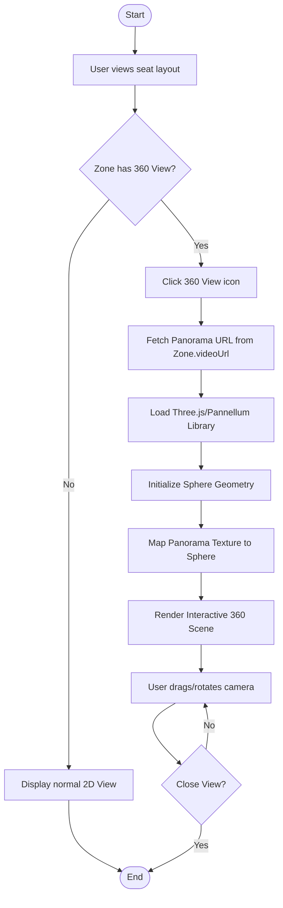
```mermaid
flowchart TD
    Start([Start]) --> A[User views seat layout]
    A --> B{Zone has 360 View?}
    B -->|No| C[Display normal 2D View]
    C --> End([End])
    B -->|Yes| D[Click 360 View icon]
    D --> E[Fetch Panorama URL from Zone.videoUrl]
    E --> F[Load Three.js/Pannellum Library]
    F --> G[Initialize Sphere Geometry]
    G --> H[Map Panorama Texture to Sphere]
    H --> I[Render Interactive 360 Scene]
    I --> J[User drags/rotates camera]
    J --> K{Close View?}
    K -->|No| J
    K -->|Yes| End
```

### 2. Sequence Diagram
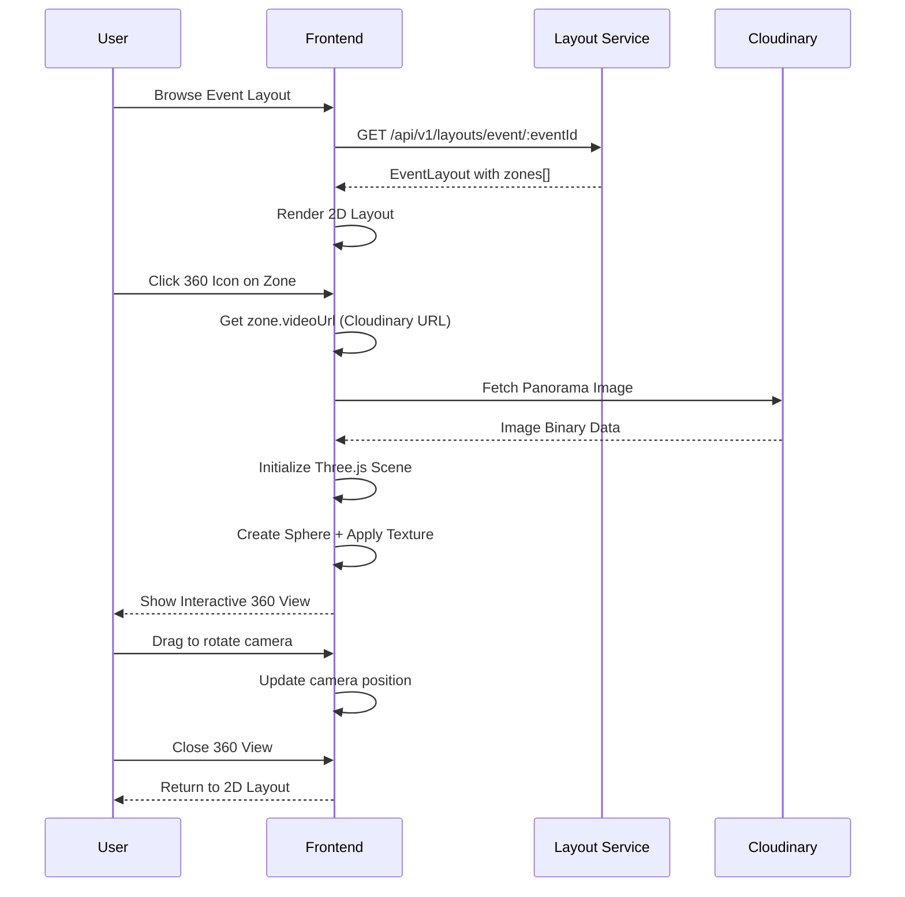
```mermaid
sequenceDiagram
    participant U as User
    participant FE as Frontend
    participant LS as Layout Service
    participant Cloud as Cloudinary
    
    U->>FE: Browse Event Layout
    FE->>LS: GET /api/v1/layouts/event/:eventId
    LS-->>FE: EventLayout with zones[]
    FE->>FE: Render 2D Layout
    U->>FE: Click 360 Icon on Zone
    FE->>FE: Get zone.videoUrl (Cloudinary URL)
    FE->>Cloud: Fetch Panorama Image
    Cloud-->>FE: Image Binary Data
    FE->>FE: Initialize Three.js Scene
    FE->>FE: Create Sphere + Apply Texture
    FE-->>U: Show Interactive 360 View
    U->>FE: Drag to rotate camera
    FE->>FE: Update camera position
    U->>FE: Close 360 View
    FE-->>U: Return to 2D Layout
```

### 3. State Diagram
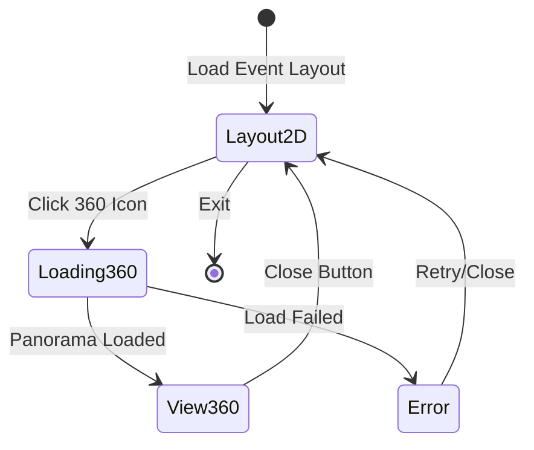
```mermaid
stateDiagram-v2
    [*] --> Layout2D: Load Event Layout
    Layout2D --> Loading360: Click 360 Icon
    Loading360 --> View360: Panorama Loaded
    Loading360 --> Error: Load Failed
    Error --> Layout2D: Retry/Close
    View360 --> Layout2D: Close Button
    Layout2D --> [*]: Exit
```

### 4. Communication Diagram
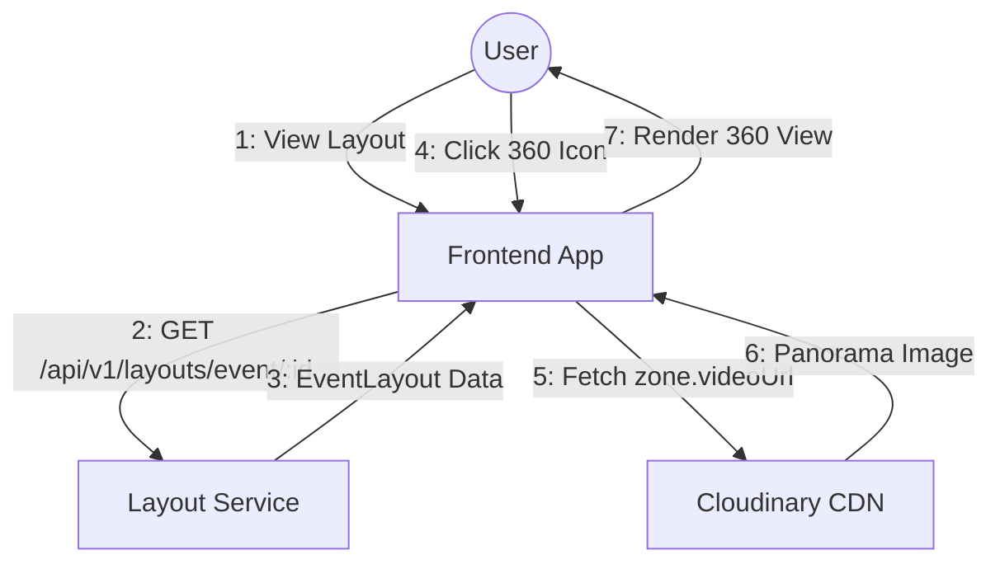
```mermaid
graph TB
    U((User)) -->|1: View Layout| FE[Frontend App]
    FE -->|2: GET /api/v1/layouts/event/:id| LS[Layout Service]
    LS -->|3: EventLayout Data| FE
    U -->|4: Click 360 Icon| FE
    FE -->|5: Fetch zone.videoUrl| Cloud[Cloudinary CDN]
    Cloud -->|6: Panorama Image| FE
    FE -->|7: Render 360 View| U
```

### 5. Class Diagram
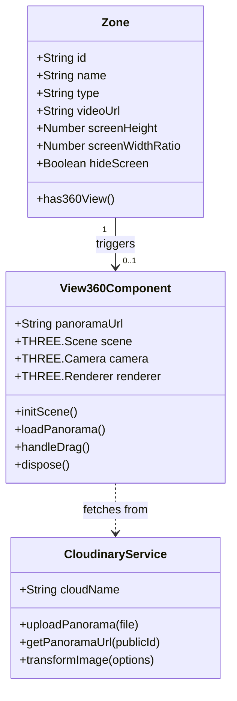
```mermaid
classDiagram
    class Zone {
        +String id
        +String name
        +String type
        +String videoUrl
        +Number screenHeight
        +Number screenWidthRatio
        +Boolean hideScreen
        +has360View()
    }
    
    class View360Component {
        +String panoramaUrl
        +THREE.Scene scene
        +THREE.Camera camera
        +THREE.Renderer renderer
        +initScene()
        +loadPanorama()
        +handleDrag()
        +dispose()
    }
    
    class CloudinaryService {
        +String cloudName
        +uploadPanorama(file)
        +getPanoramaUrl(publicId)
        +transformImage(options)
    }
    
    Zone "1" --> "0..1" View360Component: triggers
    View360Component ..> CloudinaryService: fetches from
```

---

## UC-27: Order Management

### 1. Activity Diagram
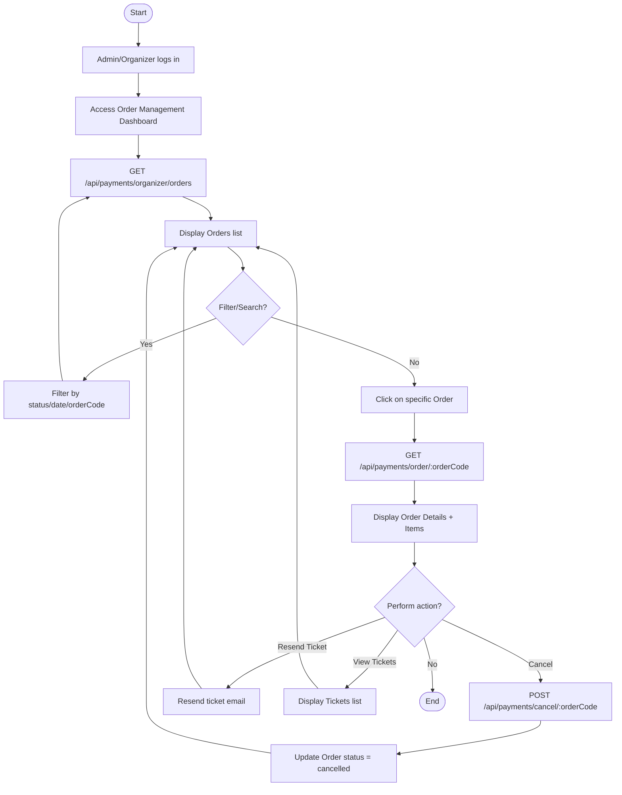
```mermaid
flowchart TD
    Start([Start]) --> A[Admin/Organizer logs in]
    A --> B[Access Order Management Dashboard]
    B --> C[GET /api/payments/organizer/orders]
    C --> D[Display Orders list]
    D --> E{Filter/Search?}
    E -->|Yes| F[Filter by status/date/orderCode]
    F --> C
    E -->|No| G[Click on specific Order]
    G --> H[GET /api/payments/order/:orderCode]
    H --> I[Display Order Details + Items]
    I --> J{Perform action?}
    J -->|Cancel| K[POST /api/payments/cancel/:orderCode]
    K --> L[Update Order status = cancelled]
    J -->|Resend Ticket| M[Resend ticket email]
    J -->|View Tickets| N[Display Tickets list]
    L --> D
    M --> D
    N --> D
    J -->|No| End([End])
```

### 2. Sequence Diagram
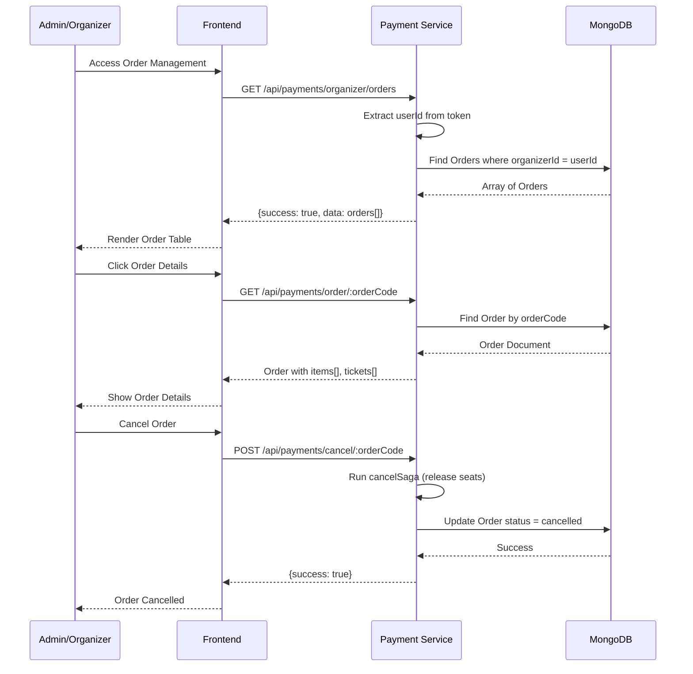
```mermaid
sequenceDiagram
    participant A as Admin/Organizer
    participant FE as Frontend
    participant PS as Payment Service
    participant DB as MongoDB
    
    A->>FE: Access Order Management
    FE->>PS: GET /api/payments/organizer/orders
    PS->>PS: Extract userId from token
    PS->>DB: Find Orders where organizerId = userId
    DB-->>PS: Array of Orders
    PS-->>FE: {success: true, data: orders[]}
    FE-->>A: Render Order Table
    
    A->>FE: Click Order Details
    FE->>PS: GET /api/payments/order/:orderCode
    PS->>DB: Find Order by orderCode
    DB-->>PS: Order Document
    PS-->>FE: Order with items[], tickets[]
    FE-->>A: Show Order Details
    
    A->>FE: Cancel Order
    FE->>PS: POST /api/payments/cancel/:orderCode
    PS->>PS: Run cancelSaga (release seats)
    PS->>DB: Update Order status = cancelled
    DB-->>PS: Success
    PS-->>FE: {success: true}
    FE-->>A: Order Cancelled
```

### 3. State Diagram
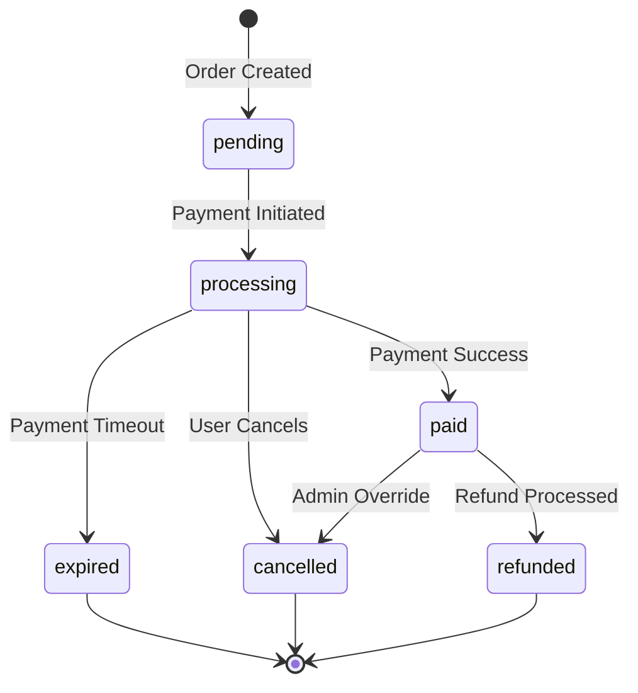
```mermaid
stateDiagram-v2
    [*] --> pending: Order Created
    pending --> processing: Payment Initiated
    processing --> paid: Payment Success
    processing --> expired: Payment Timeout
    processing --> cancelled: User Cancels
    paid --> refunded: Refund Processed
    paid --> cancelled: Admin Override
    expired --> [*]
    cancelled --> [*]
    refunded --> [*]
```

### 4. Communication Diagram
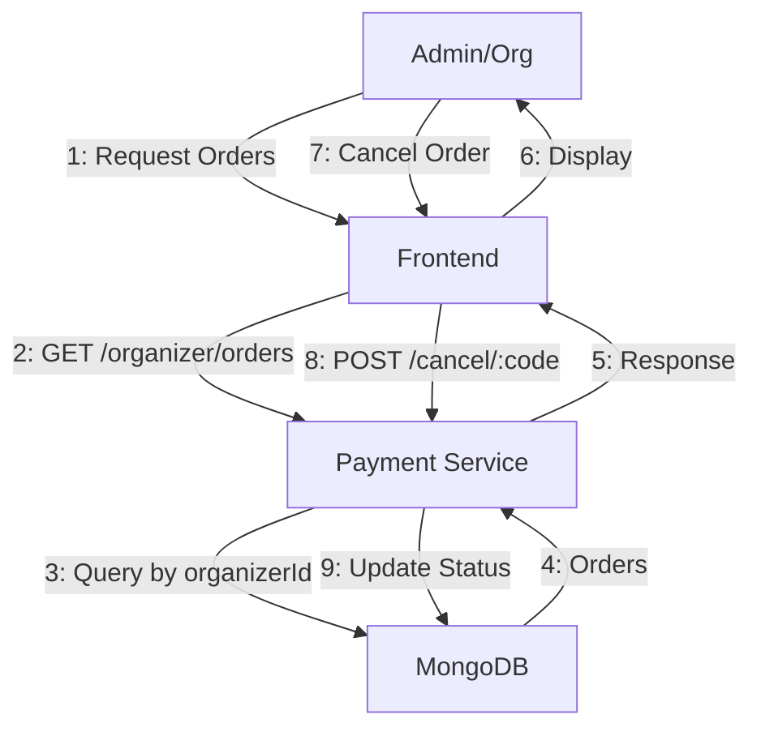
```mermaid
graph TB
    A[Admin/Org] -->|1: Request Orders| FE[Frontend]
    FE -->|2: GET /organizer/orders| PS[Payment Service]
    PS -->|3: Query by organizerId| DB[MongoDB]
    DB -->|4: Orders| PS
    PS -->|5: Response| FE
    FE -->|6: Display| A
    A -->|7: Cancel Order| FE
    FE -->|8: POST /cancel/:code| PS
    PS -->|9: Update Status| DB
```

### 5. Class Diagram
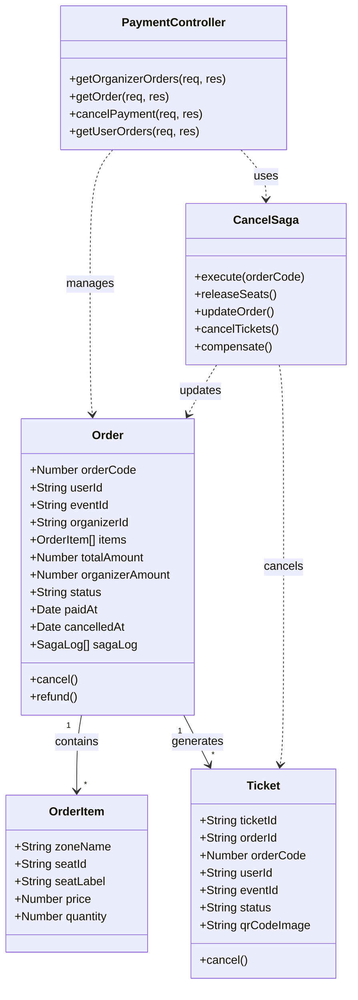
```mermaid
classDiagram
    class Order {
        +Number orderCode
        +String userId
        +String eventId
        +String organizerId
        +OrderItem[] items
        +Number totalAmount
        +Number organizerAmount
        +String status
        +Date paidAt
        +Date cancelledAt
        +SagaLog[] sagaLog
        +cancel()
        +refund()
    }
    
    class OrderItem {
        +String zoneName
        +String seatId
        +String seatLabel
        +Number price
        +Number quantity
    }
    
    class Ticket {
        +String ticketId
        +String orderId
        +Number orderCode
        +String userId
        +String eventId
        +String status
        +String qrCodeImage
        +cancel()
    }
    
    class PaymentController {
        +getOrganizerOrders(req, res)
        +getOrder(req, res)
        +cancelPayment(req, res)
        +getUserOrders(req, res)
    }
    
    class CancelSaga {
        +execute(orderCode)
        +releaseSeats()
        +updateOrder()
        +cancelTickets()
        +compensate()
    }
    
    Order "1" --> "*" OrderItem: contains
    Order "1" --> "*" Ticket: generates
    PaymentController ..> Order: manages
    PaymentController ..> CancelSaga: uses
    CancelSaga ..> Order: updates
    CancelSaga ..> Ticket: cancels
```

---

## UC-28: Export Guest List

### 1. Activity Diagram
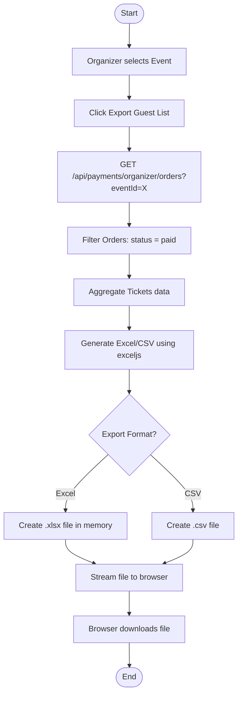
```mermaid
flowchart TD
    Start([Start]) --> A[Organizer selects Event]
    A --> B[Click Export Guest List]
    B --> C[GET /api/payments/organizer/orders?eventId=X]
    C --> D[Filter Orders: status = paid]
    D --> E[Aggregate Tickets data]
    E --> F[Generate Excel/CSV using exceljs]
    F --> G{Export Format?}
    G -->|Excel| H[Create .xlsx file in memory]
    G -->|CSV| I[Create .csv file]
    H --> J[Stream file to browser]
    I --> J
    J --> K[Browser downloads file]
    K --> End([End])
```

### 2. Sequence Diagram
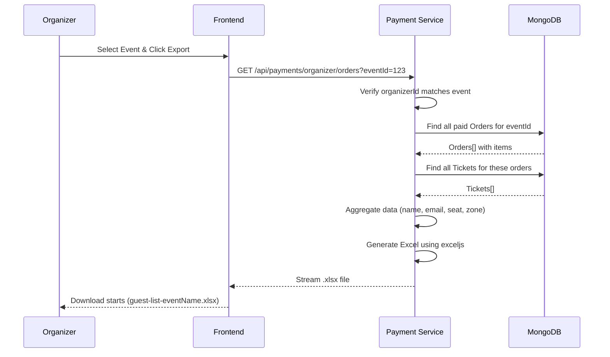
```mermaid
sequenceDiagram
    participant O as Organizer
    participant FE as Frontend
    participant PS as Payment Service
    participant DB as MongoDB
    
    O->>FE: Select Event & Click Export
    FE->>PS: GET /api/payments/organizer/orders?eventId=123
    PS->>PS: Verify organizerId matches event
    PS->>DB: Find all paid Orders for eventId
    DB-->>PS: Orders[] with items
    PS->>DB: Find all Tickets for these orders
    DB-->>PS: Tickets[]
    PS->>PS: Aggregate data (name, email, seat, zone)
    PS->>PS: Generate Excel using exceljs
    PS-->>FE: Stream .xlsx file
    FE-->>O: Download starts (guest-list-eventName.xlsx)
```

### 3. State Diagram
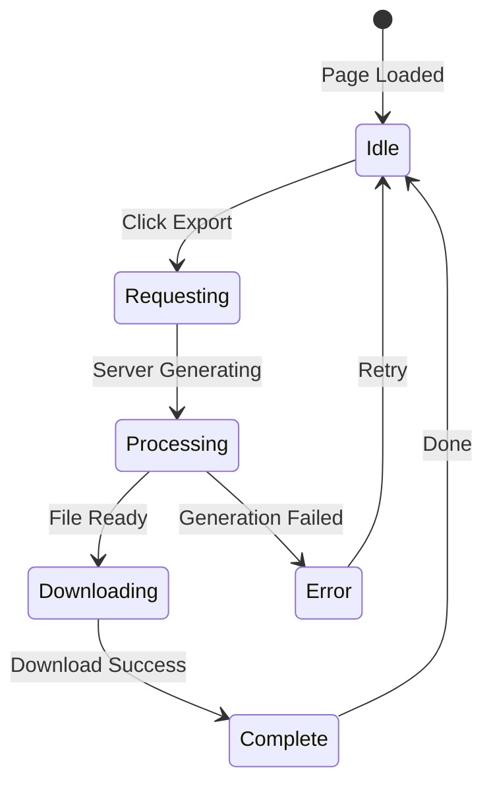
```mermaid
stateDiagram-v2
    [*] --> Idle: Page Loaded
    Idle --> Requesting: Click Export
    Requesting --> Processing: Server Generating
    Processing --> Downloading: File Ready
    Processing --> Error: Generation Failed
    Downloading --> Complete: Download Success
    Error --> Idle: Retry
    Complete --> Idle: Done
```

### 4. Communication Diagram
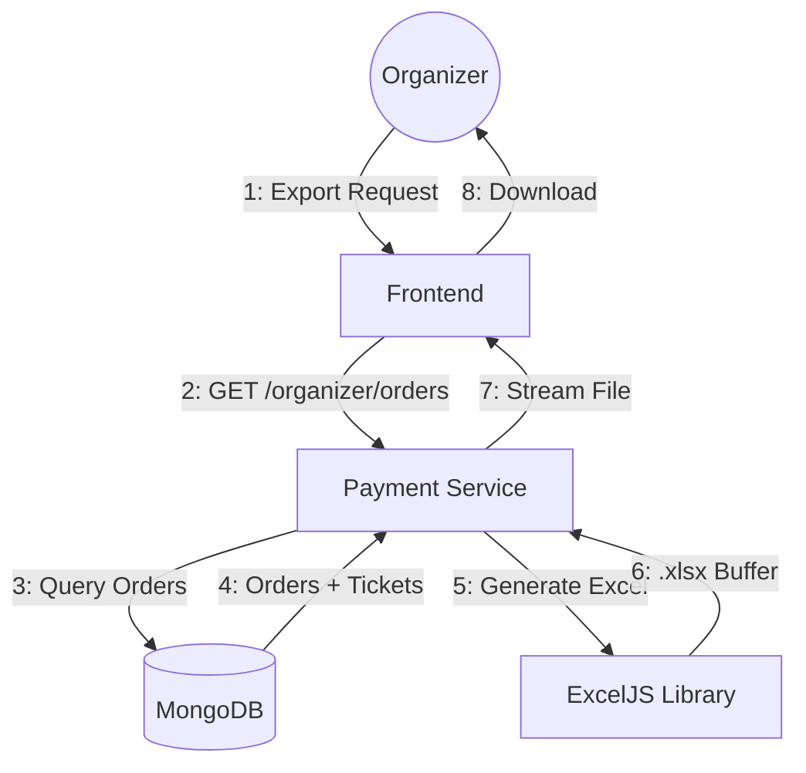
```mermaid
graph TB
    O((Organizer)) -->|1: Export Request| FE[Frontend]
    FE -->|2: GET /organizer/orders| PS[Payment Service]
    PS -->|3: Query Orders| DB[(MongoDB)]
    DB -->|4: Orders + Tickets| PS
    PS -->|5: Generate Excel| Excel[ExcelJS Library]
    Excel -->|6: .xlsx Buffer| PS
    PS -->|7: Stream File| FE
    FE -->|8: Download| O
```

### 5. Class Diagram
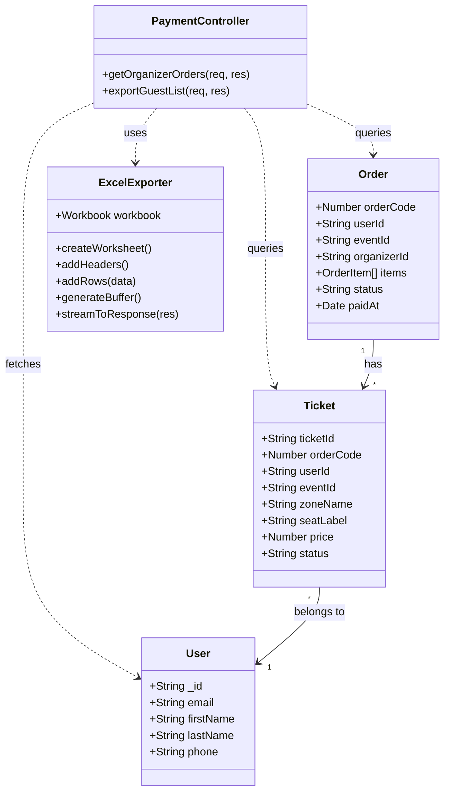
```mermaid
classDiagram
    class PaymentController {
        +getOrganizerOrders(req, res)
        +exportGuestList(req, res)
    }
    
    class Order {
        +Number orderCode
        +String userId
        +String eventId
        +String organizerId
        +OrderItem[] items
        +String status
        +Date paidAt
    }
    
    class Ticket {
        +String ticketId
        +Number orderCode
        +String userId
        +String eventId
        +String zoneName
        +String seatLabel
        +Number price
        +String status
    }
    
    class User {
        +String _id
        +String email
        +String firstName
        +String lastName
        +String phone
    }
    
    class ExcelExporter {
        +Workbook workbook
        +createWorksheet()
        +addHeaders()
        +addRows(data)
        +generateBuffer()
        +streamToResponse(res)
    }
    
    PaymentController ..> Order: queries
    PaymentController ..> Ticket: queries
    PaymentController ..> User: fetches
    PaymentController ..> ExcelExporter: uses
    Order "1" --> "*" Ticket: has
    Ticket "*" --> "1" User: belongs to
```

---

## UC-29: Analytics & Reporting

### 1. Activity Diagram
```mermaid
flowchart TD
    Start([Start]) --> A[Admin/Organizer logs in]
    A --> B[Access Analytics Dashboard]
    B --> C[GET /api/analytics/overview]
    C --> D[MongoDB Aggregation Pipeline]
    D --> E[Calculate Total Revenue]
    D --> F[Calculate Tickets Sold]
    D --> G[Calculate Occupancy Rate]
    E --> H[Group by Day/Month]
    F --> H
    G --> H
    H --> I[Return Analytics JSON]
    I --> J[Frontend renders Charts]
    J --> K[Display Bar Chart: Revenue]
    J --> L[Display Line Chart: Tickets Sold]
    J --> M[Display Pie Chart: Zone Distribution]
    K --> End([End])
    L --> End
    M --> End
```

### 2. Sequence Diagram
```mermaid
sequenceDiagram
    participant A as Admin/Organizer
    participant FE as Frontend
    participant PS as Payment Service
    participant DB as MongoDB
    
    A->>FE: Access Analytics Dashboard
    FE->>PS: GET /api/analytics/overview
    PS->>PS: Extract userId & role from token
    PS->>DB: Aggregate Orders (organizerId filter)
    Note over DB: $match: {status: 'paid', organizerId: userId}<br/>$group: {_id: '$eventId', revenue: {$sum: '$organizerAmount'}}
    DB-->>PS: Aggregated Data
    PS->>DB: Count Tickets by status
    DB-->>PS: Ticket Counts
    PS->>PS: Calculate Occupancy Rate
    PS-->>FE: {revenue, ticketsSold, occupancyRate, chartData}
    FE->>FE: Render Charts (Chart.js/Recharts)
    FE-->>A: Display Dashboard
```

### 3. State Diagram
```mermaid
stateDiagram-v2
    [*] --> Loading: Page Load
    Loading --> Fetching: Request Analytics
    Fetching --> Processing: Data Received
    Processing --> Displayed: Charts Rendered
    Fetching --> Error: Request Failed
    Error --> Loading: Retry
    Displayed --> Refreshing: User Refresh
    Refreshing --> Fetching: Re-request Data
```

### 4. Communication Diagram
```mermaid
graph TB
    A((Admin/Org)) -->|1: View Dashboard| FE[Frontend]
    FE -->|2: GET /analytics/overview| PS[Payment Service]
    PS -->|3: Aggregate Query| DB[(MongoDB)]
    DB -->|4: Revenue Data| PS
    DB -->|5: Ticket Data| PS
    PS -->|6: Calculate Metrics| PS
    PS -->|7: Analytics JSON| FE
    FE -->|8: Render Charts| Chart[Chart Library]
    Chart -->|9: Display| A
```

### 5. Class Diagram
```mermaid
classDiagram
    class AnalyticsController {
        +getOverviewAnalytics(req, res)
        +getAdminEventRevenues(req, res)
        +calculateOccupancyRate()
        +groupByTimePeriod()
    }
    
    class Order {
        +Number orderCode
        +String organizerId
        +String eventId
        +Number totalAmount
        +Number organizerAmount
        +Number commissionAmount
        +String status
        +Date paidAt
        +Date createdAt
    }
    
    class Ticket {
        +String ticketId
        +String eventId
        +String status
        +Number price
        +Date createdAt
    }
    
    class AnalyticsData {
        +Number totalRevenue
        +Number totalTicketsSold
        +Number occupancyRate
        +ChartData[] revenueByDay
        +ChartData[] ticketsByEvent
        +ZoneDistribution[] zoneStats
    }
    
    class ChartData {
        +String label
        +Number value
        +Date date
    }
    
    class MongoAggregation {
        +pipeline[]
        +match(filter)
        +group(groupBy)
        +sum(field)
        +count()
        +execute()
    }
    
    AnalyticsController ..> Order: aggregates
    AnalyticsController ..> Ticket: counts
    AnalyticsController ..> MongoAggregation: uses
    AnalyticsController ..> AnalyticsData: returns
    AnalyticsData "1" --> "*" ChartData: contains
```

---

## UC-30: AI Pricing Suggestion

### 1. Activity Diagram
```mermaid
flowchart TD
    Start([Start]) --> A[Organizer creates Event Layout]
    A --> B[Input info: Category, Capacity, Location]
    B --> C[Click Request Pricing Suggestion]
    C --> D[POST /api/v1/layouts/pricing-suggestion]
    D --> E[Fetch historical events data]
    E --> F[Filter by similar category & location]
    F --> G[Calculate average price by capacity range]
    G --> H[Analyze sell-through rate]
    H --> I[Run Linear Regression Model]
    I --> J[Generate 3 price options]
    J --> K[Low: -20% from avg]
    J --> L[Medium: avg price]
    J --> M[High: +20% from avg]
    K --> N[Return suggestions to Frontend]
    L --> N
    M --> N
    N --> O[Display price comparison cards]
    O --> P{Organizer selects?}
    P -->|Yes| Q[Apply selected price to zones]
    P -->|No| R[Manual input]
    Q --> End([End])
    R --> End
```

### 2. Sequence Diagram
```mermaid
sequenceDiagram
    participant O as Organizer
    participant FE as Frontend
    participant LS as Layout Service
    participant AI as AI Pricing Engine
    participant DB as MongoDB
    
    O->>FE: Request Pricing Recommendation
    FE->>LS: POST /api/v1/layouts/pricing-suggestion
    Note over FE,LS: {category, capacity, location, eventDate}
    LS->>DB: Find similar events (category, location)
    DB-->>LS: Historical Events[]
    LS->>AI: Analyze(events, capacity, date)
    AI->>AI: Calculate avg price by capacity
    AI->>AI: Analyze sell-through rate
    AI->>AI: Run regression model
    AI-->>LS: Price Suggestions {low, medium, high}
    LS-->>FE: {suggestions[], reasoning}
    FE-->>O: Display 3 options with comparison
    O->>FE: Select Medium Price
    FE->>FE: Apply to all zones
```

### 3. State Diagram
```mermaid
stateDiagram-v2
    [*] --> Idle: Layout Editor Open
    Idle --> Requesting: Click Get Suggestion
    Requesting --> Calculating: Data Fetched
    Calculating --> ResultReady: AI Completed
    Calculating --> Error: Insufficient Data
    ResultReady --> Applied: User Selects Option
    ResultReady --> Manual: User Rejects
    Error --> Idle: Retry
    Applied --> [*]
    Manual --> [*]
```

### 4. Communication Diagram
```mermaid
graph TB
    O((Organizer)) -->|1: Request Pricing| FE[Frontend]
    FE -->|2: POST /pricing-suggestion| LS[Layout Service]
    LS -->|3: Query Similar Events| DB[(MongoDB)]
    DB -->|4: Historical Data| LS
    LS -->|5: Analyze Data| AI[AI Engine]
    AI -->|6: Price Suggestions| LS
    LS -->|7: Response| FE
    FE -->|8: Display Options| O
```

### 5. Class Diagram
```mermaid
classDiagram
    class PricingSuggestionRequest {
        +String category
        +Number capacity
        +String location
        +Date eventDate
        +String[] tags
    }
    
    class PricingSuggestionResponse {
        +PriceOption low
        +PriceOption medium
        +PriceOption high
        +String reasoning
        +Number confidence
    }
    
    class PriceOption {
        +Number price
        +Number expectedSellThrough
        +Number projectedRevenue
        +String description
    }
    
    class AIAnalysisEngine {
        +analyzeHistoricalData(events)
        +calculateAveragePrice(capacity)
        +predictSellThroughRate(price)
        +runLinearRegression(data)
        +generateSuggestions()
    }
    
    class EventLayout {
        +String category
        +Number totalCapacity
        +String location
        +Zone[] zones
        +Number minPrice
        +Date eventDate
    }
    
    class LayoutController {
        +getPricingSuggestion(req, res)
        +applyPricingToZones(layoutId, price)
    }
    
    LayoutController ..> PricingSuggestionRequest: receives
    LayoutController ..> AIAnalysisEngine: uses
    LayoutController ..> EventLayout: queries
    AIAnalysisEngine ..> PricingSuggestionResponse: generates
    PricingSuggestionResponse "1" --> "3" PriceOption: contains
```

---

## UC-37: Event Approval

### 1. Activity Diagram
```mermaid
flowchart TD
    Start([Start]) --> A[Organizer submits Event Layout]
    A --> B[Layout status = draft]
    B --> C[Admin receives notification]
    C --> D[GET /api/v1/approval/admin/pending]
    D --> E[Display pending Events list]
    E --> F[Admin clicks Review Event]
    F --> G[GET /api/v1/approval/:eventId/review]
    G --> H[View Layout details, Zones, Pricing]
    H --> I{Meets standards?}
    I -->|Yes| J[Click Approve]
    J --> K[PATCH /api/v1/approval/:eventId/approve]
    K --> L[Update status = published]
    L --> M[Publish event to RabbitMQ]
    M --> N[Send notification to Organizer]
    N --> End([End])
    I -->|No| O[Click Reject]
    O --> P[Enter rejection reason]
    P --> Q[PATCH /api/v1/approval/:eventId/reject]
    Q --> R[Update status = rejected]
    R --> S[Save rejectionReason]
    S --> T[Send rejection email to Organizer]
    T --> End
```

### 2. Sequence Diagram
```mermaid
sequenceDiagram
    participant A as Admin
    participant FE as Frontend
    participant LS as Layout Service
    participant RMQ as RabbitMQ
    participant DB as MongoDB
    participant Email as Email Service
    
    A->>FE: Access Approval Dashboard
    FE->>LS: GET /api/v1/approval/admin/pending
    LS->>DB: Find EventLayouts where status = 'draft'
    DB-->>LS: Pending Events[]
    LS-->>FE: Events List
    FE-->>A: Display Pending Events
    
    A->>FE: Click Approve Event
    FE->>LS: PATCH /api/v1/approval/:eventId/approve
    LS->>DB: Update EventLayout {status: 'published', approvedBy, approvedAt}
    DB-->>LS: Success
    LS->>RMQ: Publish event.approved message
    RMQ-->>LS: ACK
    LS->>Email: Send approval notification
    LS-->>FE: {success: true}
    FE-->>A: Event Approved Successfully
```

### 3. State Diagram
```mermaid
stateDiagram-v2
    [*] --> draft: Layout Created
    draft --> draft: Organizer Edits
    draft --> pending: Submit for Review
    pending --> published: Admin Approves
    pending --> rejected: Admin Rejects
    rejected --> draft: Organizer Fixes
    published --> completed: Event Ends
    completed --> [*]
```

### 4. Communication Diagram
```mermaid
graph TB
    A((Admin)) -->|1: Review Request| FE[Frontend]
    FE -->|2: GET /admin/pending| LS[Layout Service]
    LS -->|3: Query Events| DB[(MongoDB)]
    DB -->|4: Pending Events| LS
    LS -->|5: Response| FE
    A -->|6: Approve/Reject| FE
    FE -->|7: PATCH /approve or /reject| LS
    LS -->|8: Update Status| DB
    LS -->|9: Publish Event| RMQ[RabbitMQ]
    LS -->|10: Send Email| Email[Email Service]
```

### 5. Class Diagram
```mermaid
classDiagram
    class EventLayout {
        +ObjectId _id
        +ObjectId eventId
        +String eventName
        +Zone[] zones
        +String status
        +String rejectionReason
        +ObjectId approvedBy
        +Date approvedAt
        +ObjectId createdBy
        +approve(adminId)
        +reject(adminId, reason)
    }
    
    class EventApprovalController {
        +getPendingEvents(req, res)
        +getEventForReview(req, res)
        +approveEvent(req, res)
        +rejectEvent(req, res)
        +processEventPayout(req, res)
    }
    
    class RabbitMQService {
        +Channel channel
        +publishEventApproved(eventData)
        +publishEventRejected(eventData)
        +connect()
        +close()
    }
    
    class EmailService {
        +sendApprovalNotification(organizer, event)
        +sendRejectionNotification(organizer, event, reason)
    }
    
    class Admin {
        +ObjectId _id
        +String email
        +String role
        +verifyAdmin()
    }
    
    EventApprovalController ..> EventLayout: manages
    EventApprovalController ..> RabbitMQService: publishes
    EventApprovalController ..> EmailService: sends
    EventApprovalController ..> Admin: verifies
    EventLayout --> Admin: approvedBy
```

---

## UC-38: User Management

### 1. Activity Diagram
```mermaid
flowchart TD
    Start([Start]) --> A[Admin logs in]
    A --> B[Access User Management]
    B --> C[GET /api/users?page=1&limit=10]
    C --> D[Display Users list]
    D --> E{Search/Filter?}
    E -->|Yes| F[Filter by role/email/status]
    F --> C
    E -->|No| G[Click on User]
    G --> H[GET /api/users/:userId]
    H --> I[Display User Details]
    I --> J{Perform action?}
    J -->|Lock| K[PATCH /api/users/:userId]
    K --> L[Update isActive = false]
    L --> M[Log action to UserLogs]
    M --> D
    J -->|Unlock| N[PATCH /api/users/:userId]
    N --> O[Update isActive = true]
    O --> M
    J -->|Change Role| P[Update role field]
    P --> M
    J -->|View History| Q[Fetch user activity logs]
    Q --> D
    J -->|No| End([End])
```

### 2. Sequence Diagram
```mermaid
sequenceDiagram
    participant A as Admin
    participant FE as Frontend
    participant AS as Auth Service
    participant DB as MongoDB
    
    A->>FE: Access User Management
    FE->>AS: GET /api/users?page=1&limit=10
    AS->>AS: Verify admin role
    AS->>DB: Find Users with pagination
    DB-->>AS: Users[] (without password)
    AS-->>FE: {success: true, data: users[], pagination}
    FE-->>A: Display User Table
    
    A->>FE: Search by email
    FE->>AS: GET /api/users?email=user@example.com
    AS->>DB: Find User by email
    DB-->>AS: User Document
    AS-->>FE: User Data
    
    A->>FE: Click Lock User
    FE->>AS: PATCH /api/users/:userId {isActive: false}
    AS->>AS: Verify admin role
    AS->>DB: Update User {isActive: false}
    AS->>DB: Create UserLog {action: 'lock', adminId, reason}
    DB-->>AS: Success
    AS-->>FE: {success: true, message: 'User locked'}
    FE-->>A: User Locked Successfully
```

### 3. State Diagram
```mermaid
stateDiagram-v2
    [*] --> Active: User Registered
    Active --> Banned: Admin Locks
    Banned --> Active: Admin Unlocks
    Active --> Suspended: Violation Detected
    Suspended --> Active: Appeal Approved
    Suspended --> Banned: Appeal Rejected
    Banned --> [*]: Account Deleted
```

### 4. Communication Diagram
```mermaid
graph TB
    A((Admin)) -->|1: Manage Users| FE[Frontend]
    FE -->|2: GET /api/users| AS[Auth Service]
    AS -->|3: Query Users| DB[(MongoDB)]
    DB -->|4: Users[]| AS
    AS -->|5: Response| FE
    A -->|6: Lock/Unlock| FE
    FE -->|7: PATCH /users/:id| AS
    AS -->|8: Update isActive| DB
    AS -->|9: Log Action| Logs[(UserLogs)]
```

### 5. Class Diagram
```mermaid
classDiagram
    class User {
        +ObjectId _id
        +String email
        +String password
        +String firstName
        +String lastName
        +String phone
        +String role
        +Boolean isActive
        +Boolean emailVerified
        +Date lastLogin
        +Number totalBookings
        +Date createdAt
        +comparePassword()
        +lock()
        +unlock()
    }
    
    class UserController {
        +getCurrentUser(req, res)
        +updateCurrentUser(req, res)
        +createStaff(req, res)
        +getStaffList(req, res)
        +updateStaff(req, res)
        +deleteStaff(req, res)
    }
    
    class AdminUserController {
        +getAllUsers(req, res)
        +getUserById(req, res)
        +updateUser(req, res)
        +lockUser(req, res)
        +unlockUser(req, res)
    }
    
    class UserLog {
        +ObjectId _id
        +ObjectId userId
        +ObjectId adminId
        +String action
        +String reason
        +Date timestamp
        +Object metadata
    }
    
    class AuthMiddleware {
        +verifyToken(req, res, next)
        +roleCheck(roles)
        +extractUserId(req, res, next)
    }
    
    UserController ..> User: manages
    AdminUserController ..> User: manages
    AdminUserController ..> UserLog: creates
    AuthMiddleware ..> User: verifies
    UserLog "*" --> "1" User: tracks
```

---

## UC-40: Complaints Management

### 1. Activity Diagram
```mermaid
flowchart TD
    Start([Start]) --> A[User encounters issue]
    A --> B[Click Support/Help]
    B --> C[Fill complaint form]
    C --> D[Upload screenshot/attachment]
    D --> E[POST /api/complaints]
    E --> F[Create Complaint Document]
    F --> G[Send notification to Admin]
    G --> H[Admin receives notification]
    H --> I[GET /api/complaints/pending]
    I --> J[View Complaints list]
    J --> K[Click on Complaint]
    K --> L[GET /api/complaints/:id]
    L --> M[View details: Order, Payment, Ticket]
    M --> N{Decision?}
    N -->|Resolve| O[POST /complaints/:id/resolve]
    O --> P[Update status = resolved]
    P --> Q[Send resolution email]
    Q --> End([End])
    N -->|Refund| R[Process refund]
    R --> S[Update Order status]
    S --> Q
    N -->|Decline| T[POST /complaints/:id/decline]
    T --> U[Update status = declined]
    U --> V[Send decline reason email]
    V --> End
```

### 2. Sequence Diagram
```mermaid
sequenceDiagram
    participant U as User
    participant FE as Frontend
    participant SS as Support Service
    participant Cloud as Cloudinary
    participant Admin as Admin Panel
    participant Email as Email Service
    
    U->>FE: Submit Complaint Form
    FE->>Cloud: Upload attachment (if any)
    Cloud-->>FE: Attachment URL
    FE->>SS: POST /api/complaints
    Note over FE,SS: {userId, orderId, subject, description, attachment, severity}
    SS->>SS: Create Complaint Document
    SS->>Admin: Send notification (WebSocket/Polling)
    SS-->>FE: {success: true, complaintId}
    FE-->>U: Complaint Submitted
    
    Admin->>SS: GET /api/complaints/pending
    SS-->>Admin: Complaints[]
    Admin->>SS: GET /api/complaints/:id
    SS-->>Admin: Complaint Details + Order + Tickets
    
    Admin->>SS: POST /api/complaints/:id/resolve
    Note over Admin,SS: {resolution, action: 'refund'/'fixed'}
    SS->>SS: Update status = resolved
    SS->>Email: Send resolution email to user
    SS-->>Admin: {success: true}
```

### 3. State Diagram
```mermaid
stateDiagram-v2
    [*] --> open: Complaint Submitted
    open --> inProgress: Admin Reading
    inProgress --> resolved: Issue Fixed
    inProgress --> declined: Rejected
    inProgress --> escalated: Needs Higher Review
    escalated --> inProgress: Assigned to Senior
    resolved --> [*]
    declined --> [*]
```

### 4. Communication Diagram
```mermaid
graph TB
    U((User)) -->|1: Submit Complaint| FE[Frontend]
    FE -->|2: Upload Attachment| Cloud[Cloudinary]
    Cloud -->|3: URL| FE
    FE -->|4: POST /complaints| SS[Support Service]
    SS -->|5: Notify| Admin[Admin Panel]
    SS -->|6: Store| DB[(MongoDB)]
    Admin -->|7: Resolve| SS
    SS -->|8: Send Email| Email[Email Service]
    Email -->|9: Notification| U
```

### 5. Class Diagram
```mermaid
classDiagram
    class Complaint {
        +ObjectId _id
        +ObjectId userId
        +String orderId
        +String subject
        +String description
        +String severity
        +String status
        +String attachment
        +String resolution
        +ObjectId assignedTo
        +Date createdAt
        +Date resolvedAt
        +resolve(resolution)
        +decline(reason)
        +escalate()
    }
    
    class ComplaintController {
        +createComplaint(req, res)
        +getPendingComplaints(req, res)
        +getComplaintById(req, res)
        +resolveComplaint(req, res)
        +declineComplaint(req, res)
        +escalateComplaint(req, res)
    }
    
    class User {
        +ObjectId _id
        +String email
        +String firstName
        +String lastName
    }
    
    class Order {
        +Number orderCode
        +String userId
        +String status
        +Number totalAmount
    }
    
    class SupportTicket {
        +ObjectId complaintId
        +String ticketNumber
        +String priority
        +Date slaDeadline
    }
    
    class EmailService {
        +sendComplaintConfirmation(user, complaint)
        +sendResolutionEmail(user, complaint)
        +sendDeclineEmail(user, complaint, reason)
    }
    
    ComplaintController ..> Complaint: manages
    ComplaintController ..> EmailService: uses
    Complaint "*" --> "1" User: submitted by
    Complaint "*" --> "1" Order: relates to
    Complaint "1" --> "0..1" SupportTicket: generates
```

**Note:** UC-40 is not yet implemented in the current system. The class diagram above is a proposed design for future implementation.

---

## UC-41: Banner Management

### 1. Activity Diagram
```mermaid
flowchart TD
    Start([Start]) --> A[Admin accesses Banner Management]
    A --> B[Click Upload New Banner]
    B --> C[Select image file]
    C --> D[POST /api/v1/layouts/upload-banner]
    D --> E[Upload to Cloudinary]
    E --> F[Receive secure URL]
    F --> G[POST /api/banners]
    G --> H[Input banner details]
    H --> I[Link: Event ID or External URL]
    I --> J[Set display order]
    J --> K[Set status: visible/hidden]
    K --> L[Save Banner Document]
    L --> M{Publish?}
    M -->|Yes| N[Update status = visible]
    M -->|No| O[Keep status = hidden]
    N --> P[Banner live on homepage]
    O --> P
    P --> End([End])
```

### 2. Sequence Diagram
```mermaid
sequenceDiagram
    participant A as Admin
    participant FE as Frontend
    participant LS as Layout Service
    participant Cloud as Cloudinary
    participant DB as MongoDB
    
    A->>FE: Upload Banner Image
    FE->>LS: POST /api/v1/layouts/upload-banner (multipart/form-data)
    LS->>Cloud: Upload to 'event-banners' folder
    Note over Cloud: Transform: width=1200, crop=limit
    Cloud-->>LS: {url: 'https://res.cloudinary.com/...'}
    LS-->>FE: {success: true, data: {url}}
    
    FE->>FE: Admin fills banner details
    FE->>LS: POST /api/v1/banners
    Note over FE,LS: {imageUrl, link, title, orderId, status}
    LS->>DB: Save Banner Document
    DB-->>LS: Success
    LS-->>FE: {success: true, data: banner}
    FE-->>A: Banner Created
    
    Note over A,FE: User opens app homepage
    FE->>LS: GET /api/v1/banners?status=visible
    LS->>DB: Find Banners where status='visible'
    DB-->>LS: Banners[] sorted by orderId
    LS-->>FE: Active Banners
    FE-->>A: Display Banner Carousel
```

### 3. State Diagram
```mermaid
stateDiagram-v2
    [*] --> draft: Banner Created
    draft --> visible: Admin Publishes
    visible --> hidden: Admin Hides
    hidden --> visible: Admin Re-publishes
    hidden --> archived: Admin Archives
    visible --> archived: Campaign Ends
    archived --> [*]
```

### 4. Communication Diagram
```mermaid
graph TB
    A((Admin)) -->|1: Upload Image| FE[Frontend]
    FE -->|2: POST /upload-banner| LS[Layout Service]
    LS -->|3: Upload| Cloud[Cloudinary]
    Cloud -->|4: Secure URL| LS
    LS -->|5: Response| FE
    FE -->|6: POST /banners| LS
    LS -->|7: Save| DB[(MongoDB)]
    DB -->|8: Banner Doc| LS
    LS -->|9: Success| FE
    FE -->|10: Display| A
```

### 5. Class Diagram
```mermaid
classDiagram
    class Banner {
        +ObjectId _id
        +String imageUrl
        +String title
        +String description
        +String link
        +String linkType
        +Number orderId
        +String status
        +Date startDate
        +Date endDate
        +Number clickCount
        +Date createdAt
        +Date updatedAt
        +publish()
        +hide()
        +archive()
        +incrementClick()
    }
    
    class BannerController {
        +uploadBannerImage(req, res)
        +createBanner(req, res)
        +getAllBanners(req, res)
        +getActiveBanners(req, res)
        +updateBanner(req, res)
        +deleteBanner(req, res)
        +reorderBanners(req, res)
    }
    
    class CloudinaryService {
        +String cloudName
        +String apiKey
        +uploadImage(file, folder)
        +deleteImage(publicId)
        +transformImage(url, options)
    }
    
    class MulterMiddleware {
        +CloudinaryStorage storage
        +fileFilter(req, file, cb)
        +limits
        +single(fieldName)
    }
    
    BannerController ..> Banner: manages
    BannerController ..> CloudinaryService: uses
    BannerController ..> MulterMiddleware: uses
    Banner --> CloudinaryService: imageUrl stored
```

**API Endpoints:**
- `POST /api/v1/layouts/upload-banner` - Upload image to Cloudinary
- `POST /api/v1/banners` - Create new banner
- `GET /api/v1/banners` - Get all banners (admin)
- `GET /api/v1/banners?status=visible` - Get active banners (public)
- `PATCH /api/v1/banners/:id` - Update banner
- `DELETE /api/v1/banners/:id` - Delete banner
- `PATCH /api/v1/banners/reorder` - Reorder banners

**Note:** Banner management is not fully implemented in the current system. Only the upload-banner endpoint exists. The class diagram above is a proposed design.

---

# UML Diagram Drawing Guide

## 1. Mermaid (Recommended for Markdown)

### Advantages:
- Direct integration into Markdown
- Renders on GitHub, GitLab, VS Code
- Simple syntax, easy to learn
- Version control friendly (text-based)
- Free, open source

### Disadvantages:
- Limited layout customization
- Doesn't support all UML diagram types
- Difficult to draw complex diagrams

### When to use:
- Documentation in Git repository
- Quick diagrams for team review
- CI/CD documentation
- README files

### Supported Diagrams:
- ✅ Flowchart / Activity Diagram
- ✅ Sequence Diagram
- ✅ Class Diagram
- ✅ State Diagram
- ✅ ER Diagram
- ✅ Gantt Chart
- ❌ Component Diagram (limited)
- ❌ Deployment Diagram (limited)

### Example:
```mermaid
classDiagram
    class User {
        +String email
        +String password
        +login()
    }
```

**Live Editor:** https://mermaid.live/

---

## 2. PlantUML

### Advantages:
- Full support for all UML diagrams
- Powerful, flexible syntax
- Export to multiple formats (PNG, SVG, PDF)
- Integrates with VS Code, IntelliJ
- Has online render server

### Disadvantages:
- Requires Java + Graphviz installation
- More complex syntax than Mermaid
- Difficult to debug large diagrams

### When to use:
- Need to draw complex, detailed diagrams
- Export high-quality images for reports
- Need full UML standard compliance
- Academic/Professional documentation

### Supported Diagrams:
- ✅ All UML 2.0 diagrams
- ✅ Component Diagram
- ✅ Deployment Diagram
- ✅ Use Case Diagram
- ✅ Timing Diagram
- ✅ Network Diagram

### Example:
```plantuml
@startuml
class User {
  +String email
  +String password
  +login()
}
@enduml
```

**Installation:**
```bash
# Install Java (required)
# Install Graphviz
brew install graphviz  # macOS
choco install graphviz # Windows

# VS Code Extension
# Search: "PlantUML" by jebbs
```

**Online Editor:** http://www.plantuml.com/plantuml/uml/

---

## 3. StarUML (GUI Tool)

### Advantages:
- Professional GUI interface
- Drag-and-drop design
- Full UML 2.0 support
- Code generation (Java, C++, C#)
- Reverse engineering from code
- Template library

### Disadvantages:
- Paid license required ($99)
- Binary files, difficult for version control
- No Git workflow integration
- Heavy application

### When to use:
- Need to draw complex diagrams with GUI
- Generate code from diagrams
- Reverse engineer existing codebase
- Professional presentations
- Academic projects

### Features:
- ✅ All UML diagrams
- ✅ Code generation
- ✅ Reverse engineering
- ✅ Model-driven development
- ✅ Export to image/PDF
- ✅ Team collaboration (with license)

**Download:** https://staruml.io/

**Alternative Free Tools:**
- **Draw.io (diagrams.net)** - Free, web-based, good for general diagrams
- **Lucidchart** - Freemium, collaborative
- **Visual Paradigm Community Edition** - Free for non-commercial

---

## Comparison and Recommendations

| Criteria | Mermaid | PlantUML | StarUML |
|----------|---------|----------|---------|
| **Price** | Free | Free | $99 |
| **Ease of Use** | ⭐⭐⭐⭐⭐ | ⭐⭐⭐ | ⭐⭐⭐⭐ |
| **Git Integration** | ⭐⭐⭐⭐⭐ | ⭐⭐⭐⭐ | ⭐ |
| **UML Coverage** | ⭐⭐⭐ | ⭐⭐⭐⭐⭐ | ⭐⭐⭐⭐⭐ |
| **Export Quality** | ⭐⭐⭐ | ⭐⭐⭐⭐ | ⭐⭐⭐⭐⭐ |
| **Learning Curve** | Low | Medium | Low |

### Recommendations for this project:

1. **Mermaid** - Use for:
   - Activity Diagrams
   - Sequence Diagrams
   - State Diagrams
   - Class Diagrams (simple)
   - Communication Diagrams (using flowchart)

2. **PlantUML** - Use for:
   - Complex Class Diagrams (many relationships)
   - Component Diagrams
   - Deployment Diagrams
   - Use Case Diagrams

3. **StarUML** - Use when:
   - Need to generate code from diagrams
   - Reverse engineer existing code
   - Presentations for stakeholders
   - Academic submissions

### Suggested Workflow:

```
1. Design phase: StarUML (GUI, quick iteration)
   ↓
2. Documentation: Export to PlantUML/Mermaid syntax
   ↓
3. Git commit: Mermaid in Markdown files
   ↓
4. Presentation: Export PNG/SVG from PlantUML
```

---

## VS Code Extensions

### Mermaid:
- **Markdown Preview Mermaid Support** - Preview in VS Code
- **Mermaid Editor** - Syntax highlighting

### PlantUML:
- **PlantUML** by jebbs - Full support
- **PlantUML Previewer** - Live preview

### Installation:
```bash
# Open VS Code
# Press Ctrl+Shift+X (Extensions)
# Search and install:
# - "Markdown Preview Mermaid Support"
# - "PlantUML"
```

---

## Conclusion

For this **Ticket Booking System** project:

✅ **Use Mermaid** for all diagrams in this file because:
- Easy to maintain in Git
- Team can review directly on GitHub
- No external tools needed
- Sufficient for documentation purposes

✅ **Use PlantUML** if you need:
- Export high-quality images for reports
- Draw Component/Deployment diagrams
- Diagrams too complex for Mermaid

✅ **Use StarUML** if you need:
- Generate code
- Reverse engineer codebase
- Presentations for instructors/clients

**Current status:** This file has been updated with Mermaid syntax for all diagrams. ✅
