# UML Designs - Nhóm của Phước (Payment, Financials & Check-in)

---

## UC-11: Áp dụng mã giảm giá (Apply Voucher)

### 1. Activity Diagram
```mermaid
activityDiagram
    start
    :User nhập mã Voucher tại trang Payment;
    :Gửi mã lên Payment Service;
    :Hệ thống kiểm tra tính hợp lệ (Hạn dùng, Min Price, EventID);
    if (Hợp lệ?) then (Yes)
        :Tính toán số tiền giảm;
        :Trừ vào Total Amount của đơn hàng;
        :Hiển thị giá mới;
    else (No)
        :Báo lỗi (Mã không tồn tại/Hết hạn);
    endif
    stop
```

### 2. Sequence Diagram
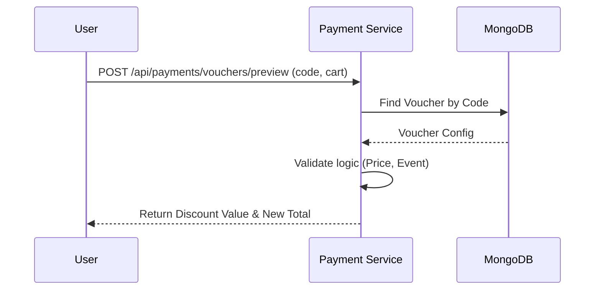

### 3. State Diagram
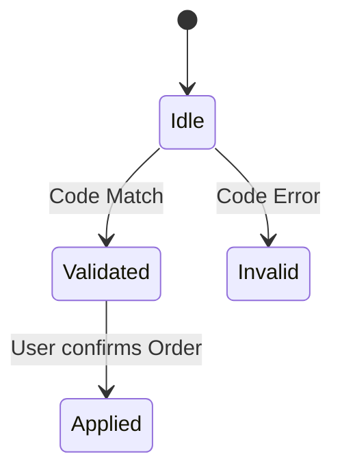

### 4. Communication Diagram
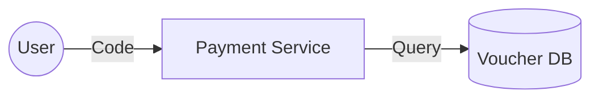

### 5. Detail Design
- **Validation:** Kiểm tra `voucher.userId` (nếu có) để đảm bảo chỉ đúng chủ sở hữu mới dùng được voucher hoàn tiền.

---

## UC-15: Hủy vé & Hoàn tiền (Refund/Voucher)

### 1. Activity Diagram
```mermaid
activityDiagram
    start
    :User yêu cầu Hủy vé (Paid Ticket);
    :Dịch vụ kiểm tra điều kiện (Thời gian trước show);
    if (Đủ điều kiện?) then (Yes)
        :Tạo Voucher 50% giá trị đơn;
        :Cập nhật Ticket = REFUNDED;
        :Giải phóng ghế về AVAILABLE;
        :Gửi thông báo Voucher mới;
    else (No)
        :Từ chối hủy;
    endif
    stop
```

### 2. Sequence Diagram
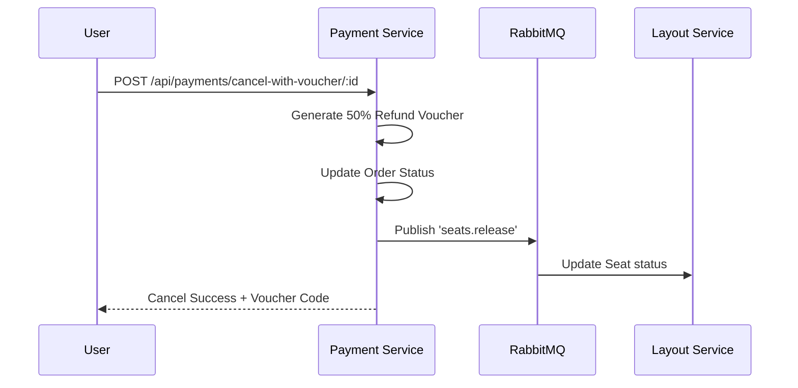

### 3. State Diagram
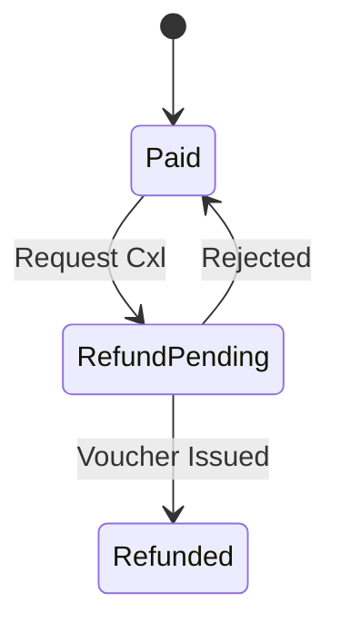

### 4. Communication Diagram
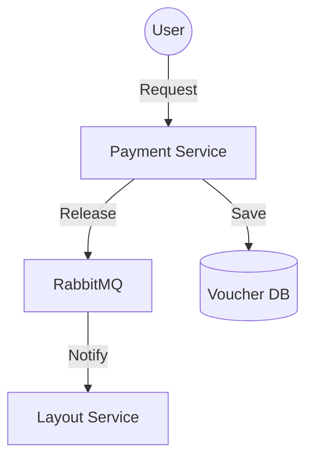

### 5. Detail Design
- **Logic:** Voucher được tạo có tiền tố `CANCEL-` và gán cứng cho `userId` của người hủy.

---

## UC-17: Thanh toán trực tuyến (PayOS Integration)

### 1. Activity Diagram
```mermaid
activityDiagram
    start
    :User nhấn "Thanh toán";
    :Tạo Đơn hàng Pending;
    :Gọi PayOS API lấy Link thanh toán;
    :User chuyển sang App Ngân hàng;
    :Thanh toán & Webhook trả về;
    :Hệ thống xác nhận PAID;
    stop
```

### 2. Sequence Diagram
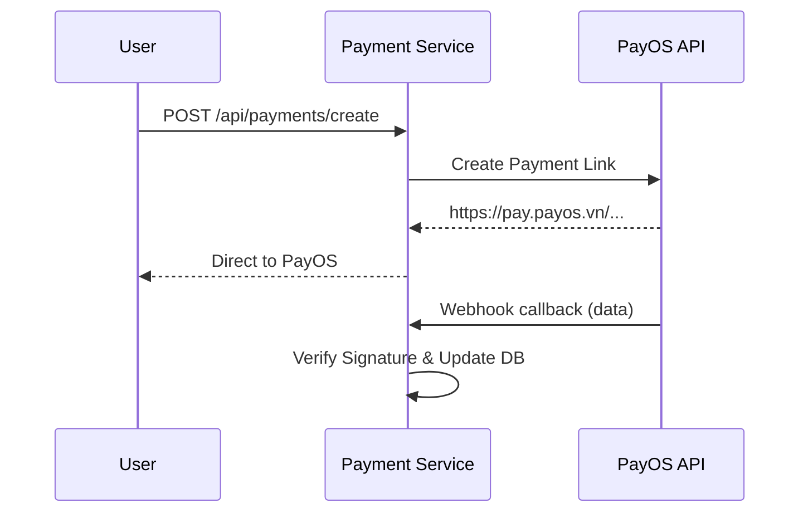

### 3. State Diagram
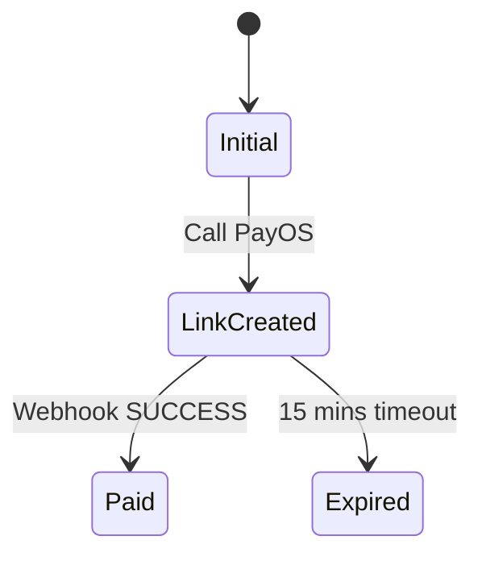

### 4. Communication Diagram
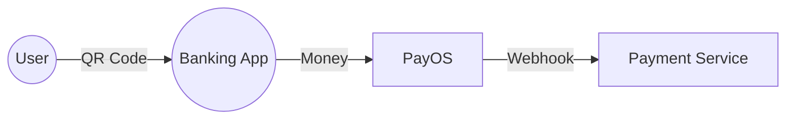

### 5. Detail Design
- **Security:** Dùng `HMAC-SHA256` để verify data từ Webhook của PayOS.

---

## UC-44: Quản lý ví số dư (User Wallet)

### 1. Activity Diagram
```mermaid
activityDiagram
    start
    :User vào mục Wallet;
    :Hệ thống truy vấn số dư hiện tại;
    :Lấy lịch sử giao dịch (Biến động số dư);
    :Hiển thị số tiền & List Transactions;
    stop
```

### 2. Sequence Diagram
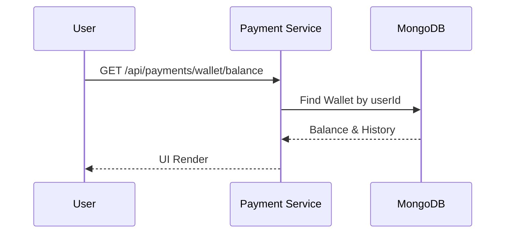

### 3. State Diagram
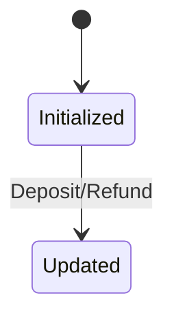

### 4. Communication Diagram
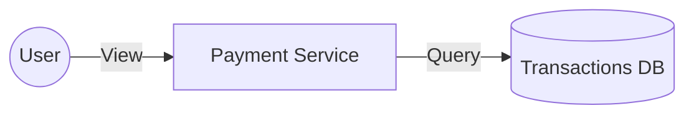

### 5. Detail Design
- **Atomic Update:** Dùng `$inc` trong MongoDB để cập nhật số dư, tránh mất mát dữ liệu khi có nhiều giao dịch đồng thời.

---

## UC-39: Đối soát tài chính (Reconciliation)

### 1. Activity Diagram
```mermaid
activityDiagram
    start
    :Hệ thống/Admin chạy lệnh đối soát;
    :Tổng hợp (Tổng thu - Phí sàn);
    :Tính số tiền Organizer nhận;
    :Tự động thực hiện lệnh Payout;
    :Ghi log lịch sử đối soát;
    stop
```

### 2. Sequence Diagram
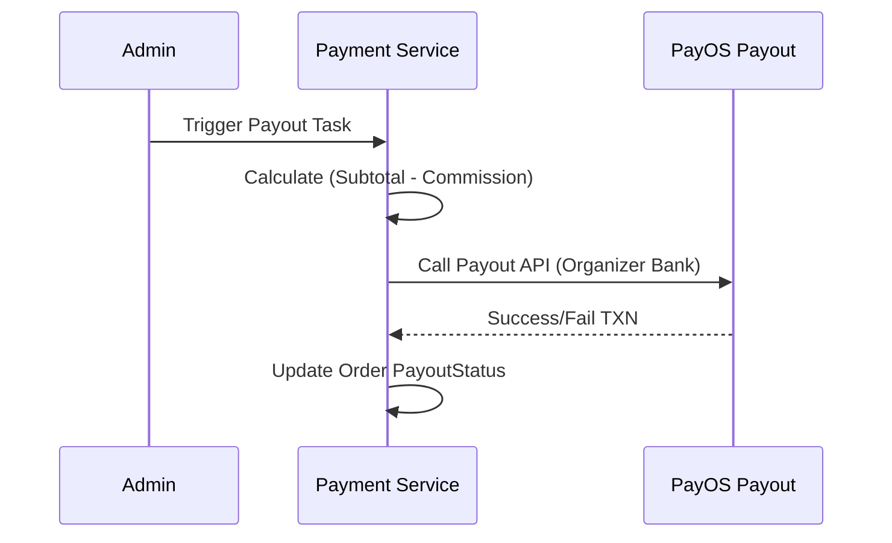

### 3. State Diagram
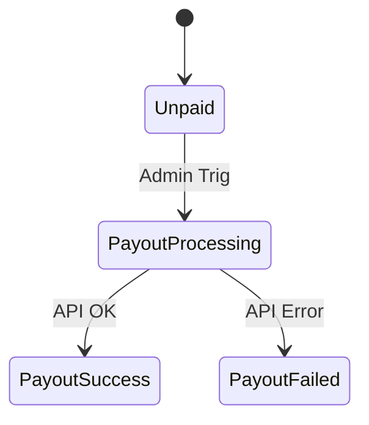

### 4. Communication Diagram
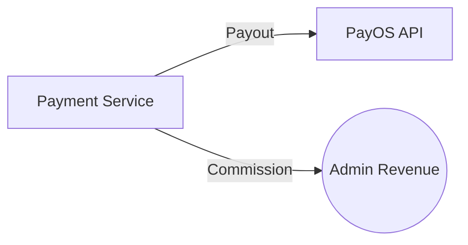

### 5. Detail Design
- **Logic:** `PayoutAmount = TotalAmount * (1 - CommissionRate)`.

---

## UC-31: Đăng nhập nhân viên (Staff Login)

### 1. Activity Diagram
```mermaid
activityDiagram
    start
    :Staff mở ứng dụng Check-in;
    :Nhập Email & Mã truy cập nội bộ;
    :Auth Service xác thực Role = 'staff';
    :Cấp Token truy cập các API quét vé;
    stop
```

### 2. Sequence Diagram
```mermaid
sequenceDiagram
    participant S as Staff
    participant A as Auth Service
    participant DB as User DB
    S->>A: POST /api/auth/login-staff
    A->>DB: Verify Creds & Role
    DB-->>A: Match
    A-->>S: JWT Staff Token
```

### 3. State Diagram
```mermaid
stateDiagram-v2
    [*] --> LoggedOut
    LoggedOut --> LoggedIn: Staff Creds OK
```

### 4. Communication Diagram
```mermaid
graph LR
    S((Staff)) -- Authenticate --> A[Auth Service]
```

### 5. Detail Design
- **Restrictions:** Token Staff chỉ được phép gọi các endpoint `/api/checkin/*`.

---

## UC-32: Quét mã QR (Scan Ticket)

### 1. Activity Diagram
```mermaid
activityDiagram
    start
    :Nhấn nút Scan trên Mobile;
    :Mở Camera quét mã QR;
    :Parse Ticket Code từ hình ảnh;
    :Tự động gửi yêu cầu xác thực;
    stop
```

### 2. Sequence Diagram
```mermaid
sequenceDiagram
    participant S as Staff
    participant M as Mobile App
    participant C as Checkin Service
    S->>M: Scan QR Code
    M->>M: Decrypt/Extract ticketID
    M->>C: POST /api/checkin/scan (ticketID)
    C-->>M: Valid/Invalid Info
```

### 3. State Diagram
```mermaid
stateDiagram-v2
    [*] --> Scanning
    Scanning --> Success: Found & Valid
    Scanning --> Fail: Not found / Invalid
```

### 4. Communication Diagram
```mermaid
graph LR
    M((Mobile)) -- Extract --> QR[QR Data]
    QR -- Verify --> C[Checkin Service]
```

### 5. Detail Design
- **Offline:** Ứng dụng cache danh sách ID vé gần đây để tăng tốc độ phản hồi.

---

## UC-33: Xác thực & Check-in

### 1. Activity Diagram
```mermaid
activityDiagram
    start
    :Nhận ticketID từ Scan;
    :Kiểm tra trạng thái vé trong DB;
    if (Trạng thái = PAID & Chưa check-in?) then (Yes)
        :Cập nhật CHECKED-IN;
        :Báo xanh (Thành công);
    else (No)
        :Báo đỏ (Thất bại kèm lý do);
    endif
    stop
```

### 2. Sequence Diagram
```mermaid
sequenceDiagram
    participant C as Checkin Service
    participant DB as MongoDB
    C->>DB: Find Ticket(id)
    DB-->>C: Data (Status, EventID)
    C->>C: Business logic check
    C->>DB: Update Status = 'checked-in'
    C-->>Staff: Return Success JSON
```

### 3. State Diagram
```mermaid
stateDiagram-v2
    [*] --> Issued
    Issued --> CheckedIn: Success Scan
    CheckedIn --> CheckedIn: Duplicate Error
```

### 4. Communication Diagram
```mermaid
graph TD
    C[Checkin Svc] -- Update --> DB[(Ticket DB)]
    C -- Log --> L[(Action logs)]
```

### 5. Detail Design
- **Fields:** Lưu `checkedInAt` và `staffId` thực hiện để đối soát về sau.

---

## UC-34: Đăng ký khuôn mặt (Face Enrollment)

### 1. Activity Diagram
```mermaid
activityDiagram
    start
    :User vào mục FaceID trên app;
    :Chụp 3 góc mặt (trái, phải, thẳng);
    :Trích xuất Feature Vectors (Embeddings);
    :Lưu vào DB kèm userId;
    stop
```

### 2. Sequence Diagram
```mermaid
sequenceDiagram
    participant U as User
    participant M as Mobile (Face SDK)
    participant C as Checkin Service
    U->>M: Position Face
    M->>M: Extract 128-d Vector
    M->>C: POST /api/checkin/face-enroll (vector)
    C->>DB: Save to user.faceData
    C-->>U: Enrollment Success
```

### 3. State Diagram
```mermaid
stateDiagram-v2
    [*] --> NotEnrolled
    NotEnrolled --> Enrolled: Bio Data Saved
```

### 4. Communication Diagram
```mermaid
graph LR
    U((User)) -- Bio --> C[Checkin Service]
    C -- Store --> DB[(Bio DB)]
```

### 5. Detail Design
- **Security:** Không lưu hình ảnh gốc để bảo mật. Chỉ lưu chuỗi Vector số (Floats).

---

## UC-35: Check-in khuôn mặt (Face Check-in)

### 1. Activity Diagram
```mermaid
activityDiagram
    start
    :Khách hàng đứng trước máy quét;
    :Máy trích xuất khuôn mặt hiện tại;
    :Hệ thống so sánh với toàn bộ khuôn mặt đã mua vé;
    if (Khớp > 90%?) then (Yes)
        :Xác nhận danh tính;
        :Thực hiện Check-in;
    else (No)
        :Báo lỗi không nhận diện;
    endif
    stop
```

### 2. Sequence Diagram
```mermaid
sequenceDiagram
    participant G as Gate Camera
    participant C as Checkin Service
    participant DB as Bio DB
    G->>C: POST /verify-face (currentVector)
    C->>DB: Search similar vectors
    DB-->>C: User Found (ID: 123)
    C->>C: Link to Ticket & Checkin
    C-->>G: Open Gate / Show Success
```

### 3. State Diagram
```mermaid
stateDiagram-v2
    [*] --> Identifying
    Identifying --> Matched: ID Found
    Identifying --> Unknown: No Match
```

### 4. Communication Diagram
```mermaid
graph TD
    Cam((Camera)) -- Vector --> C[Checkin Service]
    C -- Matching --> DB[(Vector DB)]
```

### 5. Detail Design
- **Algorithm:** Dùng `Euclidean Distance` hoặc `Cosine Similarity`. Ngưỡng (Threshold) cấu hình 0.6.
