# UML Designs - Nhóm của Phước (Payment, Financials & Check-in)

---

## UC-11: Áp dụng mã giảm giá (Apply Voucher)

### 1. Activity Diagram (Flow of applying voucher)
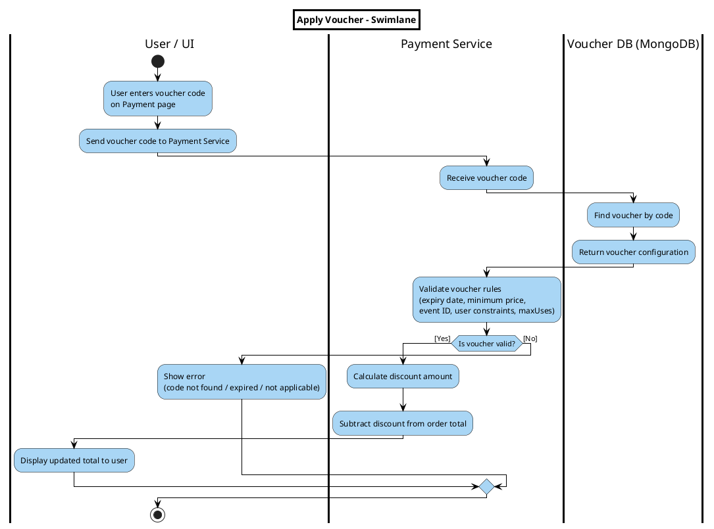
```plantuml
@startuml
title Apply Voucher - Swimlane

' =========================
' Style setup
' =========================
skinparam backgroundColor white
skinparam shadowing false

' Title (tiêu đề diagram): nền trắng, viền đen dày, chữ căn giữa
' Title (tiêu đề diagram): nền trắng, viền đen dày, chữ căn giữa
skinparam TitleBackgroundColor white
skinparam TitleBorderColor #000000
skinparam TitleBorderThickness 3
skinparam TitleAlignment center

' Swimlane (cột): viền đen dày + header trắng + chữ căn giữa
' Swimlane (cột): viền đen dày + header trắng + chữ căn giữa
skinparam swimlane {
  BorderColor #000000
  BorderThickness 3
  TitleBackgroundColor white
  TitleBorderColor #000000
  TitleBorderThickness 4
  TitleAlignment center
}

' Mũi tên màu đen
' Mũi tên màu đen
skinparam ArrowColor #000000
skinparam ArrowThickness 1

' Node activity: xanh nhạt, viền đen, bo góc
' Node activity: xanh nhạt, viền đen, bo góc
skinparam Activity {
  BackgroundColor #A9D6F5
  BorderColor #000000
  FontColor #000000
  RoundCorner 20
}

' =========================
' Luồng xử lý theo swimlane
' =========================
|User / UI|
start
:User enters voucher code\non Payment page;
:Send voucher code to Payment Service;

|Payment Service|
:Receive voucher code;

|Voucher DB (MongoDB)|
:Find voucher by code;
:Return voucher configuration;

|Payment Service|
:Validate voucher rules\n(expiry date, minimum price,\nevent ID, user constraints, maxUses);
if (Is voucher valid?) then ([Yes])
  :Calculate discount amount;
  :Subtract discount from order total;

  |User / UI|
  :Display updated total to user;
else ([No])
  |User / UI|
  :Show error\n(code not found / expired / not applicable);
endif
stop
@enduml
```

- _Comment (VI): Flow user nhập mã → service kiểm tra các điều kiện (hạn dùng, min price, event, user, maxUses) → nếu hợp lệ thì tính tiền giảm & cập nhật tổng, nếu không thì báo lỗi._

### 2. Sequence Diagram (Request-response for voucher preview)
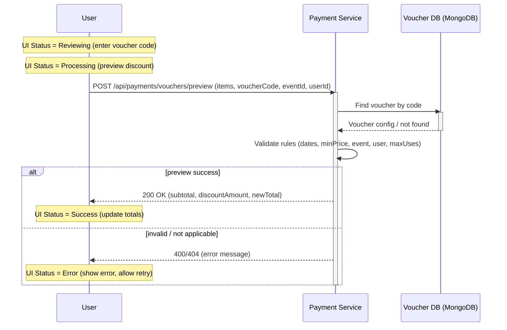
```mermaid
sequenceDiagram
    participant U as User
    participant P as Payment Service
    participant DB as Voucher DB (MongoDB)
    Note over U: UI Status = Reviewing (enter voucher code)
    Note over U: UI Status = Processing (preview discount)
    U->>P: POST /api/payments/vouchers/preview (items, voucherCode, eventId, userId)
    activate P
    P->>DB: Find voucher by code
    activate DB
    DB-->>P: Voucher config / not found
    deactivate DB
    P->>P: Validate rules (dates, minPrice, event, user, maxUses)

    alt preview success
        P-->>U: 200 OK (subtotal, discountAmount, newTotal)
        Note over U: UI Status = Success (update totals)
    else invalid / not applicable
        P-->>U: 400/404 (error message)
        Note over U: UI Status = Error (show error, allow retry)
    end
    deactivate P
```

- _Comment (VI): User gọi API preview voucher, Payment Service đọc cấu hình voucher từ DB, validate toàn bộ rule rồi trả lại subtotal, discount và total mới._

### 3. State Diagram
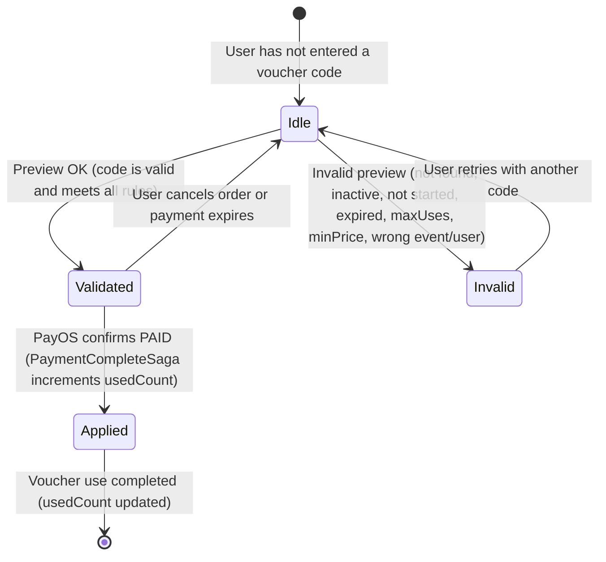
```mermaid
stateDiagram-v2
    [*] --> Idle: User has not entered a voucher code

    Idle --> Validated: Preview OK (code is valid and meets all rules)
    Idle --> Invalid: Invalid preview (not found, inactive, not started, expired, maxUses, minPrice, wrong event/user)

    Invalid --> Idle: User retries with another code

    Validated --> Applied: PayOS confirms PAID (PaymentCompleteSaga increments usedCount)
    Validated --> Idle: User cancels order or payment expires

    Applied --> [*]: Voucher use completed (usedCount updated)
```

- _Comment (VI): Voucher chỉ được coi là "Applied" (tăng `usedCount`) sau khi thanh toán PayOS thành công, không phải lúc user chỉ xác nhận đơn._
- _Đối chiếu với code (`payment-service`):_
  - **Idle → Validated / Invalid** khớp `POST /api/payments/vouchers/preview`: chỉ thành công khi voucher `active`, trong khoảng `startDate`/`endDate`, đủ `maxUses`, `minimumPrice`, đúng `eventId`, `userId` (các rule này được kiểm tra lại ở bước `BookingSaga.validate-voucher` khi tạo đơn).
  - **Lỗi "không tìm thấy / không hợp lệ" từ API** cũng gồm voucher đang `inactive`/`expired` trong DB hoặc chưa tới `startDate` (truy vấn yêu cầu `status: 'active'` và `startDate <= now`).
  - **Validated → Applied** khớp bước `increment-voucher-used` trong `PaymentCompleteSaga` sau khi đơn được đánh dấu `paid` (PayOS PAID qua webhook hoặc verify).
  - **Validated → Idle** khớp trường hợp đơn bị hủy/hết hạn/xóa (`CancelSaga`, cleanup, hoặc verify) trước khi thanh toán thành công — `usedCount` không tăng.
  - **Các trạng thái theo góc nhìn client/phiên làm việc**; server không lưu trạng thái "Validated" giữa bước preview và tạo thanh toán.

### 4. Communication Diagram
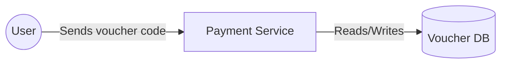
```mermaid
graph LR
    U((User)) -- Sends voucher code --> P[Payment Service]
    P -- Reads/Writes --> DB[(Voucher DB)]
```

### 5. Detail Design
- **Validation:** If `voucher.userId` is set (especially for refund vouchers with prefix `CANCEL-*`), only the assigned `userId` is allowed to use this voucher.
- _Comment (VI): Nhấn mạnh logic voucher hoàn tiền `CANCEL-*` được gán cứng cho đúng tài khoản user đó._

---

## UC-15: Cancel Ticket & Refund via Voucher (Hủy vé & Hoàn tiền)

### 1. Activity Diagram (Flow of cancelling a paid ticket)
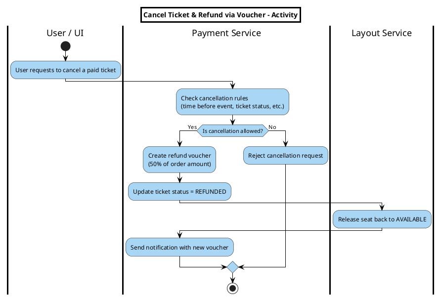
```plantuml
@startuml
title Cancel Ticket & Refund via Voucher - Activity

skinparam backgroundColor white
skinparam shadowing false

skinparam TitleBackgroundColor white
skinparam TitleBorderColor #000000
skinparam TitleBorderThickness 3
skinparam TitleAlignment center

skinparam swimlane {
  BorderColor #000000
  BorderThickness 3
  TitleBackgroundColor white
  TitleBorderColor #000000
  TitleBorderThickness 4
  TitleAlignment center
}

skinparam ArrowColor #000000
skinparam ArrowThickness 1

skinparam Activity {
  BackgroundColor #A9D6F5
  BorderColor #000000
  FontColor #000000
  RoundCorner 20
}

|User / UI|
start
:User requests to cancel a paid ticket;

|Payment Service|
:Check cancellation rules\n(time before event, ticket status, etc.);
if (Is cancellation allowed?) then (Yes)
  :Create refund voucher\n(50% of order amount);
  :Update ticket status = REFUNDED;

  |Layout Service|
  :Release seat back to AVAILABLE;

  |Payment Service|
  :Send notification with new voucher;
else (No)
  :Reject cancellation request;
endif
stop
@enduml
```

- _Comment (VI): Nếu đủ điều kiện hủy vé thì tạo voucher hoàn tiền 50%, cập nhật trạng thái vé, trả ghế và gửi thông báo; nếu không đủ thì từ chối._

### 2. Sequence Diagram (Event-driven flow with RabbitMQ)
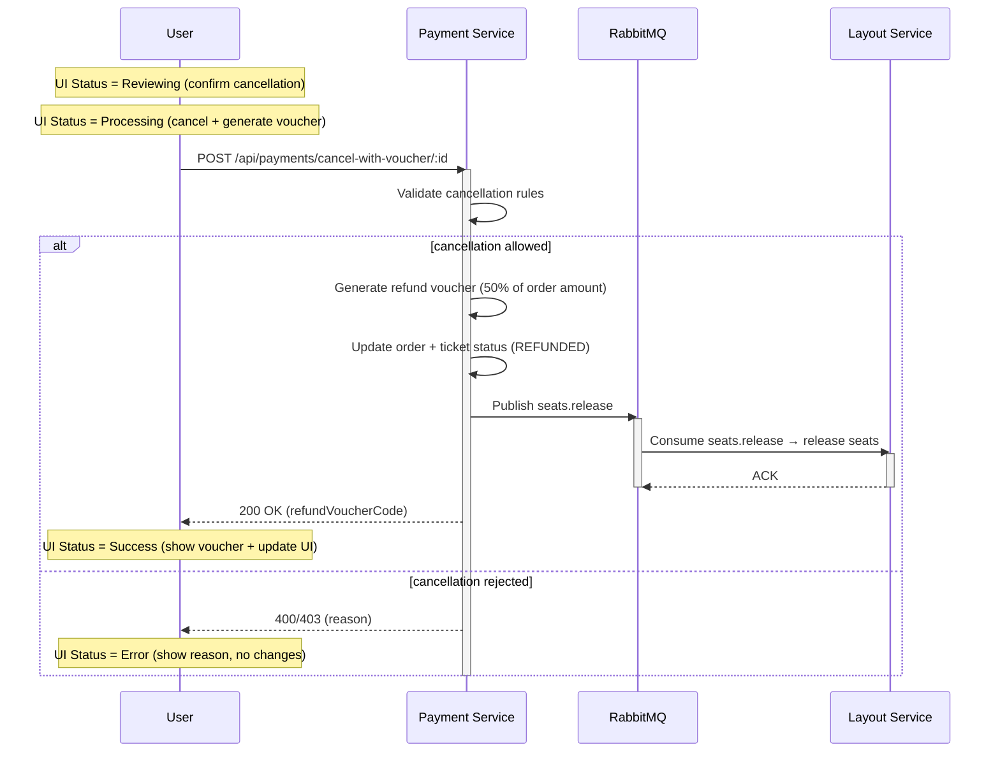
```mermaid
sequenceDiagram
    participant U as User
    participant P as Payment Service
    participant R as RabbitMQ
    participant L as Layout Service
    Note over U: UI Status = Reviewing (confirm cancellation)
    Note over U: UI Status = Processing (cancel + generate voucher)
    U->>P: POST /api/payments/cancel-with-voucher/:id
    activate P
    P->>P: Validate cancellation rules

    alt cancellation allowed
        P->>P: Generate refund voucher (50% of order amount)
        P->>P: Update order + ticket status (REFUNDED)
        P->>R: Publish seats.release
        activate R
        R->>L: Consume seats.release → release seats
        activate L
        L-->>R: ACK
        deactivate L
        deactivate R
        P-->>U: 200 OK (refundVoucherCode)
        Note over U: UI Status = Success (show voucher + update UI)
    else cancellation rejected
        P-->>U: 400/403 (reason)
        Note over U: UI Status = Error (show reason, no changes)
    end
    deactivate P
```

- _Comment (VI): Payment Service xử lý business, publish event `seats.release` cho Layout Service và trả voucher hoàn tiền về cho user._
### 3. State Diagram

**PlantUML:**
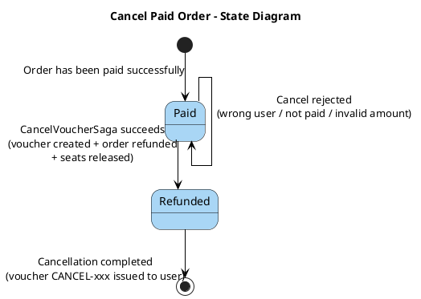
```plantuml
@startuml
title Cancel Paid Order - State Diagram

skinparam backgroundColor white
skinparam shadowing false
skinparam linetype ortho

skinparam state {
  BackgroundColor #A9D6F5
  BorderColor #000000
  FontColor #000000
  ArrowColor #000000
}

[*] --> Paid : Order has been paid successfully

Paid --> Paid : Cancel rejected\n(wrong user / not paid / invalid amount)
Paid --> Refunded : CancelVoucherSaga succeeds\n(voucher created + order refunded\n+ seats released)

Refunded --> [*] : Cancellation completed\n(voucher CANCEL-xxx issued to user)

@enduml
```

**Mermaid (backup):**
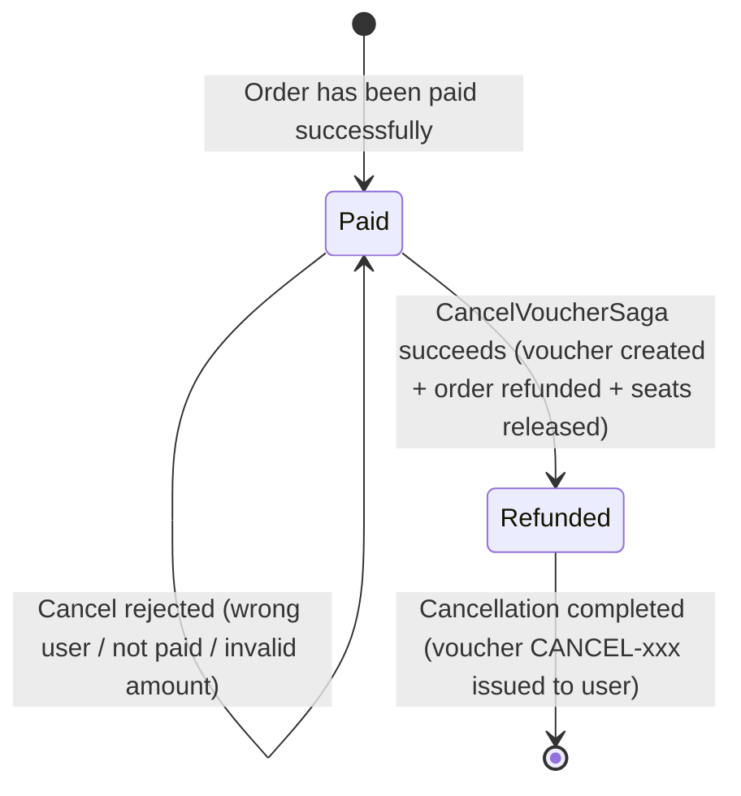
```mermaid
stateDiagram-v2
    [*] --> Paid: Order has been paid successfully

    Paid --> Paid: Cancel rejected (wrong user / not paid / invalid amount)
    Paid --> Refunded: CancelVoucherSaga succeeds (voucher created + order refunded + seats released)

    Refunded --> [*]: Cancellation completed (voucher CANCEL-xxx issued to user)
```

- _Comment (VI): Không có trạng thái trung gian "RefundPending" — code xử lý đồng bộ trong 1 saga: validate → tạo voucher → đổi status `refunded` → nhả ghế. Nếu validate thất bại (sai user, đơn không phải `paid`, số tiền không hợp lệ) thì order vẫn giữ `paid` và trả lỗi 400/403._

### 4. Communication Diagram
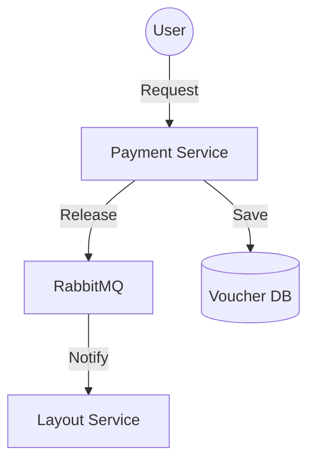
```mermaid
graph TD
    U((User)) -- Request --> P[Payment Service]
    P -- Release --> R[RabbitMQ]
    R -- Notify --> L[Layout Service]
    P -- Save --> DB[(Voucher DB)]
```

### 5. Detail Design
- **Logic:** Refund vouchers are created with prefix `CANCEL-` and are strictly bound to the `userId` of the user who cancelled the ticket.
- _Comment (VI): Tất cả voucher hoàn tiền đều có prefix `CANCEL-` và chỉ user đã hủy vé mới dùng được._

---

## UC-17: Online Payment via PayOS (Thanh toán trực tuyến)

### 1. Activity Diagram (Online payment flow with PayOS)
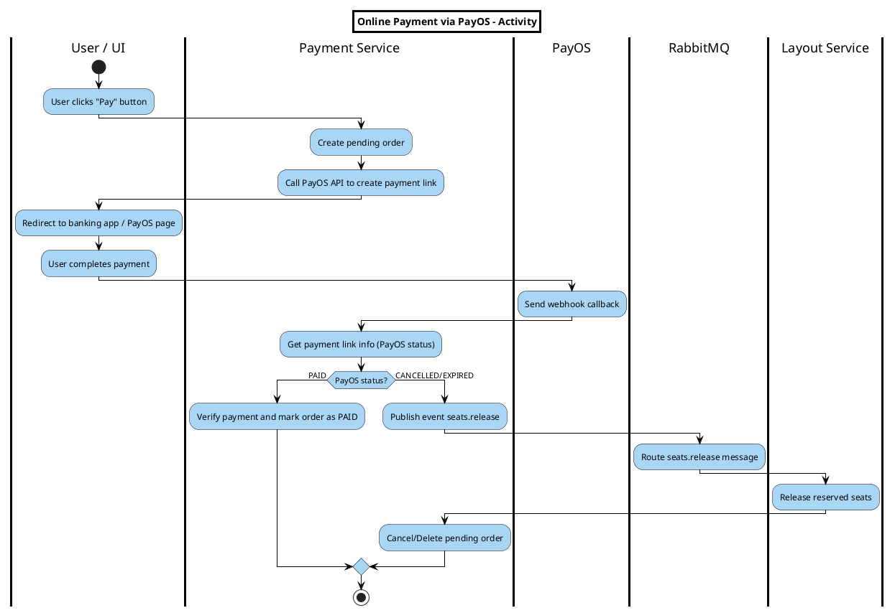
```plantuml
@startuml
title Online Payment via PayOS - Activity

skinparam backgroundColor white
skinparam shadowing false

skinparam TitleBackgroundColor white
skinparam TitleBorderColor #000000
skinparam TitleBorderThickness 3
skinparam TitleAlignment center

skinparam swimlane {
  BorderColor #000000
  BorderThickness 3
  TitleBackgroundColor white
  TitleBorderColor #000000
  TitleBorderThickness 4
  TitleAlignment center
}

skinparam ArrowColor #000000
skinparam ArrowThickness 1

skinparam Activity {
  BackgroundColor #A9D6F5
  BorderColor #000000
  FontColor #000000
  RoundCorner 20
}

|User / UI|
start
:User clicks "Pay" button;

|Payment Service|
:Create pending order;
:Call PayOS API to create payment link;

|User / UI|
:Redirect to banking app / PayOS page;
:User completes payment;

|PayOS|
:Send webhook callback;

|Payment Service|
:Get payment link info (PayOS status);
if (PayOS status?) then (PAID)
  :Verify payment and mark order as PAID;
else (CANCELLED/EXPIRED)
  :Publish event seats.release;

  |RabbitMQ|
  :Route seats.release message;

  |Layout Service|
  :Release reserved seats;

  |Payment Service|
  :Cancel/Delete pending order;
endif
stop
@enduml
```

- _Comment (VI): Flow thanh toán online: tạo order pending, gọi PayOS tạo link, user thanh toán, PayOS gửi webhook để hệ thống xác nhận PAID._

### 2. Sequence Diagram (Integration with PayOS)
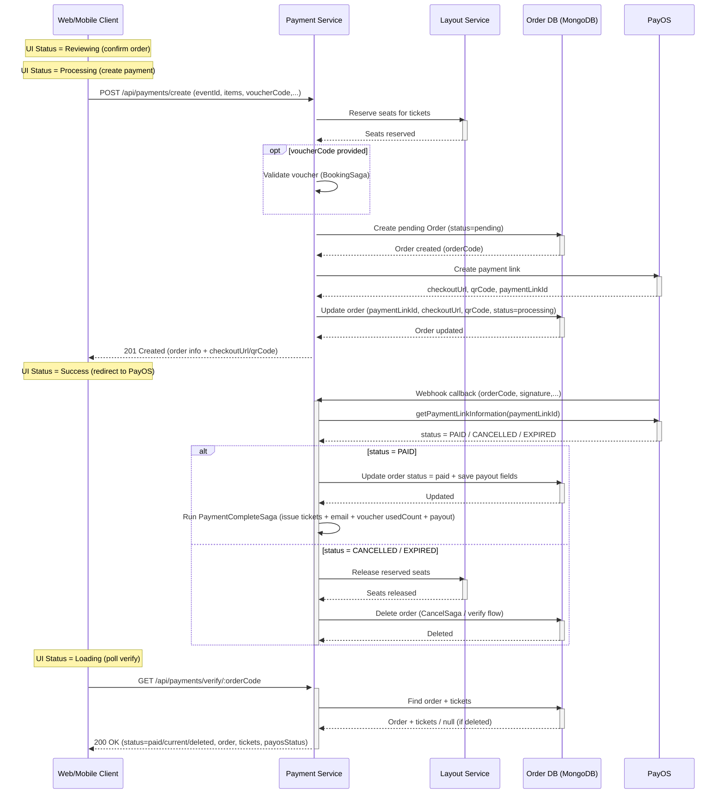
```mermaid
sequenceDiagram
    participant FE as Web/Mobile Client
    participant P as Payment Service
    participant L as Layout Service
    participant DB as Order DB (MongoDB)
    participant OS as PayOS

    %% 1) User tạo thanh toán
    Note over FE: UI Status = Reviewing (confirm order)
    Note over FE: UI Status = Processing (create payment)
    FE->>P: POST /api/payments/create (eventId, items, voucherCode,...)
    activate P
    P->>L: Reserve seats for tickets
    activate L
    L-->>P: Seats reserved
    deactivate L
    opt voucherCode provided
        P->>P: Validate voucher (BookingSaga)
    end
    P->>DB: Create pending Order (status=pending)
    activate DB
    DB-->>P: Order created (orderCode)
    deactivate DB
    P->>OS: Create payment link
    activate OS
    OS-->>P: checkoutUrl, qrCode, paymentLinkId
    deactivate OS
    P->>DB: Update order (paymentLinkId, checkoutUrl, qrCode, status=processing)
    activate DB
    DB-->>P: Order updated
    deactivate DB
    P-->>FE: 201 Created (order info + checkoutUrl/qrCode)
    Note over FE: UI Status = Success (redirect to PayOS)

    %% 2) User thanh toán và PayOS gửi webhook
    OS->>P: Webhook callback (orderCode, signature,...)
    activate P
    P->>OS: getPaymentLinkInformation(paymentLinkId)
    activate OS
    OS-->>P: status = PAID / CANCELLED / EXPIRED
    deactivate OS
    alt status = PAID
        P->>DB: Update order status = paid + save payout fields
        activate DB
        DB-->>P: Updated
        deactivate DB
        P->>P: Run PaymentCompleteSaga (issue tickets + email + voucher usedCount + payout)
    else status = CANCELLED / EXPIRED
        P->>L: Release reserved seats
        activate L
        L-->>P: Seats released
        deactivate L
        P->>DB: Delete order (CancelSaga / verify flow)
        activate DB
        DB-->>P: Deleted
        deactivate DB
    end
    deactivate P

    %% 3) FE kiểm tra kết quả
    Note over FE: UI Status = Loading (poll verify)
    FE->>P: GET /api/payments/verify/:orderCode
    activate P
    P->>DB: Find order + tickets
    activate DB
    DB-->>P: Order + tickets / null (if deleted)
    deactivate DB
    P-->>FE: 200 OK (status=paid/current/deleted, order, tickets, payosStatus)
    deactivate P

```

- _Comment (VI): Payment Service đóng vai trò trung gian, tạo link thanh toán và xử lý webhook từ PayOS._
### 3. State Diagram (Order state vs PayOS status)
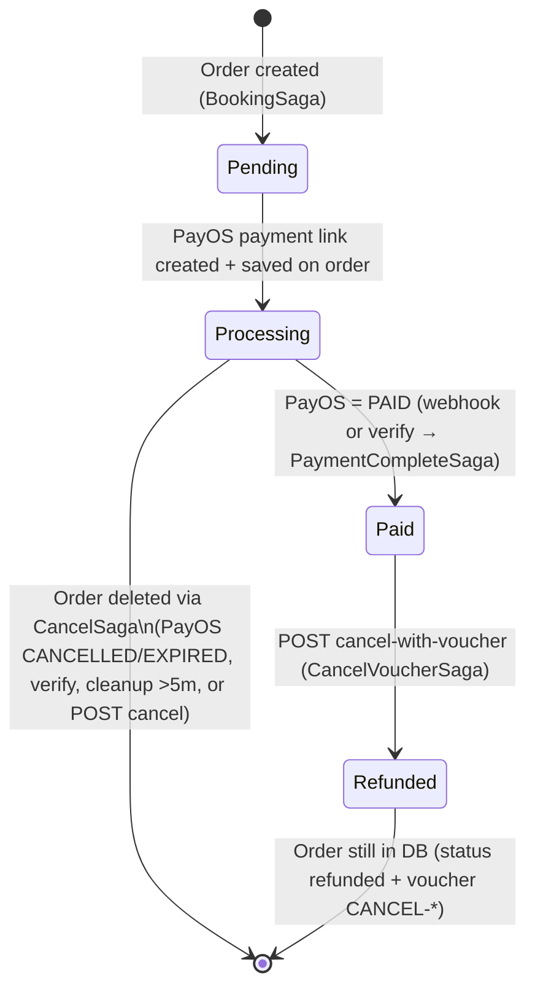
```mermaid
stateDiagram-v2
    [*] --> Pending: Order created (BookingSaga)

    Pending --> Processing: PayOS payment link created + saved on order

    Processing --> Paid: PayOS = PAID (webhook or verify → PaymentCompleteSaga)

    Processing --> [*]: Order deleted via CancelSaga\n(PayOS CANCELLED/EXPIRED, verify, cleanup >5m, or POST cancel)

    Paid --> Refunded: POST cancel-with-voucher (CancelVoucherSaga)

    Refunded --> [*]: Order still in DB (status refunded + voucher CANCEL-*)
```

- _Comment (VI): Trong MongoDB, trạng thái thật là `pending` → `processing` → `paid` (không có tên `LinkCreated`). Khi PayOS `CANCELLED`/`EXPIRED`, hoặc cleanup timeout, hoặc user hủy đơn chưa trả tiền, code thường **xoá document Order** (`CancelSaga`), không lưu `cancelled`/`expired` trên đơn. Enum trong schema vẫn có `cancelled`/`expired` nhưng luồng hiện tại chủ yếu là xóa._

### 4. Communication Diagram (Money flow vs. system callbacks)
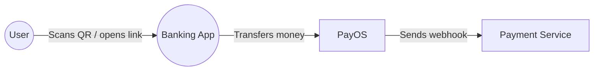
```mermaid
graph LR
    U((User)) -- Scans QR / opens link --> Bank((Banking App))
    Bank -- Transfers money --> OS[PayOS]
    OS -- Sends webhook --> P[Payment Service]
```

### 5. Detail Design
- **Security:** Use `HMAC-SHA256` to verify integrity and authenticity of PayOS webhook data before updating any payment records.
- _Comment (VI): Luôn verify HMAC-SHA256 từ PayOS rồi mới tin tưởng và cập nhật trạng thái thanh toán._

---
## UC-39: Financial Reconciliation (Đối soát tài chính)

### 1. Activity Diagram (Reconciliation and payout run)
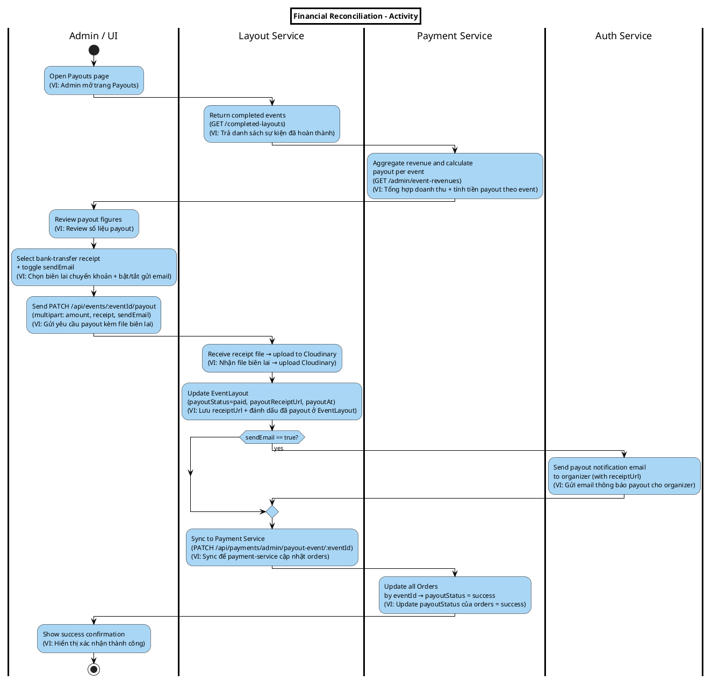
```plantuml
@startuml
title Financial Reconciliation - Activity

' =========================
' Thiết lập giao diện (style)
' =========================
skinparam backgroundColor white
skinparam shadowing false

skinparam TitleBackgroundColor white
skinparam TitleBorderColor #000000
skinparam TitleBorderThickness 3
skinparam TitleAlignment center

skinparam swimlane {
  BorderColor #000000
  BorderThickness 3
  TitleBackgroundColor white
  TitleBorderColor #000000
  TitleBorderThickness 4
  TitleAlignment center
}

skinparam ArrowColor #000000
skinparam ArrowThickness 1

skinparam Activity {
  BackgroundColor #A9D6F5
  BorderColor #000000
  FontColor #000000
  RoundCorner 20
}

' =========================
' Reconciliation flow by swimlane
' - Payout request goes to Layout Service (not Payment Service)
' - Layout Service uploads receipt to Cloudinary
' - Layout Service syncs to Payment Service to update orders
' =========================
|Admin / UI|
start
:Open Payouts page\n(VI: Admin mở trang Payouts);

|Layout Service|
:Return completed events\n(GET /completed-layouts)\n(VI: Trả danh sách sự kiện đã hoàn thành);

|Payment Service|
:Aggregate revenue and calculate\npayout per event\n(GET /admin/event-revenues)\n(VI: Tổng hợp doanh thu + tính tiền payout theo event);

|Admin / UI|
:Review payout figures\n(VI: Review số liệu payout);
:Select bank-transfer receipt\n+ toggle sendEmail\n(VI: Chọn biên lai chuyển khoản + bật/tắt gửi email);
:Send PATCH /api/events/:eventId/payout\n(multipart: amount, receipt, sendEmail)\n(VI: Gửi yêu cầu payout kèm file biên lai);

|Layout Service|
:Receive receipt file → upload to Cloudinary\n(VI: Nhận file biên lai → upload Cloudinary);
:Update EventLayout\n(payoutStatus=paid, payoutReceiptUrl, payoutAt)\n(VI: Lưu receiptUrl + đánh dấu đã payout ở EventLayout);
if (sendEmail == true?) then (yes)
  |Auth Service|
  :Send payout notification email\nto organizer (with receiptUrl)\n(VI: Gửi email thông báo payout cho organizer);
  |Layout Service|
endif
:Sync to Payment Service\n(PATCH /api/payments/admin/payout-event/:eventId)\n(VI: Sync để payment-service cập nhật orders);

|Payment Service|
:Update all Orders\nby eventId → payoutStatus = success\n(VI: Update payoutStatus của orders = success);

|Admin / UI|
:Show success confirmation\n(VI: Hiển thị xác nhận thành công);
stop
@enduml
```

- _Comment (VI): Payout PATCH đi về Layout Service — service này upload biên lai lên Cloudinary, cập nhật EventLayout DB, gửi email qua Auth Service (nếu bật), rồi mới sync sang Payment Service để update orders._

### 2. Sequence Diagram (Scheduled payout integration)
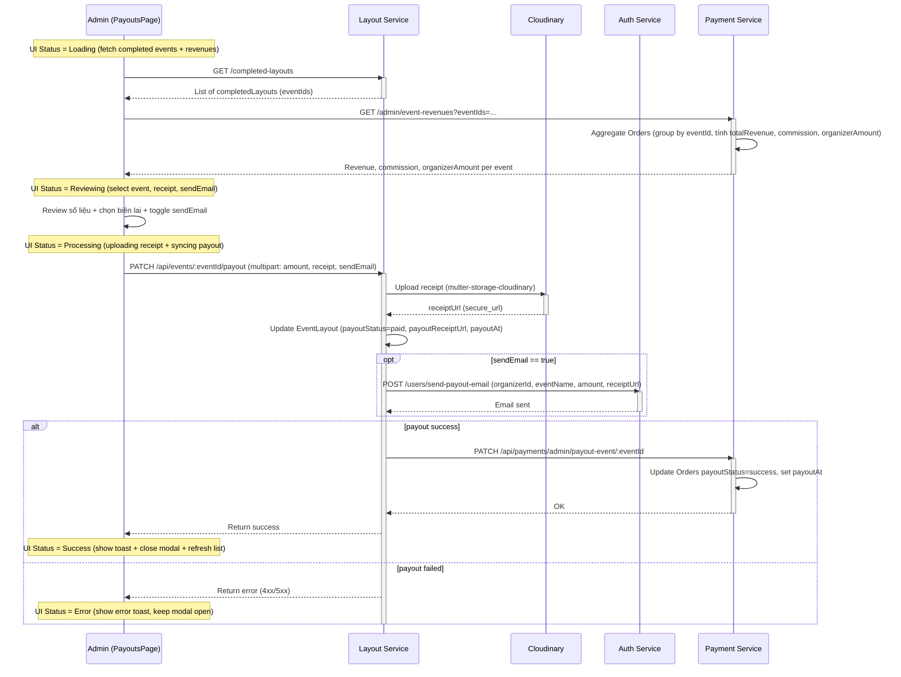
```mermaid
sequenceDiagram
    participant A as Admin (PayoutsPage)
    participant LA as Layout Service
    participant CL as Cloudinary
    participant AU as Auth Service
    participant P as Payment Service

    Note over A: UI Status = Loading (fetch completed events + revenues)
    A->>LA: GET /completed-layouts
    activate LA
    LA-->>A: List of completedLayouts (eventIds)
    deactivate LA
    A->>P: GET /admin/event-revenues?eventIds=...
    activate P
    P->>P: Aggregate Orders (group by eventId, tính totalRevenue, commission, organizerAmount)
    P-->>A: Revenue, commission, organizerAmount per event
    deactivate P

    Note over A: UI Status = Reviewing (select event, receipt, sendEmail)
    A->>A: Review số liệu + chọn biên lai + toggle sendEmail

    Note over A: UI Status = Processing (uploading receipt + syncing payout)
    A->>LA: PATCH /api/events/:eventId/payout (multipart: amount, receipt, sendEmail)
    activate LA
    LA->>CL: Upload receipt (multer-storage-cloudinary)
    activate CL
    CL-->>LA: receiptUrl (secure_url)
    deactivate CL
    LA->>LA: Update EventLayout (payoutStatus=paid, payoutReceiptUrl, payoutAt)

    opt sendEmail == true
        LA->>AU: POST /users/send-payout-email (organizerId, eventName, amount, receiptUrl)
        activate AU
        AU-->>LA: Email sent
        deactivate AU
    end

    alt payout success
        LA->>P: PATCH /api/payments/admin/payout-event/:eventId
        activate P
        P->>P: Update Orders payoutStatus=success, set payoutAt
        P-->>LA: OK
        deactivate P
        LA-->>A: Return success
        Note over A: UI Status = Success (show toast + close modal + refresh list)
    else payout failed
        LA-->>A: Return error (4xx/5xx)
        Note over A: UI Status = Error (show error toast, keep modal open)
    end
    deactivate LA
```

- _Comment (VI): Payout PATCH gửi về Layout Service — service này upload biên lai lên Cloudinary (multer-storage-cloudinary), cập nhật EventLayout, tuỳ chọn gửi email qua Auth Service, rồi sync sang Payment Service để update orders._
### 3. State Diagram
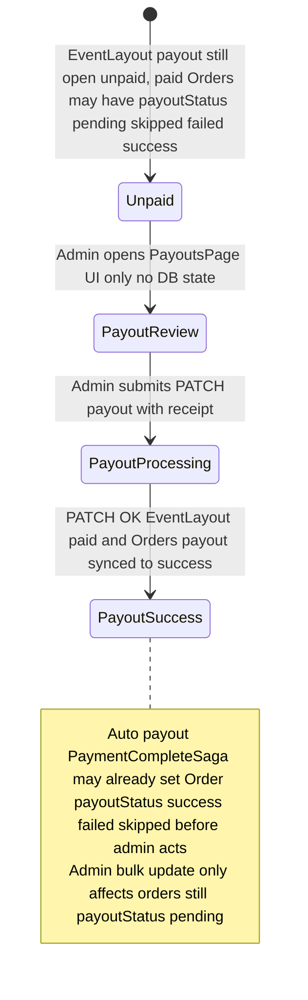
```mermaid
stateDiagram-v2
    [*] --> Unpaid: EventLayout payout still open unpaid, paid Orders may have payoutStatus pending skipped failed success

    Unpaid --> PayoutReview: Admin opens PayoutsPage UI only no DB state

    PayoutReview --> PayoutProcessing: Admin submits PATCH payout with receipt

    PayoutProcessing --> PayoutSuccess: PATCH OK EventLayout paid and Orders payout synced to success

    note right of PayoutSuccess
        Auto payout PaymentCompleteSaga may already set Order payoutStatus success failed skipped before admin acts
        Admin bulk update only affects orders still payoutStatus pending
    end note
```

- _Comment (VI): **Hai tầng dữ liệu:** (1) `EventLayout` (layout-service): `payoutStatus` enum `unpaid|processing|paid` — khi admin `PATCH /api/events/:eventId/payout` thì cập nhật thẳng **`paid`**, upload `payoutReceiptUrl`, `payoutAt`. (2) `Order` (payment-service): `payoutStatus` enum **`pending|success|failed|skipped`** — **không có `rejected`**. `markEventPayoutSuccess` chỉ `updateMany` các đơn `status=paid` **và** `payoutStatus=pending` → `success`. **PayoutReview / PayoutProcessing** là trạng thái quy trình/UI, không phải cột riêng trong Mongo. **Payout failed** trên Order chủ yếu từ bước **auto-payout** (chuyển khoản API lỗi), không có API admin “từ chối payout” đặt `failed`. **Lỗi HTTP** khi PATCH: có thể không đổi DB; nếu layout đã `paid` mà sync payment-service lỗi thì dữ liệu lệch — cần xử lý thủ công (xem log layout-service)._
- _Mermaid:_ Trên cạnh chuyển trạng thái (`A --> B: mô tả`) **chỉ được một dấu hai chấm** sau tên state đích — không ghi thêm `:` trong phần mô tả (vd `PATCH OK:`). Tránh `|` và mũi tên Unicode `→` trong nhãn nếu renderer báo lỗi parse._

### 4. Communication Diagram (Money and commission flow)
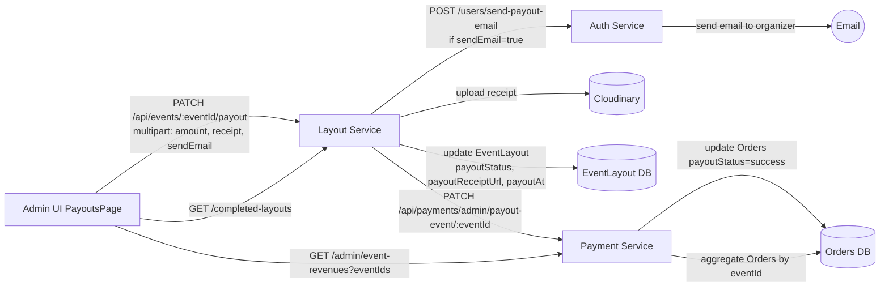
```mermaid
graph LR
    A[Admin UI PayoutsPage] -- GET /completed-layouts --> LA[Layout Service]
    A -- GET /admin/event-revenues?eventIds --> P[Payment Service]
    P -- aggregate Orders by eventId --> DB[(Orders DB)]
    A -- PATCH /api/events/:eventId/payout\nmultipart: amount, receipt, sendEmail --> LA
    LA -- upload receipt --> CL[(Cloudinary)]
    LA -- update EventLayout\npayoutStatus, payoutReceiptUrl, payoutAt --> EDB[(EventLayout DB)]
    LA -- POST /users/send-payout-email\nif sendEmail=true --> AU[Auth Service]
    AU -- send email to organizer --> EM((Email))
    LA -- PATCH /api/payments/admin/payout-event/:eventId --> P
    P -- update Orders payoutStatus=success --> DB
```

### 5. Detail Design
- **Logic:** `PayoutAmount = TotalAmount * (1 - CommissionRate)` per organizer, with rounding rules defined consistently across the system.
- _Comment (VI): Số tiền trả cho organizer = tổng thu * (1 - commissionRate), áp dụng cùng quy tắc làm tròn ở mọi nơi._

---

## UC-31: Staff Login for Check-in (Đăng nhập nhân viên)

### 1. Activity Diagram (Staff authentication flow)

> **Giải thích:** Sơ đồ hoạt động mô tả luồng đăng nhập của nhân viên (staff).
> - Nhân viên mở ứng dụng check-in và nhập email + mã nội bộ.
> - Auth Service chỉ kiểm tra email, password, `isActive`, `emailVerified` (`POST /api/auth/login`).
> - JWT luôn chứa `role`; **không** chặn staff tại Auth. App check-in hoặc `POST /api/checkin/scan` mới yêu cầu role staff/admin.
> - Nếu hợp lệ → 200 + JWT. Nếu sai → 400/401/403/404 tùy lỗi.

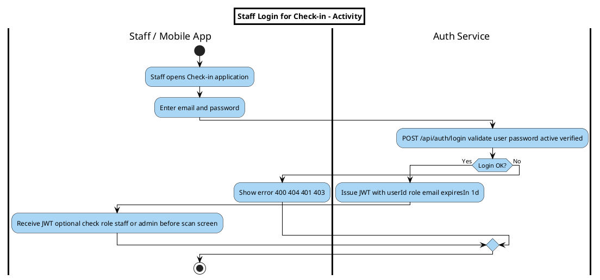
```plantuml
@startuml
title Staff Login for Check-in - Activity

skinparam backgroundColor white
skinparam shadowing false

skinparam TitleBackgroundColor white
skinparam TitleBorderColor #000000
skinparam TitleBorderThickness 3
skinparam TitleAlignment center

skinparam swimlane {
  BorderColor #000000
  BorderThickness 3
  TitleBackgroundColor white
  TitleBorderColor #000000
  TitleBorderThickness 4
  TitleAlignment center
}

skinparam ArrowColor #000000
skinparam ArrowThickness 1

skinparam Activity {
  BackgroundColor #A9D6F5
  BorderColor #000000
  FontColor #000000
  RoundCorner 20
}

|Staff / Mobile App|
start
:Staff opens Check-in application;
:Enter email and password;

|Auth Service|
:POST /api/auth/login validate user password active verified;
if (Login OK?) then (Yes)
  :Issue JWT with userId role email expiresIn 1d;

  |Staff / Mobile App|
  :Receive JWT optional check role staff or admin before scan screen;
else (No)
  |Staff / Mobile App|
  :Show error 400 404 401 403;
endif
stop
@enduml
```

- _Comment (VI): **Khớp auth-service:** đăng nhập bằng **email + password** (không có “mã nội bộ” riêng trong API). Auth không trả 401 vì “không phải staff”; customer đăng nhập vẫn 200. App check-in nên chặn nếu `role` không phải `staff`/`admin`, hoặc để Check-in Service trả 403 khi gọi `/api/checkin/scan`._

### 2. Sequence Diagram (Staff login API)

> **Giải thích:** Sơ đồ tuần tự mô tả luồng gọi API đăng nhập.
> - Staff gửi POST request với email + mật khẩu lên Auth Service.
> - Auth Service truy vấn DB để xác minh user + password (+ active, email verified).
> - Nếu đúng → trả JWT (có `role`). Nếu sai → 400/401/403/404 tùy trường hợp.

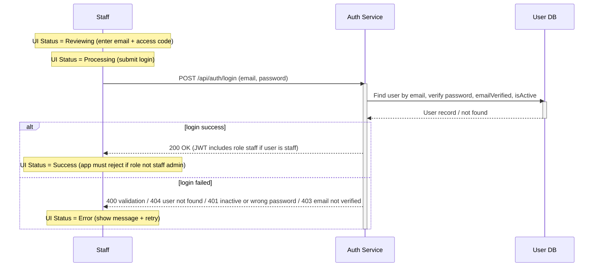
```mermaid
sequenceDiagram
    participant S as Staff
    participant A as Auth Service
    participant DB as User DB
    Note over S: UI Status = Reviewing (enter email + access code)
    Note over S: UI Status = Processing (submit login)
    S->>A: POST /api/auth/login (email, password)
    activate A
    A->>DB: Find user by email, verify password, emailVerified, isActive
    activate DB
    DB-->>A: User record / not found
    deactivate DB

    alt login success
        A-->>S: 200 OK (JWT includes role staff if user is staff)
        Note over S: UI Status = Success (app must reject if role not staff admin)
    else login failed
        A-->>S: 400 validation / 404 user not found / 401 inactive or wrong password / 403 email not verified
        Note over S: UI Status = Error (show message + retry)
    end
    deactivate A
```

- _Comment (VI): **Khớp code:** chỉ có `POST /api/auth/login` (email + password). Auth **không** có endpoint `login-staff` và **không** chặn role tại bước login — JWT luôn chứa `role` của user. App check-in cần kiểm tra `role` là `staff` hoặc `admin` sau khi nhận token; **Check-in Service** (`requireStaffRole`) mới chặn role khi gọi API quét vé._

### 3. State Diagram

> **Giải thích:** Sơ đồ trạng thái mô tả các trạng thái của phiên đăng nhập nhân viên.
> - Ban đầu ở trạng thái `LoggedOut`.
> - Nếu đăng nhập thành công → chuyển sang `LoggedIn`.
> - Nếu sai thông tin → chuyển sang `LoginFailed`, có thể thử lại.

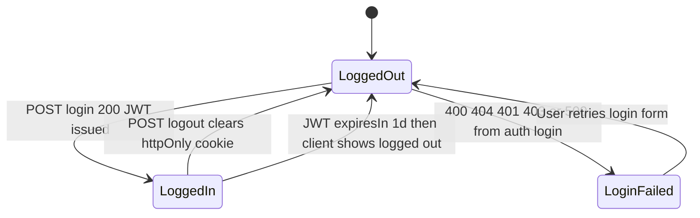
```mermaid
stateDiagram-v2
    [*] --> LoggedOut

    LoggedOut --> LoggedIn: POST login 200 JWT issued

    LoggedOut --> LoginFailed: 400 404 401 403 or 500 from auth login

    LoginFailed --> LoggedOut: User retries login form

    LoggedIn --> LoggedOut: POST logout clears httpOnly cookie

    LoggedIn --> LoggedOut: JWT expiresIn 1d then client shows logged out
```

- _Comment (VI): **Khớp auth-service:** `LoggedIn` = client đã lưu JWT (và server set cookie `jwt` httpOnly). Lỗi login gồm validate body 400, user không tồn tại 404, inactive hoặc sai mật khẩu 401, email chưa verify 403. **Không** có state “đúng mật khẩu nhưng không phải staff” trong login — login vẫn 200; app staff hoặc API check-in mới từ chối nếu role sai._

### 4. Communication Diagram (Auth responsibility)

> **Giải thích:** Sơ đồ giao tiếp cho thấy Staff chỉ tương tác trực tiếp với Auth Service để xác thực. Auth Service chịu toàn bộ trách nhiệm kiểm tra thông tin.

```mermaid
graph LR
    S((Staff)) -- Authenticate --> A[Auth Service]
```

- _Comment (VI): Staff chỉ giao tiếp với Auth Service. Auth Service chịu trách nhiệm xác thực thông tin và cấp JWT._

### 5. Detail Design
- **Restrictions (theo code checkin-service):** Endpoint `POST /api/checkin/scan` yêu cầu `Authorization: Bearer <JWT>` và `role` phải là `staff` hoặc `admin`. Các endpoint thống kê dưới `/api/checkin/event/*` hiện đang public.
- **JWT Payload (theo code checkin-service):** Checkin Service chỉ đọc `userId` và `role` từ JWT (không kiểm tra `eventId` trong token).
- **Auth responsibility:** Auth Service chịu trách nhiệm cấp JWT; Checkin Service tự verify JWT bằng `JWT_SECRET_KEY`.
- _Comment (VI): Theo code hiện tại, chỉ API quét vé (`/scan`) cần token staff/admin. Các API thống kê sự kiện đang để public. JWT khi sang checkin-service chỉ cần có `userId` và `role`._

---

## UC-32: Scan Ticket QR Code (Quét mã QR)

### 1. Activity Diagram (Scanning QR from mobile app)

> **Giải thích:** Luồng thao tác trên mobile khi quét QR.
> - App mở camera quét QR và trích xuất `ticketCode` (mã vé).
> - App gọi API `POST /api/checkin/scan` kèm `Authorization: Bearer <JWT>` (staff/admin).
> - Backend trả về kết quả (thành công hoặc lỗi kèm reason).

```plantuml
@startuml
title Scan Ticket QR Code - Activity

skinparam backgroundColor white
skinparam shadowing false

skinparam TitleBackgroundColor white
skinparam TitleBorderColor #000000
skinparam TitleBorderThickness 3
skinparam TitleAlignment center

skinparam swimlane {
  BorderColor #000000
  BorderThickness 3
  TitleBackgroundColor white
  TitleBorderColor #000000
  TitleBorderThickness 4
  TitleAlignment center
}

skinparam ArrowColor #000000
skinparam ArrowThickness 1

skinparam Activity {
  BackgroundColor #A9D6F5
  BorderColor #000000
  FontColor #000000
  RoundCorner 20
}

|Staff / Mobile App|
start
:Staff taps "Scan" button;
:Open camera and scan QR code;
:Extract ticketCode from QR image;

|Check-in Service|
:Receive POST /api/checkin/scan\n(Authorization Bearer JWT + ticketCode);
:Process check-in request;

|Staff / Mobile App|
:Show result to staff\n(success / error code + message);
stop
@enduml
```

- _Comment (VI): Flow quét QR: mở camera → lấy `ticketCode` → gọi `/api/checkin/scan` kèm Bearer JWT (staff/admin) → hiển thị kết quả._

### 2. Sequence Diagram (From scan to API call)

> **Giải thích:** 1 lần quét QR tương ứng 1 request tới Checkin Service.
> - Mobile App gửi `ticketCode` + Bearer JWT.
> - Checkin Service verify JWT + check role rồi chạy logic check-in.

```mermaid
sequenceDiagram
    participant S as Staff
    participant M as Mobile App
    participant C as Checkin Service
    Note over M: UI Status = Reviewing (camera open, ready to scan)
    S->>M: Tap "Scan"
    Note over M: UI Status = Processing (scanning QR)
    M->>M: Extract ticketCode from QR

    Note over M: UI Status = Processing (submit check-in)
    M->>C: POST /api/checkin/scan (Authorization: Bearer JWT, body: { ticketCode })
    activate C

    alt check-in success
        C-->>M: 200 OK (ticket info)
        Note over M: UI Status = Success (show success)
    else check-in failed
        C-->>M: 4xx/5xx (code, message)
        Note over M: UI Status = Error (show error, allow rescan)
    end
    deactivate C
```

- _Comment (VI): App mobile gửi `ticketCode` kèm Bearer JWT. Checkin Service trả về 200 (thành công) hoặc lỗi 4xx/5xx kèm mã lỗi + message._
### 3. State Diagram

> **Giải thích:** Trạng thái kết quả của một lần quét theo phản hồi từ backend.

```mermaid
stateDiagram-v2
    [*] --> Scanning

    Scanning --> Success: 200 JSON success true check-in OK

    Scanning --> NotFound: 404 code NOT_FOUND

    Scanning --> AlreadyCheckedIn: 400 code ALREADY_CHECKED_IN

    Scanning --> InvalidStatus: 400 code INVALID_STATUS cancelled or refunded ticket

    Scanning --> BadRequest: 400 missing ticketCode in body

    Scanning --> Unauthorized: 401 no token invalid token JWT no role field or no staffId

    Scanning --> Forbidden: 403 role not staff or admin

    Scanning --> ServerError: 500 catch block log result ERROR

    Success --> [*]: Scan round complete ready for next QR

    NotFound --> [*]: Scan round complete

    AlreadyCheckedIn --> [*]: Scan round complete

    InvalidStatus --> [*]: Scan round complete

    BadRequest --> [*]: Scan round complete

    Unauthorized --> [*]: Scan round complete

    Forbidden --> [*]: Scan round complete

    ServerError --> [*]: Scan round complete
```

- _Comment (VI): **Final state `[*]`:** mỗi nhánh kết thúc một **lần gọi** scan; app quay về idle để quét QR tiếp (server không giữ state “đang quét”). **Khớp checkin-service:** `verifyToken` → `requireStaffRole` → `scanTicket`. **401** / **403** / mã lỗi body như trên. **200** có `success: true`. Vé `issued`/`used` không nhánh riêng (rơi vào cập nhật `checked-in` nếu không thuộc checked-in/cancelled/refunded)._

### 4. Communication Diagram (QR data vs. backend)

> **Giải thích:** Mobile App gửi `ticketCode` và Bearer JWT cho Checkin Service. Checkin Service tự verify JWT và kiểm tra role trước khi xử lý.

```mermaid
graph LR
    M((Mobile App)) -- Extracts ticketCode from --> QR[QR Data]
    M -- Sends ticketCode + Bearer JWT --> C[Checkin Service]
    C -- verifyToken + requireStaffRole --> C
```

### 5. Detail Design
- **Offline:** The mobile app can cache a list of recently scanned `ticketCode` and their validation results to improve perceived response time when network is slow.
- _Comment (VI): Cho phép cache kết quả check-in gần đây trên mobile để đỡ phụ thuộc mạng._

---

## UC-33: Ticket Validation & Check-in (Xác thực & Check-in)

### 1. Activity Diagram (Backend check-in decision)
```plantuml
@startuml
title Backend check-in decision - Activity

' =========================
' Comment (VI): Luồng xử lý check-in ở backend
' - Nhận request scan kèm Bearer JWT + ticketCode
' - Auth OK (token hợp lệ + role staff/admin) mới cho đi tiếp
' - Kiểm tra ticketCode, tìm ticket, validate trạng thái
' - Ghi log checkin và trả HTTP code tương ứng
' =========================

skinparam backgroundColor white
skinparam shadowing false

skinparam TitleBackgroundColor white
skinparam TitleBorderColor #000000
skinparam TitleBorderThickness 3
skinparam TitleAlignment center

skinparam swimlane {
  BorderColor #000000
  BorderThickness 3
  TitleBackgroundColor white
  TitleBorderColor #000000
  TitleBorderThickness 4
  TitleAlignment center
}

skinparam ArrowColor #000000
skinparam ArrowThickness 1

skinparam Activity {
  BackgroundColor #A9D6F5
  BorderColor #000000
  FontColor #000000
  RoundCorner 20
}

|Check-in Service|
start
:Receive POST /api/checkin/scan\n(Bearer JWT + ticketCode)\n(VI: Nhận request scan từ app);

' (VI) Auth fail → 401/403; còn Auth OK thì tiếp tục validate input + ticket
if (Auth OK?) then (Yes)
  if (ticketCode missing?) then (Yes)
    :Return 400 Missing ticketCode\n(VI: Thiếu ticketCode trong body);
  else (No)
    |Ticket DB (MongoDB)|
    :Find ticket by ticketId\n(VI: Tra cứu vé theo ticketId=ticketCode);
    |Check-in Service|

    if (Ticket found?) then (Yes)
      if (Ticket status = checked-in?) then (Yes)
        :Log ALREADY_CHECKED_IN\n(VI: Vé đã check-in trước đó);
        :Return 400 ALREADY_CHECKED_IN;
      else (No)
        if (Ticket status = cancelled/refunded?) then (Yes)
          :Log CANCELLED/REFUNDED\n(VI: Vé đã bị hủy/hoàn tiền);
          :Return 400 INVALID_STATUS;
        else (No)
          :Set status = checked-in\ncheckedInAt = now\n(VI: Đánh dấu check-in);
          :Log SUCCESS;
          :Return 200 SUCCESS;
        endif
      endif
    else (No)
      :Log INVALID\n(VI: Không tìm thấy vé);
      :Return 404 NOT_FOUND;
    endif
  endif
else (No)
  :Return 401/403\n(VI: Token sai/thiếu hoặc role không hợp lệ);
endif
stop
@enduml
```

- _Comment (VI):_
  - **B → C (Auth OK?)**: Checkin Service kiểm tra Bearer JWT (đúng secret, chưa hết hạn) và role phải là `staff`/`admin`.
    - **Auth fail** → trả **401/403** (thiếu token / token sai-hết hạn / thiếu role / role không hợp lệ).
  - **C → D (ticketCode missing?)**: Nếu body không có `ticketCode` → trả **400 Missing ticketCode**.
  - **E → F (Ticket found?)**: Tìm vé theo `Ticket.findOne({ ticketId: ticketCode })`.
    - **Không thấy vé** → log `INVALID` + reason “Không tìm thấy vé” → trả **404 NOT_FOUND**.
  - **G (Ticket status)**:
    - **checked-in** → log `ALREADY_CHECKED_IN` → trả **400 ALREADY_CHECKED_IN**.
    - **cancelled/refunded** → log `CANCELLED/REFUNDED` → trả **400 INVALID_STATUS**.
    - **các status khác (ví dụ issued)** → cập nhật `status='checked-in'`, set `checkedInAt=now` → log `SUCCESS` → trả **200 SUCCESS**.

### 2. Sequence Diagram (Check-in service logic)
```mermaid
sequenceDiagram
    participant Staff as Staff App
    participant C as Checkin Service
    participant DB as MongoDB
    participant L as CheckinLog

    %% (VI) Trạng thái UI: đang gửi request scan
    Note over Staff: UI Status = Processing (submit scan)
    Staff->>C: POST /api/checkin/scan (Authorization: Bearer JWT, body: { ticketCode })
    activate C
    %% (VI) Backend tự verify JWT và role (staff/admin)
    C->>C: verifyToken (JWT_SECRET_KEY) & requireStaffRole

    alt auth failed (missing/invalid token)
        C-->>Staff: 401 Unauthorized
        %% (VI) Token thiếu/sai/hết hạn
        Note over Staff: UI Status = Error (please login again)
    else forbidden (role not staff/admin)
        C-->>Staff: 403 Forbidden
        %% (VI) Role không phải staff/admin
        Note over Staff: UI Status = Error (insufficient permissions)
    else bad request (missing ticketCode)
        C-->>Staff: 400 Bad Request (missing ticketCode)
        %% (VI) QR đọc được nhưng body thiếu ticketCode
        Note over Staff: UI Status = Error (rescan QR)
    else request valid
        %% (VI) Tìm ticket theo ticketCode
        C->>DB: Ticket.findOne({ ticketId: ticketCode })
        activate DB
        DB-->>C: ticket / null
        deactivate DB

        alt ticket not found
            %% (VI) Ghi log INVALID + trả 404
            C->>L: CheckinLog.create({ result: 'INVALID', reason })
            activate L
            L-->>C: logged
            deactivate L
            C-->>Staff: 404 NOT_FOUND
            Note over Staff: UI Status = Error (invalid QR)
        else already checked-in
            %% (VI) Vé đã check-in → log + trả 400
            C->>L: CheckinLog.create({ result: 'ALREADY_CHECKED_IN' })
            activate L
            L-->>C: logged
            deactivate L
            C-->>Staff: 400 ALREADY_CHECKED_IN
            Note over Staff: UI Status = Error (already checked-in)
        else cancelled/refunded
            %% (VI) Vé bị hủy/hoàn tiền → log + trả 400
            C->>L: CheckinLog.create({ result: 'INVALID_STATUS', reason })
            activate L
            L-->>C: logged
            deactivate L
            C-->>Staff: 400 INVALID_STATUS
            Note over Staff: UI Status = Error (invalid ticket status)
        else valid ticket
            %% (VI) Vé hợp lệ → update status + log SUCCESS + trả 200
            C->>DB: Update ticket.status='checked-in', checkedInAt=now
            activate DB
            DB-->>C: updated
            deactivate DB
            C->>L: CheckinLog.create({ result: 'SUCCESS' })
            activate L
            L-->>C: logged
            deactivate L
            C-->>Staff: 200 OK (ticket/event info)
            Note over Staff: UI Status = Success (checked-in)
        end
    end
    deactivate C
```

### 3. State Diagram
```mermaid
stateDiagram-v2
    [*] --> Issued
    Issued --> CheckedIn: Success Scan
    CheckedIn --> CheckedIn: Duplicate Scan
    CheckedIn --> [*]
    Issued --> Cancelled: External void ticket
    Issued --> Refunded: External void ticket
    Cancelled --> [*]
    Refunded --> [*]
```
_**Comment (VI):** Đây là trạng thái **vé trong DB** (theo `ticket.model`). Check-in API chỉ chuyển `issued` → `checked-in`; `cancelled`/`refunded` là trạng thái sẵn có khi quét (từ đồng bộ payment/admin — hiện saga có thể chưa cập nhật vé, nhưng controller đã xử lý). `used` có trong enum schema, chưa thấy code gán — có thể dùng sau. Nhánh “Duplicate Scan” không đổi trạng thái vé, chỉ trả lỗi `ALREADY_CHECKED_IN`._

### 4. Communication Diagram (Check-in write path)
```mermaid
graph TD
    C[Checkin Service] -- Updates --> DB[(Ticket DB)]
    C -- Writes --> L[(Action logs / audit)]
```

### 5. Detail Design
- **Fields (theo code hiện tại):**
  - Ticket: lưu `checkedInAt`.
  - CheckinLog: lưu `staffId`, `ticketCode`, `eventId` (nếu có), `result`, `reason` để audit/báo cáo.
- _Comment (VI): Theo code hiện tại, `staffId` được lưu trong bảng log (`CheckinLog`) để audit; ticket chỉ lưu thời điểm `checkedInAt`._

---

