# UML Designs - Nhóm của Phước (Payment, Financials & Check-in)

---

## UC-11: Áp dụng mã giảm giá (Apply Voucher)

### 1. Activity Diagram (Flow of applying voucher)
```mermaid
flowchart TD
    A([Start]) --> B[User enters voucher code on Payment page]
    B --> C[Send voucher code to Payment Service]
    C --> D[Validate voucher<br/>(expiry date, minimum price, event ID, user constraints)]
    D --> E{Is voucher valid?}
    E -- Yes --> F[Calculate discount amount]
    F --> G[Subtract discount from order total]
    G --> H[Display updated total to user]
    H --> I([Stop])
    E -- No --> J[Show error<br/>(code not found / expired / not applicable)]
    J --> I
```

- _Comment (VI): Flow user nhập mã → service kiểm tra các điều kiện (hạn dùng, min price, event, user, maxUses) → nếu hợp lệ thì tính tiền giảm & cập nhật tổng, nếu không thì báo lỗi._

### 2. Sequence Diagram (Request-response for voucher preview)
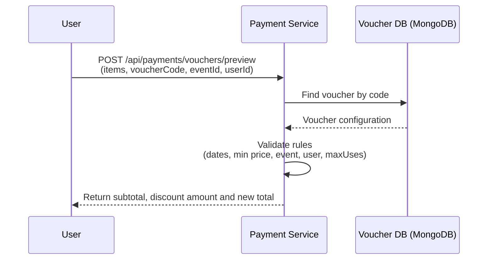

- _Comment (VI): User gọi API preview voucher, Payment Service đọc cấu hình voucher từ DB, validate toàn bộ rule rồi trả lại subtotal, discount và total mới._

### 3. State Diagram
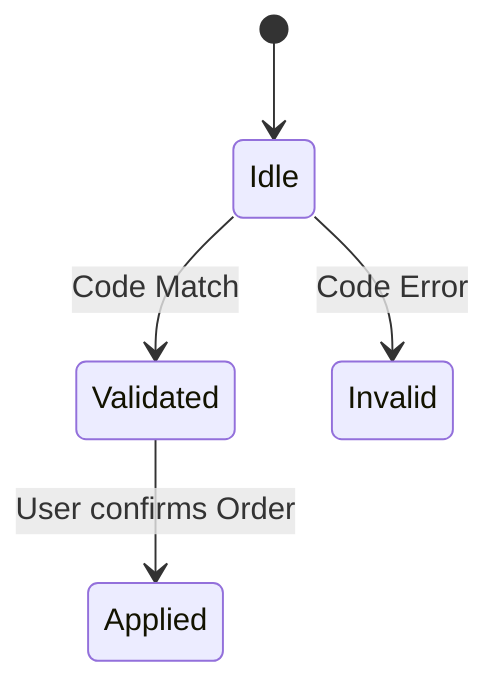

### 4. Communication Diagram
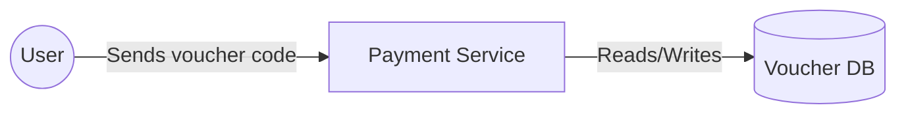

### 5. Detail Design
- **Validation:** If `voucher.userId` is set (especially for refund vouchers with prefix `CANCEL-*`), only the assigned `userId` is allowed to use this voucher.
- _Comment (VI): Nhấn mạnh logic voucher hoàn tiền `CANCEL-*` được gán cứng cho đúng tài khoản user đó._

---

## UC-15: Cancel Ticket & Refund via Voucher (Hủy vé & Hoàn tiền)

### 1. Activity Diagram (Flow of cancelling a paid ticket)
```mermaid
flowchart TD
    A([Start]) --> B[User requests to cancel a paid ticket]
    B --> C[Payment Service checks cancellation rules<br/>(time before event, ticket status, etc.)]
    C --> D{Is cancellation allowed?}
    D -- Yes --> E[Create refund voucher<br/>(50% of order amount)]
    E --> F[Update ticket status = REFUNDED]
    F --> G[Release seat back to AVAILABLE]
    G --> H[Send notification with new voucher]
    H --> I([Stop])
    D -- No --> J[Reject cancellation request]
    J --> I
```

- _Comment (VI): Nếu đủ điều kiện hủy vé thì tạo voucher hoàn tiền 50%, cập nhật trạng thái vé, trả ghế và gửi thông báo; nếu không đủ thì từ chối._

### 2. Sequence Diagram (Event-driven flow with RabbitMQ)
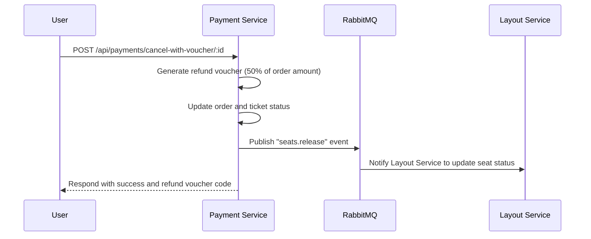

- _Comment (VI): Payment Service xử lý business, publish event `seats.release` cho Layout Service và trả voucher hoàn tiền về cho user._
### 3. State Diagram
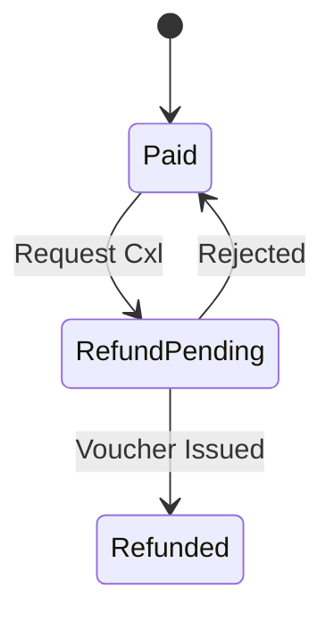

### 4. Communication Diagram
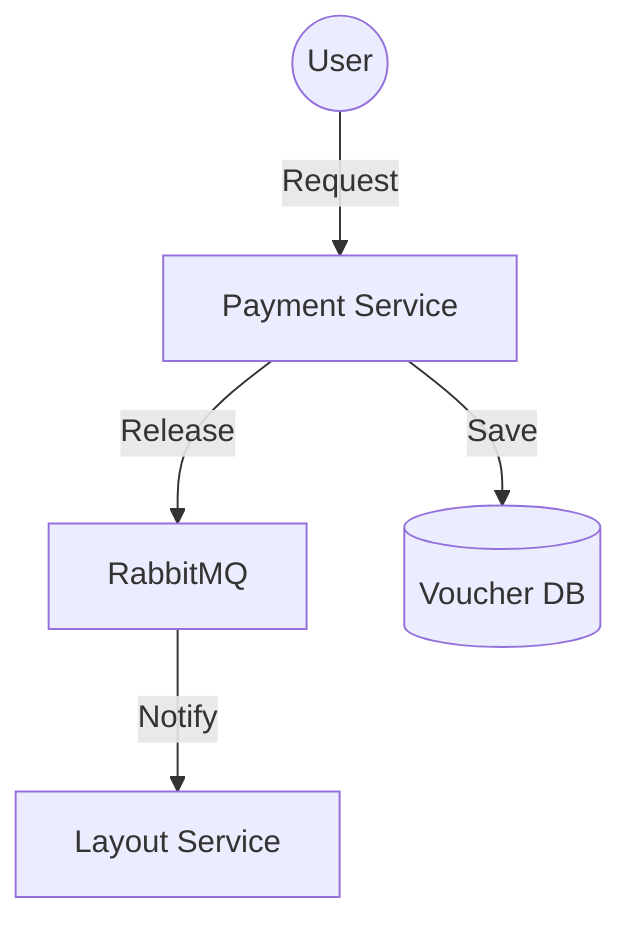

### 5. Detail Design
- **Logic:** Refund vouchers are created with prefix `CANCEL-` and are strictly bound to the `userId` of the user who cancelled the ticket.
- _Comment (VI): Tất cả voucher hoàn tiền đều có prefix `CANCEL-` và chỉ user đã hủy vé mới dùng được._

---

## UC-17: Online Payment via PayOS (Thanh toán trực tuyến)

### 1. Activity Diagram (Online payment flow with PayOS)
```mermaid
flowchart TD
    A([Start]) --> B[User clicks "Pay" button]
    B --> C[Create pending order]
    C --> D[Call PayOS API to create payment link]
    D --> E[Redirect user to banking app / PayOS page]
    E --> F[User completes payment<br/>PayOS sends webhook callback]
    F --> G[System verifies payment and marks order as PAID]
    G --> H([Stop])
```

- _Comment (VI): Flow thanh toán online: tạo order pending, gọi PayOS tạo link, user thanh toán, PayOS gửi webhook để hệ thống xác nhận PAID._

### 2. Sequence Diagram (Integration with PayOS)
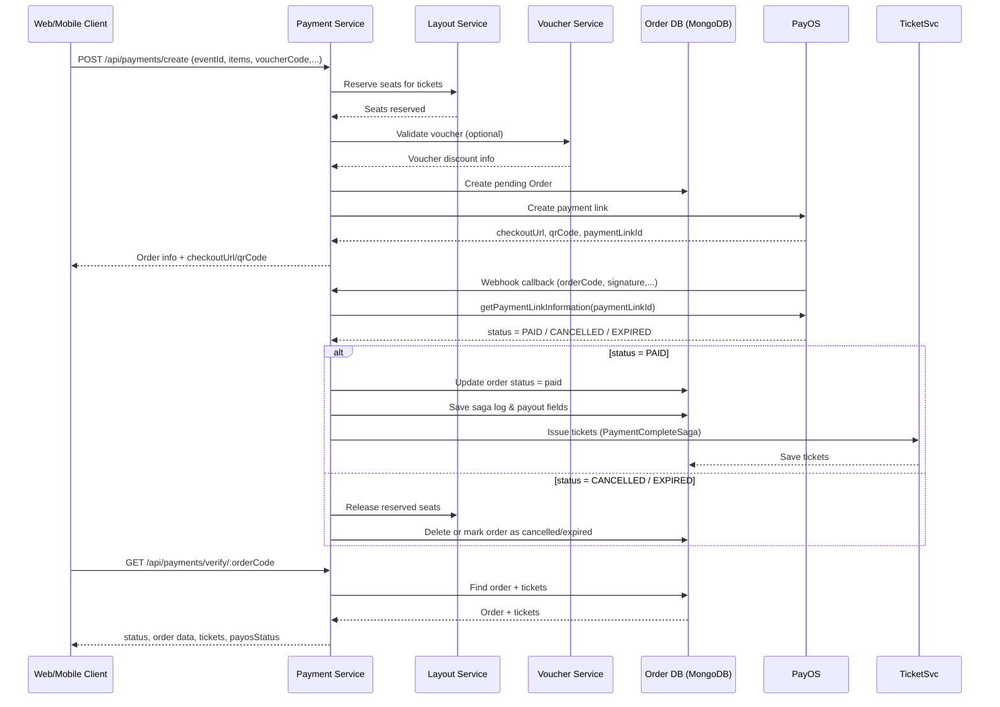

- _Comment (VI): Payment Service đóng vai trò trung gian, tạo link thanh toán và xử lý webhook từ PayOS._
### 3. State Diagram (Order state vs PayOS status)
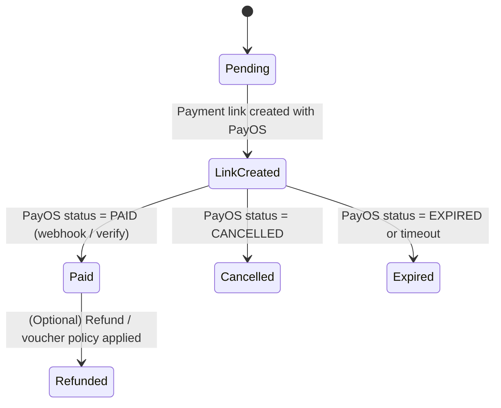

### 4. Communication Diagram (Money flow vs. system callbacks)
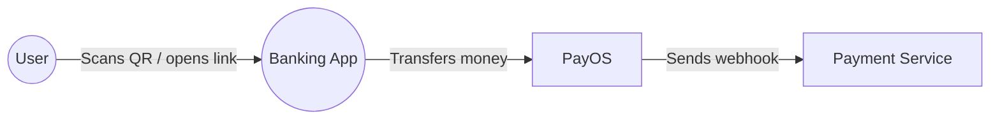

### 5. Detail Design
- **Security:** Use `HMAC-SHA256` to verify integrity and authenticity of PayOS webhook data before updating any payment records.
- _Comment (VI): Luôn verify HMAC-SHA256 từ PayOS rồi mới tin tưởng và cập nhật trạng thái thanh toán._

---
## UC-39: Financial Reconciliation (Đối soát tài chính)

### 1. Activity Diagram (Reconciliation and payout run)
```mermaid
flowchart TD
    A([Start]) --> B["System/Admin triggers reconciliation job"] %% Bắt đầu: Admin hoặc hệ thống chạy job đối soát
    B --> C["Aggregate amounts<br/>(total revenue - platform commission)"] %% Tổng hợp doanh thu và phần trăm phí sàn
    C --> D["Calculate payout amount for each organizer"] %% Tính số tiền thực nhận cho từng organizer
    D --> E["Admin reviews payout details<br/>& uploads transfer receipt"] %% Admin xem lại số liệu và nhập/thêm chứng từ chuyển khoản
    E --> F["Execute organizer payout<br/>(manual bank transfer)"] %% Admin thực hiện chuyển khoản thủ công qua ngân hàng
    F --> G["Update payoutStatus & record reconciliation logs"] %% Gọi API payment-service để mark payout success, lưu payoutAt + log
    G --> H([Stop]) %% Kết thúc flow đối soát cho đợt chạy này
```

- _Comment (VI): Job đối soát tính toán tổng thu trừ phí sàn, tính số tiền tổ chức nhận và tự động tạo payout + log lịch sử._

### 2. Sequence Diagram (Scheduled payout integration)
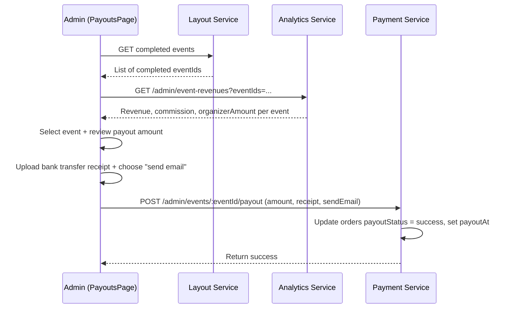

- _Comment (VI): Admin hoặc cron gọi Payment Service, service tính toán và gọi PayOS Payout, rồi cập nhật trạng thái payout cho từng order._
### 3. State Diagram
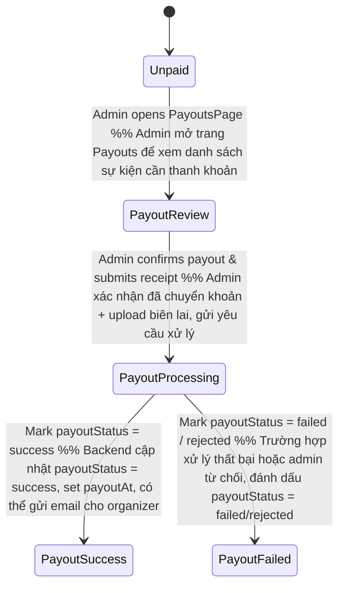

- _Comment (VI): `Unpaid` = sự kiện đã có doanh thu nhưng chưa thanh toán cho organizer; `PayoutReview` = admin mở trang Payouts xem số liệu; `PayoutProcessing` = admin xác nhận đã chuyển khoản + upload biên lai; `PayoutSuccess` / `PayoutFailed` = hệ thống đánh dấu kết quả thanh khoản qua trường payoutStatus/payoutAt trong DB._

### 4. Communication Diagram (Money and commission flow)
```mermaid
graph LR
    A[Admin UI (PayoutsPage)] -- fetch completed events --> LA[Layout Service]
    A -- fetch revenues --> AN[Analytics/Payment Analytics]
    A -- process payout request --> P[Payment Service]
    P -- marks payoutStatus & payoutAt --> DB[(Orders DB)]

```

### 5. Detail Design
- **Logic:** `PayoutAmount = TotalAmount * (1 - CommissionRate)` per organizer, with rounding rules defined consistently across the system.
- _Comment (VI): Số tiền trả cho organizer = tổng thu * (1 - commissionRate), áp dụng cùng quy tắc làm tròn ở mọi nơi._

---

## UC-31: Staff Login for Check-in (Đăng nhập nhân viên)

### 1. Activity Diagram (Staff authentication flow)
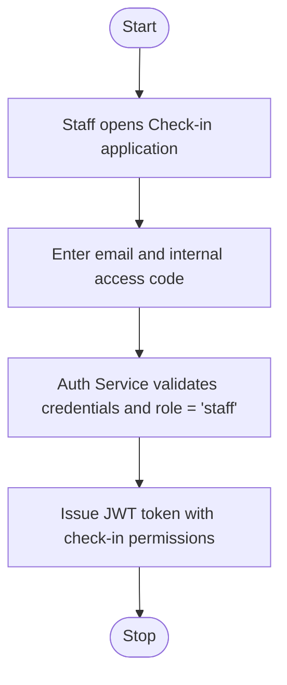

- _Comment (VI): Nhân viên mở app check-in, đăng nhập bằng email + mã nội bộ, Auth Service cấp JWT với quyền quét vé._

### 2. Sequence Diagram (Staff login API)
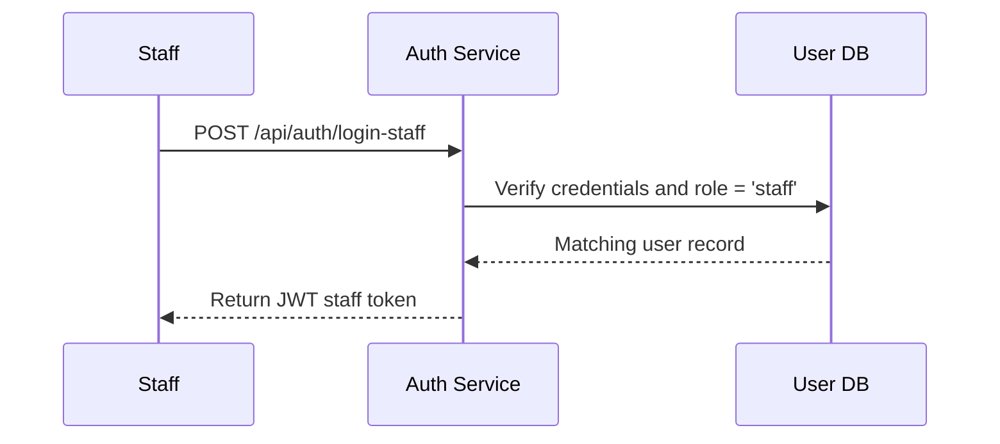

- _Comment (VI): API login staff kiểm tra đúng user + role 'staff' rồi trả JWT cho client._
### 3. State Diagram
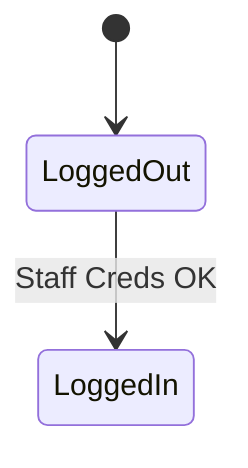

### 4. Communication Diagram (Auth responsibility)
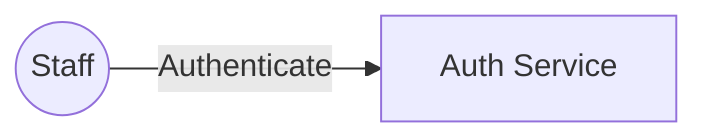

### 5. Detail Design
- **Restrictions:** Staff tokens are only allowed to call check-in related endpoints under `/api/checkin/*`.
- _Comment (VI): JWT staff bị giới hạn scope chỉ được dùng cho các API check-in._

---

## UC-32: Scan Ticket QR Code (Quét mã QR)

### 1. Activity Diagram (Scanning QR from mobile app)
```mermaid
flowchart TD
    A([Start]) --> B[Staff taps "Scan" button on mobile app]
    B --> C[Open camera and scan QR code]
    C --> D[Parse and decode ticketID from QR image]
    D --> E[Automatically send verification request to Check-in Service]
    E --> F([Stop])
```

- _Comment (VI): Flow quét QR cơ bản: mở camera, đọc mã, parse ticketID rồi tự động gửi request check-in._

### 2. Sequence Diagram (From scan to API call)
```mermaid
sequenceDiagram
    participant S as Staff
    participant M as Mobile App
    participant C as Checkin Service
    S->>M: Initiate QR scan
    M->>M: Decrypt / extract ticketID from QR
    M->>C: POST /api/checkin/scan (ticketID)
    C-->>M: Return validation result (valid/invalid + reason)
```

- _Comment (VI): App mobile chịu trách nhiệm giải mã QR, Checkin Service chỉ nhận ticketID và trả lại kết quả._
### 3. State Diagram
```mermaid
stateDiagram-v2
    [*] --> Scanning
    Scanning --> Success: Found & Valid
    Scanning --> Fail: Not found / Invalid
```

### 4. Communication Diagram (QR data vs. backend)
```mermaid
graph LR
    M((Mobile App)) -- Extracts ticketID from --> QR[QR Data]
    M -- Sends ticketID for verification --> C[Checkin Service]
```

### 5. Detail Design
- **Offline:** The mobile app can cache a list of recently scanned ticket IDs and their validation results to improve perceived response time when network is slow.
- _Comment (VI): Cho phép cache kết quả check-in gần đây trên mobile để đỡ phụ thuộc mạng._

---

## UC-33: Ticket Validation & Check-in (Xác thực & Check-in)

### 1. Activity Diagram (Backend check-in decision)
```mermaid
flowchart TD
    A([Start]) --> B[Receive ticketCode + staffId]
    B --> C[Validate input<br/>(ticketCode, staffId)]
    C -->|Invalid| Z[Return failure (400/401)]
    C -->|Valid| D[Fetch ticket by ticketId from DB]
    D --> E{Ticket found?}
    E -- No --> E1[Log result = INVALID<br/>reason = 'Không tìm thấy vé']
    E1 --> E2[Return 404 + message 'Mã QR không hợp lệ']
    E2 --> G([Stop])
    E -- Yes --> F{Status == 'checked-in'?}
    F -- Yes --> F1[Log result = ALREADY_CHECKED_IN]
    F1 --> F2[Return 400 + code 'ALREADY_CHECKED_IN']
    F2 --> G
    F -- No --> H{Status in ['cancelled','refunded']?}
    H -- Yes --> H1[Log result = CANCELLED/REFUNDED]
    H1 --> H2[Return 400 + code 'INVALID_STATUS']
    H2 --> G
    H -- No --> I[Update status = 'checked-in'<br/>set checkedInAt = now]
    I --> I1[Log result = SUCCESS]
    I1 --> I2[Return success response<br/>(Check-in thành công + info)]
    I2 --> G
```

- _Comment (VI): Service checkin đọc ticket theo `ticketCode`, nếu vé tồn tại, chưa check-in và không ở trạng thái hủy/hoàn tiền thì cập nhật trạng thái sang `checked-in`, lưu `checkedInAt` + log `SUCCESS` và trả thành công; các trường hợp còn lại trả lỗi kèm mã lỗi (NOT_FOUND, ALREADY_CHECKED_IN, INVALID_STATUS, thiếu input, lỗi hệ thống, v.v.)._

### 2. Sequence Diagram (Check-in service logic)
```mermaid
sequenceDiagram
    participant Staff as Staff App
    participant C as Checkin Service
    participant DB as MongoDB
    participant L as CheckinLog

    Staff->>C: POST /api/checkin/scan (ticketCode, staffId)
    C->>C: Validate ticketCode &amp; staffId
    C-->>Staff: 400/401 nếu thiếu input

    Staff->>C: POST /api/checkin/scan (ticketCode, staffId hợp lệ)
    C->>DB: Ticket.findOne({ ticketId: ticketCode })
    DB-->>C: ticket | null

    alt ticket không tồn tại
        C->>L: CheckinLog.create({ result: 'INVALID', reason: 'Không tìm thấy vé' })
        C-->>Staff: 404 NOT_FOUND + message 'Mã QR không hợp lệ'
    else status === 'checked-in'
        C->>L: CheckinLog.create({ result: 'ALREADY_CHECKED_IN' })
        C-->>Staff: 400 ALREADY_CHECKED_IN + message 'Vé này đã được check-in trước đó'
    else status in ['cancelled','refunded']
        C->>L: CheckinLog.create({ result: 'CANCELLED'/'REFUNDED', reason: 'Vé đã bị hủy hoặc hoàn tiền' })
        C-->>Staff: 400 INVALID_STATUS + message tương ứng
    else vé hợp lệ (thường là 'issued')
        C->>DB: Cập nhật ticket.status = 'checked-in', checkedInAt = now
        C->>L: CheckinLog.create({ result: 'SUCCESS' })
        C-->>Staff: 200 success + thông tin vé/sự kiện/chủ sở hữu
    end
```

### 3. State Diagram
```mermaid
stateDiagram-v2
    [*] --> Issued
    Issued --> CheckedIn: Success Scan
    CheckedIn --> CheckedIn: Duplicate Error
```

### 4. Communication Diagram (Check-in write path)
```mermaid
graph TD
    C[Checkin Service] -- Updates --> DB[(Ticket DB)]
    C -- Writes --> L[(Action logs / audit)]
```

### 5. Detail Design
- **Fields:** Store `checkedInAt` timestamp and `staffId` of the staff who performed the check-in for later auditing and reporting.
- _Comment (VI): Lưu thời điểm và nhân viên check-in để phục vụ đối soát/báo cáo sau này._

---
